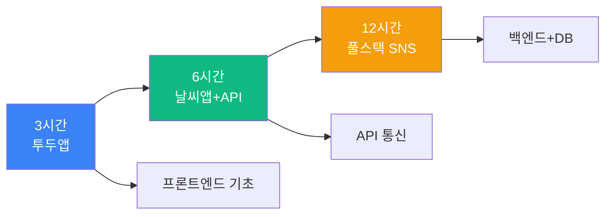
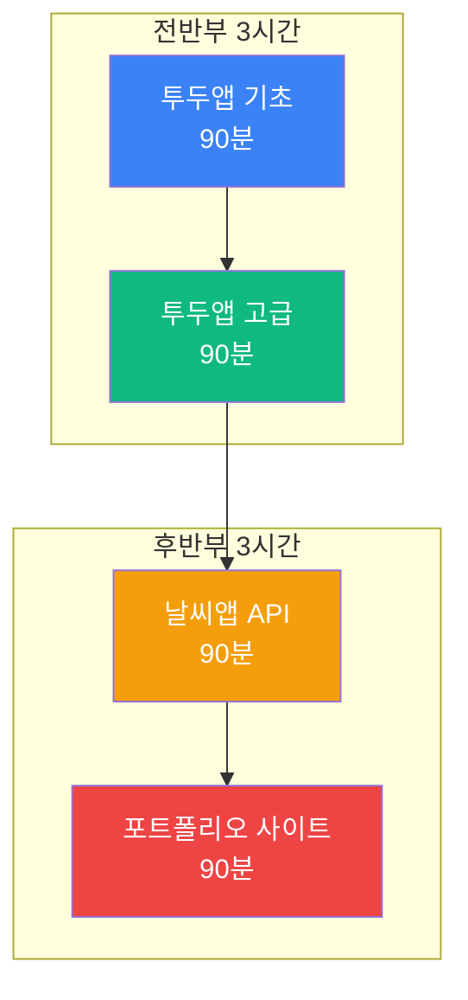
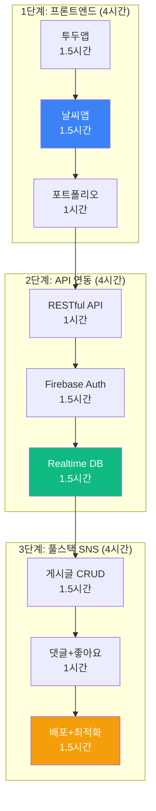
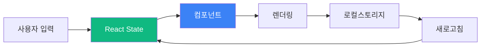
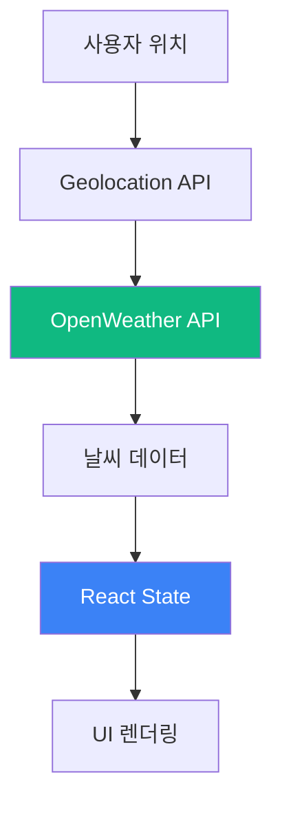
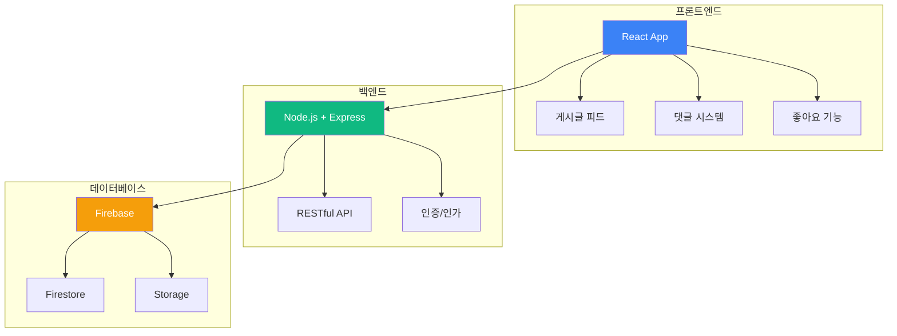
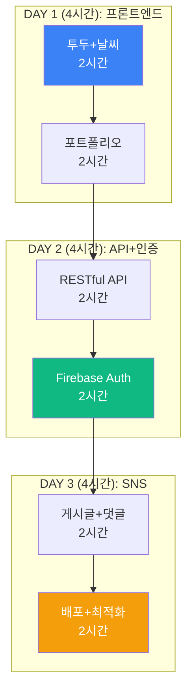

# 맛보기 출장수업: 바이브 코딩 웹개발

## 🎯 Hero Section

**배지**: "AI로 빠르게 만드는 실전 웹"  
**타이틀**: "바이브 코딩 웹개발 체험"  
**설명**: "ChatGPT + CodeSandbox로 투두앱, 날씨앱, SNS를 3시간 만에 만들어보세요"

### Features

| 아이콘 | 라벨 | 설명 |
|--------|------|------|
| ⚡ | 빠른 개발 | AI 코드 생성 |
| 🎨 | 모던 UI | Tailwind CSS |
| 🚀 | 즉시 배포 | Vercel/Netlify |
| 💻 | 풀스택 | React + Node.js |

---

## 📊 Course Info

| 항목 | 아이콘 | 색상 | 내용 |
|------|--------|------|------|
| 수업 시간 | ⏰ Clock | purple | 3시간 / 6시간 / 12시간 선택 |
| 수강 인원 | 👥 Users | blue | 최대 30명 (개인 작업) |
| 준비물 | 💻 Laptop | green | 노트북 + 크롬 브라우저 |
| 수업 방식 | 🎯 Target | orange | PRIMM 방식 (체험→탐구→수정→창작) |

---

## 📖 과정 소개

### 타이틀
"왜 바이브 코딩인가?"

### 내용

바이브 코딩은 **ChatGPT와 AI 도구로 빠르게 프로토타입을 만드는 현대적 개발 방식**입니다. 전통적인 코딩 학습처럼 문법부터 배우는 것이 아니라, 완성된 프로젝트를 수정하고 개선하며 개발 프로세스를 체득합니다.

넷플릭스, 인스타그램처럼 **실제 서비스의 핵심 기능**을 직접 구현하고, CodeSandbox로 브라우저에서 바로 개발하며, Vercel로 즉시 배포하여 친구들과 공유할 수 있습니다.

**HTML/CSS/JS 기초부터 React, Node.js, MongoDB까지** 풀스택 개발을 경험하되, AI가 코드를 생성해주므로 문법보다는 **웹 개발 원리와 데이터 흐름**에 집중합니다.

중학생부터 고등학생까지 참여 가능하며, **3시간 만에 작동하는 웹앱**을, **12시간이면 실전 SNS**를 완성하여 포트폴리오로 활용할 수 있습니다.

### 이미지 (3개)
- CodeSandbox 개발 화면
- 학생들이 웹앱 테스트하는 모습
- 완성된 웹앱들 (투두, 날씨, SNS)

---

## 🎓 학습 경로 (Learning Path)

### 전체 구조도



### 3시간 과정: 투두 앱

| 단계 | 시간 | 내용 | 강조 |
|------|------|------|------|
| 1. 벤치마킹 | 15분 | 유명 앱 분석 & 토론 | 💡 |
| 2. Predict | 10분 | 완성된 투두앱 체험 | 🎮 |
| 3. Run | 30분 | CodeSandbox 셋업 & 실행 | ⭐ |
| 4. Investigate | 20분 | React 컴포넌트 구조 | 🔍 |
| 5. Modify | 40분 | 디자인, 기능 수정 | ⭐⭐ |
| 6. Make | 50분 | 나만의 기능 추가 | ⭐⭐⭐ |
| 7. 배포 | 15분 | Vercel 배포 & 공유 | 🚀 |

**완성 작품**: 반응형 투두 앱 (CRUD + 로컬스토리지)

### 6시간 과정: 투두 + 날씨 + 포트폴리오



| 세션 | 시간 | 프로젝트 | 핵심 기술 |
|------|------|----------|-----------|
| 1교시 | 90분 | 투두앱 기초 | React State |
| 2교시 | 90분 | 필터링 + 애니메이션 | Hooks + Framer Motion |
| 3교시 | 90분 | 날씨앱 | OpenWeather API |
| 4교시 | 90분 | 포트폴리오 사이트 | Tailwind CSS |

**완성 작품**: 3개 웹앱 + 개인 포트폴리오

### 12시간 과정: 풀스택 SNS 완성



**일정표**

| 차시 | 시간 | 단계 | 프로젝트 | 완성도 |
|------|------|------|----------|--------|
| 1차시 | 2시간 | 프론트 1 | 투두앱 (완성형) | ⭐⭐⭐ |
| 2차시 | 2시간 | 프론트 2 | 날씨앱 + 포트폴리오 | ⭐⭐⭐ |
| 3차시 | 2시간 | API 1 | RESTful API + Auth | ⭐⭐⭐ |
| 4차시 | 2시간 | API 2 | Firebase Realtime | ⭐⭐⭐ |
| 5차시 | 2시간 | SNS 1 | 게시글 + 댓글 시스템 | ⭐⭐⭐ |
| 6차시 | 2시간 | SNS 2 | 배포 + 성능 최적화 | ⭐⭐⭐ |

**완성 작품**: 풀스택 SNS + 3개 웹앱 + 포트폴리오

---

## 🎮 프로젝트 상세

### 프로젝트 1: 투두 앱 (3시간 과정 메인)



**난이도**: ⭐⭐ (초급)  
**소요 시간**: 3시간  
**대상**: 중등 1학년 ~ 고등 3학년

**학습 목표**
- React 컴포넌트 구조 이해
- State 관리 (useState)
- 이벤트 핸들링
- 로컬스토리지 데이터 저장

**제작 단계**

| 단계 | 내용 | 시간 | 도구 |
|------|------|------|------|
| 1. 셋업 | CodeSandbox 프로젝트 생성 | 10분 | CodeSandbox |
| 2. UI | 입력창 + 리스트 컴포넌트 | 30분 | React |
| 3. State | 할 일 추가/삭제 기능 | 30분 | useState |
| 4. 스타일 | Tailwind CSS 디자인 | 30분 | Tailwind |
| 5. 필터 | 전체/완료/미완료 필터 | 30분 | 조건부 렌더링 |
| 6. 저장 | 로컬스토리지 연동 | 20분 | localStorage API |
| 7. 배포 | Vercel 배포 | 10분 | Vercel CLI |

**핵심 코드: React 투두 앱**

```jsx
import React, { useState, useEffect } from 'react';
import './styles.css';

function TodoApp() {
  // State 관리
  const [todos, setTodos] = useState([]);
  const [input, setInput] = useState('');
  const [filter, setFilter] = useState('all'); // all, active, completed
  
  // 로컬스토리지에서 불러오기
  useEffect(() => {
    const savedTodos = JSON.parse(localStorage.getItem('todos') || '[]');
    setTodos(savedTodos);
  }, []);
  
  // 로컬스토리지에 저장
  useEffect(() => {
    localStorage.setItem('todos', JSON.stringify(todos));
  }, [todos]);
  
  // 할 일 추가
  const addTodo = () => {
    if (input.trim() === '') return;
    
    const newTodo = {
      id: Date.now(),
      text: input,
      completed: false,
      createdAt: new Date().toISOString()
    };
    
    setTodos([...todos, newTodo]);
    setInput('');
  };
  
  // 완료 토글
  const toggleTodo = (id) => {
    setTodos(todos.map(todo => 
      todo.id === id ? { ...todo, completed: !todo.completed } : todo
    ));
  };
  
  // 삭제
  const deleteTodo = (id) => {
    setTodos(todos.filter(todo => todo.id !== id));
  };
  
  // 필터링
  const filteredTodos = todos.filter(todo => {
    if (filter === 'active') return !todo.completed;
    if (filter === 'completed') return todo.completed;
    return true; // all
  });
  
  return (
    <div className="container mx-auto max-w-md p-4">
      <h1 className="text-3xl font-bold text-center mb-6">
        ✅ My Todo App
      </h1>
      
      {/* 입력 영역 */}
      <div className="flex gap-2 mb-4">
        <input
          type="text"
          value={input}
          onChange={(e) => setInput(e.target.value)}
          onKeyPress={(e) => e.key === 'Enter' && addTodo()}
          placeholder="할 일을 입력하세요..."
          className="flex-1 px-4 py-2 border rounded-lg"
        />
        <button
          onClick={addTodo}
          className="px-6 py-2 bg-blue-500 text-white rounded-lg hover:bg-blue-600"
        >
          추가
        </button>
      </div>
      
      {/* 필터 버튼 */}
      <div className="flex gap-2 mb-4">
        {['all', 'active', 'completed'].map(f => (
          <button
            key={f}
            onClick={() => setFilter(f)}
            className={`px-4 py-1 rounded ${
              filter === f ? 'bg-gray-800 text-white' : 'bg-gray-200'
            }`}
          >
            {f === 'all' ? '전체' : f === 'active' ? '진행중' : '완료'}
          </button>
        ))}
      </div>
      
      {/* 할 일 리스트 */}
      <ul className="space-y-2">
        {filteredTodos.map(todo => (
          <li
            key={todo.id}
            className="flex items-center gap-2 p-3 bg-white border rounded-lg shadow-sm"
          >
            <input
              type="checkbox"
              checked={todo.completed}
              onChange={() => toggleTodo(todo.id)}
              className="w-5 h-5"
            />
            <span className={`flex-1 ${todo.completed ? 'line-through text-gray-400' : ''}`}>
              {todo.text}
            </span>
            <button
              onClick={() => deleteTodo(todo.id)}
              className="px-3 py-1 bg-red-500 text-white rounded hover:bg-red-600"
            >
              삭제
            </button>
          </li>
        ))}
      </ul>
      
      {/* 통계 */}
      <div className="mt-4 text-center text-gray-600">
        총 {todos.length}개 | 완료 {todos.filter(t => t.completed).length}개
      </div>
    </div>
  );
}

export default TodoApp;
```

**기대 효과**
- ✅ React 기본 개념 이해
- ✅ State 기반 UI 업데이트
- ✅ 3시간 만에 실전 앱 완성
- ✅ 배포하여 친구들과 공유

### 프로젝트 2: 날씨 앱 (6시간 과정 포함)



**난이도**: ⭐⭐⭐ (중급)  
**소요 시간**: 90분  
**대상**: 중등 2학년 ~ 고등 3학년

**시스템 구성**

| 기능 | API | 설명 |
|------|-----|------|
| 현재 위치 | Geolocation | 브라우저 위치 정보 |
| 날씨 정보 | OpenWeather | 온도, 습도, 날씨 |
| 아이콘 | OpenWeather | 날씨 아이콘 |
| 5일 예보 | OpenWeather | 주간 날씨 |

**핵심 코드: API 호출**

```jsx
import React, { useState, useEffect } from 'react';
import axios from 'axios';

function WeatherApp() {
  const [weather, setWeather] = useState(null);
  const [loading, setLoading] = useState(true);
  const [error, setError] = useState(null);
  
  const API_KEY = 'YOUR_OPENWEATHER_API_KEY';
  
  useEffect(() => {
    getWeather();
  }, []);
  
  // 날씨 데이터 가져오기
  const getWeather = async () => {
    try {
      // 1. 사용자 위치 가져오기
      navigator.geolocation.getCurrentPosition(async (position) => {
        const { latitude, longitude } = position.coords;
        
        // 2. OpenWeather API 호출
        const response = await axios.get(
          `https://api.openweathermap.org/data/2.5/weather`,
          {
            params: {
              lat: latitude,
              lon: longitude,
              appid: API_KEY,
              units: 'metric', // 섭씨
              lang: 'kr' // 한국어
            }
          }
        );
        
        setWeather(response.data);
        setLoading(false);
      });
    } catch (err) {
      setError(err.message);
      setLoading(false);
    }
  };
  
  if (loading) return <div className="text-center p-8">로딩 중...</div>;
  if (error) return <div className="text-center p-8 text-red-500">에러: {error}</div>;
  
  return (
    <div className="container mx-auto max-w-md p-6">
      <div className="bg-gradient-to-br from-blue-400 to-blue-600 rounded-2xl p-8 text-white shadow-xl">
        {/* 도시명 */}
        <h2 className="text-3xl font-bold mb-2">{weather.name}</h2>
        <p className="text-blue-100 mb-6">{weather.sys.country}</p>
        
        {/* 날씨 아이콘 + 온도 */}
        <div className="flex items-center justify-between mb-6">
          <div>
            <div className="text-6xl font-bold">
              {Math.round(weather.main.temp)}°C
            </div>
            <div className="text-xl capitalize mt-2">
              {weather.weather[0].description}
            </div>
          </div>
          
        </div>
        
        {/* 상세 정보 */}
        <div className="grid grid-cols-2 gap-4 mt-6 pt-6 border-t border-blue-300">
          <div>
            <div className="text-blue-100 text-sm">체감 온도</div>
            <div className="text-2xl font-semibold">
              {Math.round(weather.main.feels_like)}°C
            </div>
          </div>
          <div>
            <div className="text-blue-100 text-sm">습도</div>
            <div className="text-2xl font-semibold">
              {weather.main.humidity}%
            </div>
          </div>
          <div>
            <div className="text-blue-100 text-sm">풍속</div>
            <div className="text-2xl font-semibold">
              {weather.wind.speed} m/s
            </div>
          </div>
          <div>
            <div className="text-blue-100 text-sm">기압</div>
            <div className="text-2xl font-semibold">
              {weather.main.pressure} hPa
            </div>
          </div>
        </div>
        
        {/* 새로고침 버튼 */}
        <button
          onClick={getWeather}
          className="w-full mt-6 py-3 bg-white text-blue-600 rounded-lg font-semibold hover:bg-blue-50"
        >
          🔄 새로고침
        </button>
      </div>
    </div>
  );
}

export default WeatherApp;
```

**확장 기능**

| 기능 | 설명 | 난이도 |
|------|------|--------|
| 도시 검색 | 입력한 도시 날씨 조회 | ⭐⭐ |
| 5일 예보 | 주간 날씨 그래프 | ⭐⭐⭐ |
| 다크모드 | 테마 전환 | ⭐ |
| 즐겨찾기 | 여러 도시 저장 | ⭐⭐⭐ |

### 프로젝트 3: 풀스택 SNS (12시간 과정 메인)

**난이도**: ⭐⭐⭐⭐⭐ (고급)  
**소요 시간**: 8시간  
**대상**: 중등 3학년 ~ 고등 3학년

**시스템 구조**



**데이터 모델**

```javascript
// User 컬렉션
{
  uid: "user123",
  email: "user@example.com",
  displayName: "김코딩",
  photoURL: "https://...",
  createdAt: "2025-01-01T00:00:00Z",
  followers: ["user456", "user789"],
  following: ["user456"]
}

// Post 컬렉션
{
  id: "post123",
  authorId: "user123",
  authorName: "김코딩",
  authorPhoto: "https://...",
  content: "안녕하세요! 첫 게시글입니다.",
  imageUrl: "https://...",
  likes: ["user456", "user789"], // 좋아요 누른 사용자 UID
  commentCount: 5,
  createdAt: "2025-01-01T12:00:00Z"
}

// Comment 컬렉션
{
  id: "comment123",
  postId: "post123",
  authorId: "user456",
  authorName: "이개발",
  authorPhoto: "https://...",
  content: "멋진 글이네요!",
  createdAt: "2025-01-01T12:05:00Z"
}
```

**핵심 기능 구현**

**1) 게시글 CRUD**

```jsx
import { collection, addDoc, getDocs, deleteDoc, doc } from 'firebase/firestore';
import { db } from './firebase';

// 게시글 작성
export const createPost = async (postData) => {
  try {
    const docRef = await addDoc(collection(db, 'posts'), {
      ...postData,
      createdAt: new Date().toISOString(),
      likes: [],
      commentCount: 0
    });
    return docRef.id;
  } catch (error) {
    console.error('게시글 작성 실패:', error);
    throw error;
  }
};

// 게시글 목록 가져오기
export const getPosts = async () => {
  try {
    const querySnapshot = await getDocs(collection(db, 'posts'));
    const posts = [];
    querySnapshot.forEach((doc) => {
      posts.push({ id: doc.id, ...doc.data() });
    });
    return posts.sort((a, b) => new Date(b.createdAt) - new Date(a.createdAt));
  } catch (error) {
    console.error('게시글 불러오기 실패:', error);
    throw error;
  }
};

// 게시글 삭제
export const deletePost = async (postId) => {
  try {
    await deleteDoc(doc(db, 'posts', postId));
  } catch (error) {
    console.error('게시글 삭제 실패:', error);
    throw error;
  }
};
```

**2) 좋아요 기능**

```jsx
import { doc, updateDoc, arrayUnion, arrayRemove } from 'firebase/firestore';

// 좋아요 토글
export const toggleLike = async (postId, userId) => {
  try {
    const postRef = doc(db, 'posts', postId);
    const post = await getDoc(postRef);
    const likes = post.data().likes || [];
    
    if (likes.includes(userId)) {
      // 좋아요 취소
      await updateDoc(postRef, {
        likes: arrayRemove(userId)
      });
    } else {
      // 좋아요 추가
      await updateDoc(postRef, {
        likes: arrayUnion(userId)
      });
    }
  } catch (error) {
    console.error('좋아요 처리 실패:', error);
    throw error;
  }
};
```

**3) 댓글 시스템**

```jsx
// 댓글 작성
export const createComment = async (postId, commentData) => {
  try {
    // 댓글 추가
    await addDoc(collection(db, 'comments'), {
      postId,
      ...commentData,
      createdAt: new Date().toISOString()
    });
    
    // 게시글의 댓글 수 증가
    const postRef = doc(db, 'posts', postId);
    await updateDoc(postRef, {
      commentCount: increment(1)
    });
  } catch (error) {
    console.error('댓글 작성 실패:', error);
    throw error;
  }
};

// 게시글의 댓글 목록
export const getComments = async (postId) => {
  try {
    const q = query(
      collection(db, 'comments'),
      where('postId', '==', postId),
      orderBy('createdAt', 'asc')
    );
    const querySnapshot = await getDocs(q);
    const comments = [];
    querySnapshot.forEach((doc) => {
      comments.push({ id: doc.id, ...doc.data() });
    });
    return comments;
  } catch (error) {
    console.error('댓글 불러오기 실패:', error);
    throw error;
  }
};
```

**완성 화면 구성**

| 페이지 | 경로 | 주요 기능 |
|--------|------|-----------|
| 홈 | `/` | 게시글 피드 |
| 프로필 | `/profile/:userId` | 사용자 정보 + 게시글 |
| 게시글 작성 | `/create` | 이미지 + 텍스트 |
| 게시글 상세 | `/post/:postId` | 댓글, 좋아요 |
| 로그인 | `/login` | Firebase Auth |

---

## 📚 커리큘럼 상세

### 3시간 과정: 투두 앱 빠른 체험

**목표**: 반응형 투두 앱 + Vercel 배포

**시간표**

| 시간 | 내용 | 활동 | 산출물 |
|------|------|------|--------|
| 00:00-00:15 | 오리엔테이션 | 웹개발 사례 | - |
| 00:15-00:25 | 체험 (Predict) | 완성 투두앱 테스트 | - |
| 00:25-00:55 | 셋업 (Run) | CodeSandbox 프로젝트 | 기본 구조 |
| 00:55-01:15 | 이해 (Investigate) | React 컴포넌트 설명 | 체크리스트 |
| 01:15-01:55 | 수정 (Modify) | UI + 기능 수정 | 개선된 앱 |
| 01:55-02:45 | 창작 (Make) | 필터 + 로컬스토리지 | 완성 작품 |
| 02:45-03:00 | 배포 | Vercel 배포 | 공유 URL |

**준비물**
- 노트북 (개인)
- GitHub 계정
- Vercel 계정 (무료)

**제공 자료**
- CodeSandbox 템플릿
- React 치트시트
- Tailwind CSS 가이드

### 6시간 과정: 3개 웹앱 + 포트폴리오

**목표**: 투두 + 날씨 + 포트폴리오

**일정 구성**

```mermaid
gantt
    title 6시간 과정 일정
    dateFormat HH:mm
    axisFormat %H:%M
    
    section 1부 (3시간)
    오리엔테이션: 09:00, 15m
    투두앱 기초: 09:15, 75m
    투두앱 고급: 10:30, 90m
    
    section 점심 (1시간)
    휴식: 12:00, 60m
    
    section 2부 (3시간)
    날씨앱: 13:00, 90m
    포트폴리오: 14:30, 90m
```



**세부 시간표**

| 교시 | 시간 | 프로젝트 | 세부 활동 |
|------|------|----------|-----------|
| **1교시** | **09:00-10:30** | **투두앱 기초** | |
| | 09:00-09:15 | 오리엔테이션 | 웹개발 개요 |
| | 09:15-09:45 | Predict + Run | 체험 + 셋업 |
| | 09:45-10:15 | Modify | UI 수정 |
| | 10:15-10:30 | 발표 | 1차 작품 |
| **2교시** | **10:30-12:00** | **투두앱 고급** | |
| | 10:30-11:00 | 필터링 | 전체/완료/미완료 |
| | 11:00-11:30 | 애니메이션 | Framer Motion |
| | 11:30-12:00 | 로컬스토리지 | 데이터 저장 |
| **점심** | **12:00-13:00** | 휴식 | - |
| **3교시** | **13:00-14:30** | **날씨앱** | |
| | 13:00-13:30 | API 셋업 | OpenWeather |
| | 13:30-14:00 | UI 구현 | 날씨 카드 |
| | 14:00-14:30 | 5일 예보 | 추가 기능 |
| **4교시** | **14:30-16:00** | **포트폴리오** | |
| | 14:30-15:00 | 디자인 | Tailwind |
| | 15:00-15:30 | 프로젝트 링크 | 3개 앱 연동 |
| | 15:30-16:00 | 배포 & 발표 | Vercel 배포 |

### 12시간 과정: 풀스택 SNS 완성

**목표**: 인스타그램 클론 + 배포

**전체 구조**



**일차별 계획**

| 일차 | 주제 | 프로젝트 | 시간 배분 |
|------|------|----------|-----------|
| **1일차** | **프론트엔드** | | **4시간** |
| | 오리엔테이션 | 웹개발 로드맵 | 30분 |
| | 투두앱 | 완성형 투두앱 | 90분 |
| | 날씨앱 | API 연동 | 60분 |
| | 포트폴리오 | 반응형 사이트 | 60분 |
| **2일차** | **API + 인증** | | **4시간** |
| | 복습 | 1일차 리뷰 | 15분 |
| | REST API | Express 서버 | 60분 |
| | Firebase 셋업 | 프로젝트 설정 | 45분 |
| | 인증 시스템 | 로그인/회원가입 | 60분 |
| | Firestore | DB 연동 | 60분 |
| **3일차** | **SNS 완성** | | **4시간** |
| | 복습 | 2일차 리뷰 | 15분 |
| | 게시글 시스템 | CRUD | 60분 |
| | 댓글 + 좋아요 | 인터랙션 | 45분 |
| | 이미지 업로드 | Firebase Storage | 60분 |
| | 배포 + 최적화 | Vercel + 성능 | 60분 |

---

## 💰 가격 정책

### 3시간 과정

| 항목 | 기본 | 프리미엄 |
|------|------|----------|
| 수업 시간 | 3시간 | 3시간 |
| 수강 인원 | 최대 30명 | 최대 30명 |
| 강사 | 1명 | 2명 |
| 제공 자료 | 디지털 | 디지털 + 템플릿 |
| 완성 작품 | 투두앱 1개 | 투두앱 + 배포 |
| 사후 지원 | - | 1주일 온라인 |
| **가격** | **25만원** | **35만원** |

### 6시간 과정

| 항목 | 기본 | 프리미엄 |
|------|------|----------|
| 수업 시간 | 6시간 (1일) | 6시간 (1일) |
| 수강 인원 | 최대 30명 | 최대 30명 |
| 강사 | 2명 | 3명 |
| 제공 자료 | 디지털 | 풀패키지 + USB |
| 완성 작품 | 3개 웹앱 | 3개 + 포트폴리오 |
| 사후 지원 | 1주일 | 2주일 + 화상 |
| 추가 혜택 | - | • 정식 과정 20% 할인<br/>• GitHub 저장소 |
| **가격** | **45만원** | **65만원** |

### 12시간 과정

| 항목 | 기본 | 프리미엄 |
|------|------|----------|
| 수업 시간 | 12시간 (3일) | 12시간 (3일) |
| 수강 인원 | 최대 30명 | 최대 30명 |
| 강사 | 2명 | 3명 |
| 제공 자료 | 디지털 + 워크북 | 풀패키지 + USB |
| 완성 작품 | SNS + 3개 웹앱 | SNS + 4개 + 포트폴리오 |
| 사후 지원 | 2주일 | 1개월 + 월 1회 화상 |
| 추가 혜택 | 정식 과정 10% 할인 | • 정식 과정 30% 할인<br/>• 도메인 1년<br/>• 포트폴리오 사이트 |
| **가격** | **90만원** | **130만원** |

---

## 🎯 교육 효과

### 역량 비교

| 역량 | 3시간 | 6시간 | 12시간 |
|------|-------|-------|--------|
| React | ⭐⭐ | ⭐⭐⭐⭐ | ⭐⭐⭐⭐⭐ |
| API 연동 | ⭐ | ⭐⭐⭐ | ⭐⭐⭐⭐⭐ |
| 풀스택 | - | ⭐⭐ | ⭐⭐⭐⭐⭐ |
| 배포 | ⭐⭐ | ⭐⭐⭐⭐ | ⭐⭐⭐⭐⭐ |
| 포트폴리오 | ⭐⭐ | ⭐⭐⭐⭐ | ⭐⭐⭐⭐⭐ |

---

## 📞 문의

**홈페이지**: https://aimakerlab.com  
**이메일**: trial-vibe@aimakerlab.com  
**전화**: 02-XXXX-XXXX

---

## 📝 문서 정보

**최종 업데이트**: 2025-12-30  
**버전**: 1.0  
**작성자**: AI Maker Lab 교육팀

