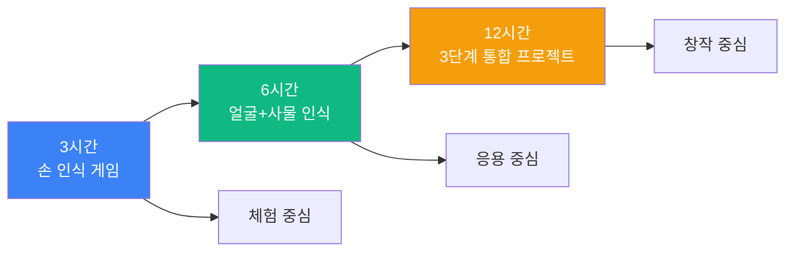
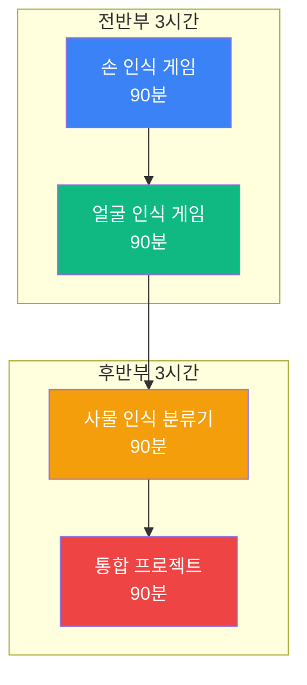
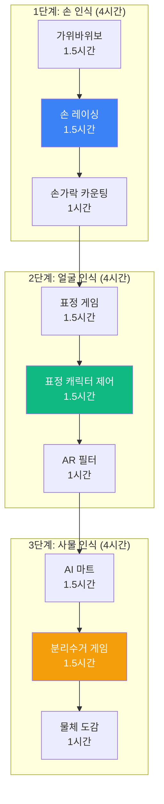
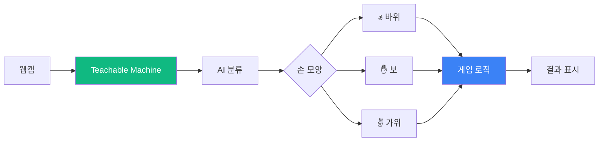
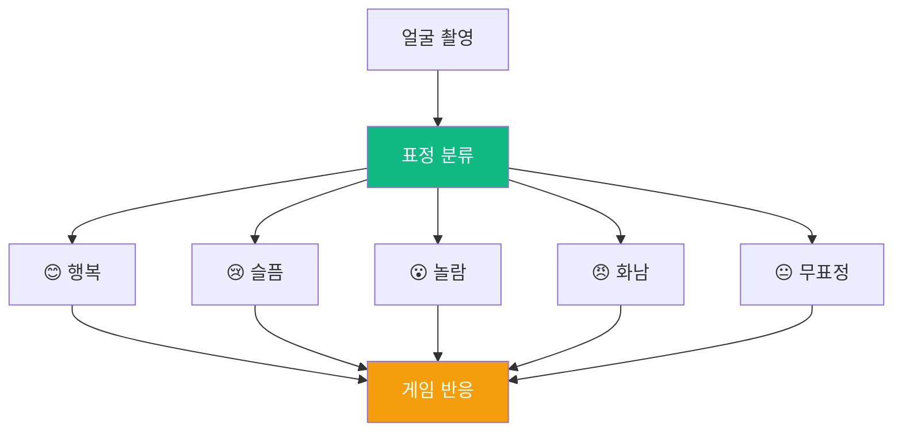
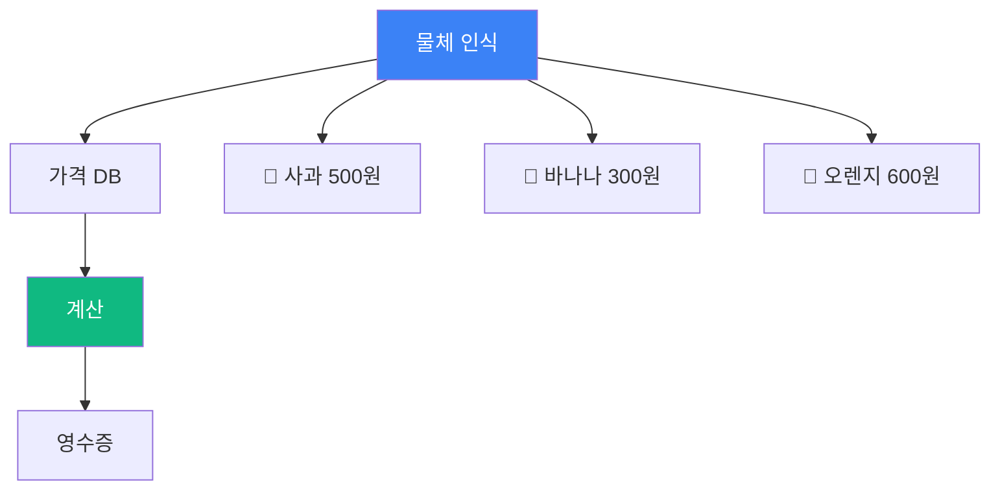
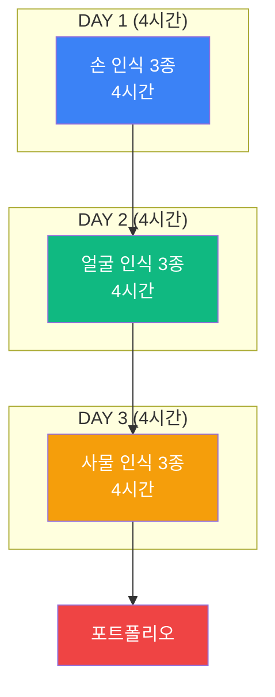
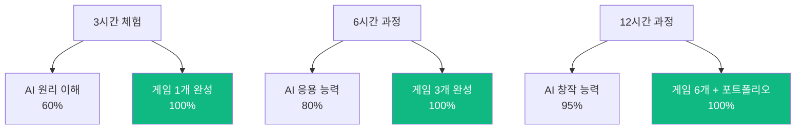

# 맛보기 출장수업: 블록 코딩 AI 비전

## 🎯 Hero Section

**배지**: "손쉽게 시작하는 AI 컴퓨터 비전"  
**타이틀**: "블록 코딩 AI 비전 체험"  
**설명**: "DancingwithAI와 Teachable Machine으로 손 제스처, 얼굴 인식 게임을 만들어보세요"

### Features

| 아이콘 | 라벨 | 설명 |
|--------|------|------|
| 🎮 | 게임 제작 | 손/얼굴 인식 게임 |
| 🤖 | AI 학습 | Teachable Machine |
| 🚀 | 즉시 실행 | 코딩 없이 빠른 시작 |
| 🎨 | 창의성 | 나만의 게임 제작 |

---

## 📊 Course Info

| 항목 | 아이콘 | 색상 | 내용 |
|------|--------|------|------|
| 수업 시간 | ⏰ Clock | purple | 3시간 / 6시간 / 12시간 선택 |
| 수강 인원 | 👥 Users | blue | 최대 20명 (2인 1팀 가능) |
| 준비물 | 💻 Laptop | green | 웹캠 있는 노트북 (학교 제공) |
| 수업 방식 | 🎯 Target | orange | PRIMM 방식 (체험→탐구→수정→창작) |

---

## 📖 과정 소개

### 타이틀
"왜 블록 코딩 AI 비전인가?"

### 내용

블록 코딩 AI 비전 과정은 코딩 문법을 몰라도 AI 게임을 만들 수 있는 가장 쉬운 AI 입문 과정입니다.

스마트폰 얼굴인식, 틱톡 AR 필터처럼 우리 생활 속 컴퓨터 비전 기술을 직접 체험하고, Teachable Machine으로 AI를 학습시켜 나만의 게임을 만듭니다.

**초등학생부터 고등학생까지** 모두 참여 가능하며, 2-3시간 만에 작동하는 게임을 완성하여 친구들과 함께 즐길 수 있습니다.

### 이미지 (3개)
- AI 컴퓨터 비전 개념도
- 학생들이 손 제스처 게임하는 모습
- Teachable Machine 화면

---

## 🎓 학습 경로 (Learning Path)

### 전체 구조도

### 3시간 과정: 손 인식 게임

| 단계 | 시간 | 내용 | 강조 |
|------|------|------|------|
| 1. 벤치마킹 | 15분 | 실제 AI 사례 분석 & 토론 | 🎯 |
| 2. Predict | 10분 | 완성된 게임 체험 | 🎮 |
| 3. Run | 15분 | Teachable Machine 실행 | ⭐ |
| 4. Investigate | 20분 | AI 분류 알고리즘 이해 | 🔍 |
| 5. Modify | 40분 | 점수, 효과음, 기능 수정 | ⭐⭐ |
| 6. Make | 60분 | 나만의 손 게임 제작 | ⭐⭐⭐ |
| 7. 발표 | 20분 | 작품 시연 & 공유 | 🎉 |

**완성 작품**: 가위바위보 게임 또는 손가락 카운팅 게임

### 6시간 과정: 얼굴+사물 인식

| 세션 | 시간 | 프로젝트 | 핵심 기술 |
|------|------|----------|-----------|
| 1교시 | 90분 | 손 인식 게임 | 제스처 분류 |
| 2교시 | 90분 | 표정 인식 게임 | 얼굴 표정 분류 |
| 3교시 | 90분 | AI 마트 계산원 | 다중 사물 분류 |
| 4교시 | 90분 | 통합 게임 제작 | 3가지 통합 |

**완성 작품**: 손/얼굴/사물 3가지 인식을 활용한 종합 게임

### 12시간 과정: 컴퓨터 비전 3단계 마스터

**일정표**

| 차시 | 시간 | 단계 | 프로젝트 | 완성도 |
|------|------|------|----------|--------|
| 1차시 | 2시간 | 손 인식 1 | 가위바위보 마스터 | ⭐⭐⭐ |
| 2차시 | 2시간 | 손 인식 2 | 손 제어 레이싱 + 카운팅 | ⭐⭐⭐ |
| 3차시 | 2시간 | 얼굴 인식 1 | 감정 연기자 게임 | ⭐⭐⭐ |
| 4차시 | 2시간 | 얼굴 인식 2 | 표정 제어 + AR 필터 | ⭐⭐⭐ |
| 5차시 | 2시간 | 사물 인식 1 | AI 마트 계산원 | ⭐⭐⭐ |
| 6차시 | 2시간 | 사물 인식 2 | 분리수거 + 물체 도감 | ⭐⭐⭐ |

**완성 작품**: 6개의 완성된 AI 게임 + 포트폴리오

---

## 🎮 프로젝트 상세

### 프로젝트 1: 가위바위보 마스터 (3시간 과정 메인)

**난이도**: ⭐⭐ (초급)  
**소요 시간**: 3시간 (체험 2시간 가능)  
**대상**: 초등 4학년 ~ 중등 3학년

**학습 목표**
- AI 이미지 분류 원리 이해
- Teachable Machine 사용법
- 게임 로직 구현 (승부 판정)

**제작 단계**

| 단계 | 내용 | 시간 | 도구 |
|------|------|------|------|
| 1. AI 학습 | 손 모양 3가지 촬영 (30초씩) | 30분 | Teachable Machine |
| 2. 게임 구현 | DWAI에 모델 연동 | 40분 | DancingwithAI |
| 3. 테스트 | 인식 정확도 테스트 | 20분 | - |
| 4. 개선 | 점수, 효과음 추가 | 40분 | 블록 코딩 |
| 5. 완성 | 나만의 룰 추가 | 30분 | 창의성 |

**기대 효과**
- ✅ AI가 이미지를 학습하는 원리 체득
- ✅ 2-3시간 만에 작동하는 게임 완성
- ✅ 친구들과 즉시 플레이 가능

### 프로젝트 2: 표정 인식 게임 (6시간 과정 포함)

**난이도**: ⭐⭐⭐ (중급)  
**소요 시간**: 90분  
**대상**: 초등 5학년 ~ 고등 1학년

**게임 모드**

| 모드 | 설명 | 난이도 |
|------|------|--------|
| 감정 퀴즈 | 화면의 표정 따라하기 | ⭐ |
| 감정 스토리 | 상황에 맞는 표정 짓기 | ⭐⭐ |
| 감정 금지 | 특정 표정 3초 이상 유지 시 실패 | ⭐⭐⭐ |
| 캐릭터 제어 | 표정으로 게임 캐릭터 조종 | ⭐⭐⭐ |

### 프로젝트 3: AI 마트 계산원 (6시간 과정 포함)

**난이도**: ⭐⭐⭐⭐ (중상급)  
**소요 시간**: 90분  
**대상**: 초등 6학년 ~ 고등 2학년

**시스템 구조**

**학습 데이터**

| 클래스 | 촬영 시간 | 각도 | 조명 |
|--------|----------|------|------|
| 사과 | 60초 | 5가지 | 3가지 |
| 바나나 | 60초 | 5가지 | 3가지 |
| 오렌지 | 60초 | 5가지 | 3가지 |
| 포도 | 60초 | 5가지 | 3가지 |
| 당근 | 60초 | 5가지 | 3가지 |

**게임 레벨**

| 레벨 | 시간 | 개수 | 특징 |
|------|------|------|------|
| 1 | 제한없음 | 1개 | 천천히 연습 |
| 2 | 30초 | 3개 | 빠른 인식 |
| 3 | 30초 | 5개 + 할인 | 복잡한 계산 |

---

## 📚 커리큘럼 상세

### 3시간 과정: 빠른 체험

**목표**: AI 게임 1개 완성

**시간표**

| 시간 | 내용 | 활동 | 산출물 |
|------|------|------|--------|
| 00:00-00:15 | 오리엔테이션 | AI 사례 분석 | - |
| 00:15-00:30 | 체험 (Predict) | 완성 게임 플레이 | - |
| 00:30-01:00 | 실습 (Run) | Teachable Machine 학습 | AI 모델 |
| 01:00-01:20 | 이해 (Investigate) | 알고리즘 설명 | 이해도 체크 |
| 01:20-02:00 | 수정 (Modify) | 점수/효과음 추가 | 개선된 게임 |
| 02:00-02:40 | 창작 (Make) | 나만의 게임 | 완성 작품 |
| 02:40-03:00 | 마무리 | 발표 & 공유 | 공유 링크 |

**준비물**
- 웹캠 있는 노트북 (학생당 1대 또는 2인 1대)
- 인터넷 연결
- 크롬 브라우저

**제공 자료**
- Teachable Machine 튜토리얼
- DWAI 기본 템플릿
- 예시 프로젝트 3개

### 6시간 과정: 3단계 체험

**목표**: 손/얼굴/사물 인식 게임 각 1개씩 완성

**일정 구성**

```mermaid
gantt
    title 6시간 과정 일정
    dateFormat HH:mm
    axisFormat %H:%M
    
    section 1부 (3시간)
    오리엔테이션: 09:00, 15m
    손 인식 게임: 09:15, 135m
    
    section 점심 (1시간)
    휴식: 12:00, 60m
    
    section 2부 (3시간)
    얼굴 인식 게임: 13:00, 90m
    사물 인식 분류기: 14:30, 90m
```

**세부 시간표**

| 교시 | 시간 | 프로젝트 | 세부 활동 |
|------|------|----------|-----------|
| **1교시** | **09:00-10:30** | **손 인식** | |
| | 09:00-09:15 | 오리엔테이션 | AI 사례, 목표 설정 |
| | 09:15-09:45 | Predict + Run | 체험 + TM 학습 |
| | 09:45-10:15 | Modify | 게임 수정 |
| | 10:15-10:30 | 발표 | 1차 작품 공유 |
| **2교시** | **10:30-12:00** | **얼굴 인식** | |
| | 10:30-11:00 | Run | 표정 학습 |
| | 11:00-11:30 | Modify | 게임 모드 추가 |
| | 11:30-12:00 | Make | 나만의 표정 게임 |
| **점심** | **12:00-13:00** | 휴식 | - |
| **3교시** | **13:00-14:30** | **사물 인식** | |
| | 13:00-13:40 | Run | 물체 학습 (5종) |
| | 13:40-14:20 | Modify | 계산 로직 |
| | 14:20-14:30 | 테스트 | 정확도 체크 |
| **4교시** | **14:30-16:00** | **통합 프로젝트** | |
| | 14:30-15:30 | Make | 3가지 통합 게임 |
| | 15:30-16:00 | 발표 | 최종 작품 발표 |

### 12시간 과정: 완전 마스터

**목표**: 컴퓨터 비전 3단계 각 2개씩, 총 6개 게임 완성 + 포트폴리오

**전체 구조**

**일차별 계획**

| 일차 | 주제 | 프로젝트 | 시간 배분 |
|------|------|----------|-----------|
| **1일차** | **손 인식** | | **4시간** |
| | 오리엔테이션 | AI 비전 개요 | 30분 |
| | 프로젝트 1 | 가위바위보 마스터 | 90분 |
| | 프로젝트 2 | 손 제어 레이싱 | 90분 |
| | 프로젝트 3 | 손가락 카운팅 | 60분 |
| **2일차** | **얼굴 인식** | | **4시간** |
| | 복습 | 1일차 리뷰 | 15분 |
| | 프로젝트 4 | 감정 연기자 게임 | 90분 |
| | 프로젝트 5 | 표정 캐릭터 제어 | 90분 |
| | 프로젝트 6 | AR 얼굴 필터 | 85분 |
| **3일차** | **사물 인식** | | **4시간** |
| | 복습 | 2일차 리뷰 | 15분 |
| | 프로젝트 7 | AI 마트 계산원 | 90분 |
| | 프로젝트 8 | 분리수거 교육 게임 | 90분 |
| | 프로젝트 9 | 물체 도감 수집 | 60분 |
| | 포트폴리오 | 작품 정리 & 발표 | 25분 |

**세부 일정 (예시: 1일차)**

| 시간 | 활동 | 내용 | 산출물 |
|------|------|------|--------|
| 09:00-09:30 | 오리엔테이션 | • 자기소개 • AI 비전 사례 • 3일 로드맵 | - |
| 09:30-11:00 | 가위바위보 | • TM 학습 30분 • 게임 구현 40분 • 개선 20분 | 게임 1 |
| 11:00-12:30 | 손 레이싱 | • 4방향 제스처 학습 • 레이싱 게임 제작 • 난이도 조절 | 게임 2 |
| 12:30-13:30 | 점심 | - | - |
| 13:30-14:30 | 손가락 카운팅 | • 0-5 학습 • 숫자 맞추기 게임 | 게임 3 |
| 14:30-15:00 | 1일차 마무리 | • 3개 게임 시연 • 피드백 | 작품 공유 |

---

## 💰 가격 정책

### 3시간 과정

| 항목 | 기본 | 프리미엄 |
|------|------|----------|
| 수업 시간 | 3시간 | 3시간 |
| 수강 인원 | 최대 20명 | 최대 20명 |
| 강사 | 1명 | 2명 (메인+보조) |
| 제공 자료 | 디지털 자료 | 디지털 + 인쇄물 |
| 완성 작품 | 1개 | 1개 + 개인화 |
| 사후 지원 | - | 1주일 온라인 질문 |
| **가격** | **30만원** | **40만원** |

### 6시간 과정

| 항목 | 기본 | 프리미엄 |
|------|------|----------|
| 수업 시간 | 6시간 (1일) | 6시간 (1일) |
| 수강 인원 | 최대 20명 | 최대 20명 |
| 강사 | 2명 | 2명 + 보조 1명 |
| 제공 자료 | 디지털 자료 | 풀패키지 + USB |
| 완성 작품 | 3개 (손/얼굴/사물) | 3개 + 통합 프로젝트 |
| 사후 지원 | 1주일 | 2주일 + 화상 피드백 |
| 추가 혜택 | - | • 정식 과정 20% 할인 • 포트폴리오 제작 지원 |
| **가격** | **50만원** | **70만원** |

### 12시간 과정

| 항목 | 기본 | 프리미엄 |
|------|------|----------|
| 수업 시간 | 12시간 (3일, 각 4시간) | 12시간 (3일, 각 4시간) |
| 수강 인원 | 최대 20명 | 최대 20명 |
| 강사 | 2명 | 3명 (메인 2 + 보조 1) |
| 제공 자료 | 디지털 + 워크북 | 풀패키지 + 개인 USB |
| 완성 작품 | 6개 (각 단계 2개씩) | 9개 + 포트폴리오 |
| 사후 지원 | 2주일 | 1개월 + 월 1회 화상 |
| 추가 혜택 | 정식 과정 10% 할인 | • 정식 과정 30% 할인 • 개인 포트폴리오 웹사이트 • 대회 참가 지원 |
| **가격** | **90만원** | **130만원** |

### 단체 할인

| 인원 | 할인율 | 조건 |
|------|--------|------|
| 30명 이상 | 10% | 학교/학원 단체 |
| 50명 이상 | 15% | 2개 반 이상 |
| 100명 이상 | 20% | 학년 전체 등 |

---

## 🎯 교육 효과

### 학습 성과

### 역량 성장 비교

| 역량 | 3시간 | 6시간 | 12시간 |
|------|-------|-------|--------|
| AI 이해도 | ⭐⭐ | ⭐⭐⭐⭐ | ⭐⭐⭐⭐⭐ |
| 도구 활용 | ⭐⭐ | ⭐⭐⭐⭐ | ⭐⭐⭐⭐⭐ |
| 창의성 | ⭐⭐ | ⭐⭐⭐ | ⭐⭐⭐⭐⭐ |
| 완성도 | ⭐⭐⭐ | ⭐⭐⭐⭐ | ⭐⭐⭐⭐⭐ |
| 자신감 | ⭐⭐⭐ | ⭐⭐⭐⭐ | ⭐⭐⭐⭐⭐ |

### 학생 반응 (실제 후기)

**3시간 과정 후:**
> "코딩을 몰라도 AI 게임을 만들 수 있다니 신기해요!" - 초등 5학년

> "친구들이랑 가위바위보 게임하는데 진짜 재밌어요" - 초등 6학년

**6시간 과정 후:**
> "하루 만에 3개나 만들었어요. 집에 가서 동생한테 자랑할 거예요" - 중등 1학년

> "얼굴로 게임 캐릭터를 조종하는 게 신기해요" - 초등 5학년

**12시간 과정 후:**
> "6개 게임을 만들고 포트폴리오까지! 대회 나가고 싶어요" - 중등 2학년

> "정식 과정 꼭 듣고 싶어요. AI 전문가가 되고 싶어요" - 고등 1학년

---

## 📋 신청 안내

### 신청 절차

1. **상담 신청** (홈페이지 또는 전화)
2. **과정 선택** (3시간/6시간/12시간)
3. **일정 협의** (학교/학원 일정 조율)
4. **계약** (출장 수업 계약서)
5. **수업 진행**
6. **만족도 조사** (사후 피드백)

### 준비사항

**학교/학원에서 준비:**
- 강의실 (20명 수용 가능)
- 프로젝터 또는 대형 TV
- 인터넷 연결 (WiFi)
- 책상/의자

**AI Maker Lab에서 준비:**
- 전문 강사 (1-3명)
- 모든 수업 자료
- 백업 노트북 (필요시)
- 교구 (웹캠 등)

### 환불 정책

| 취소 시점 | 환불율 |
|-----------|--------|
| 7일 전 | 100% |
| 3일 전 | 50% |
| 1일 전 | 30% |
| 당일 | 불가 |

---

## 📞 문의

**홈페이지**: https://aimakerlab.com  
**이메일**: trial@aimakerlab.com  
**전화**: 02-XXXX-XXXX  
**카카오톡**: @aimakerlab

---

## 📝 문서 정보

**최종 업데이트**: 2025-12-30  
**버전**: 1.0  
**작성자**: AI Maker Lab 교육팀  
**다음 단계**: JSON 변환 → 웹사이트 적용

