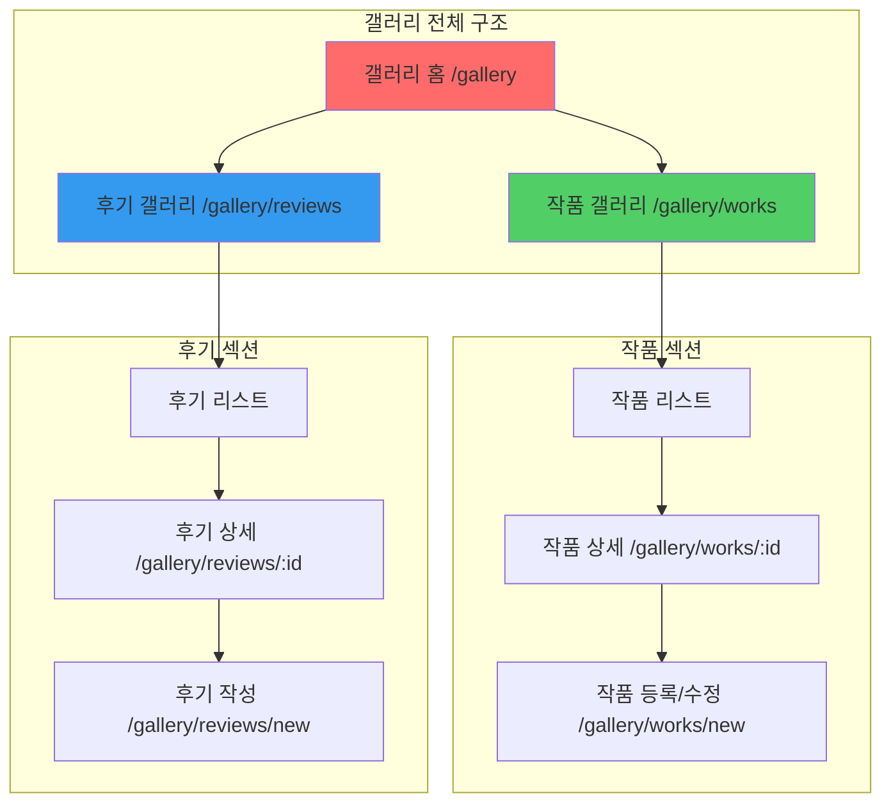
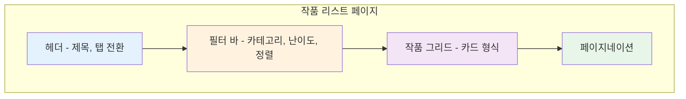
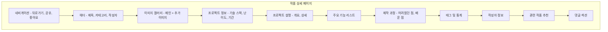
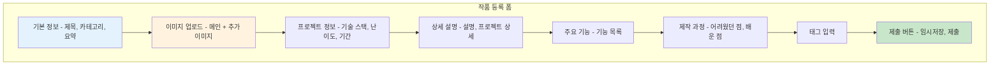
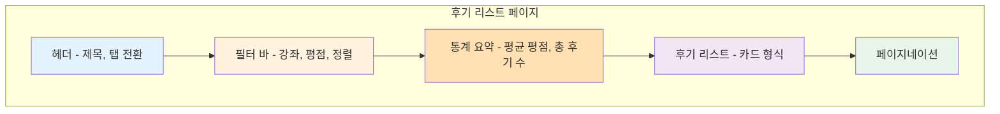
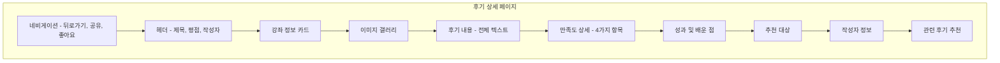
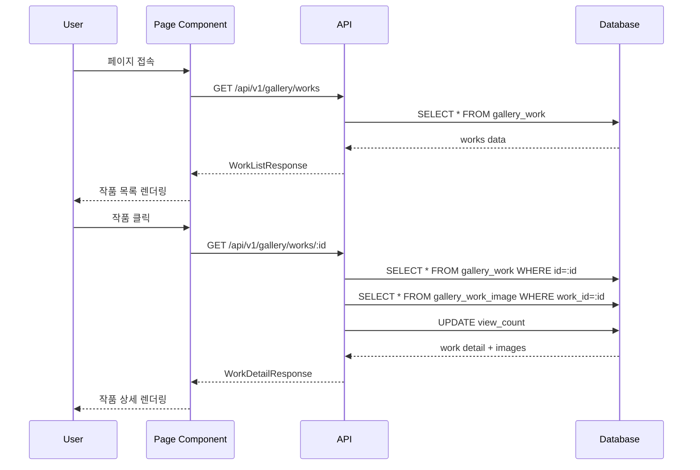
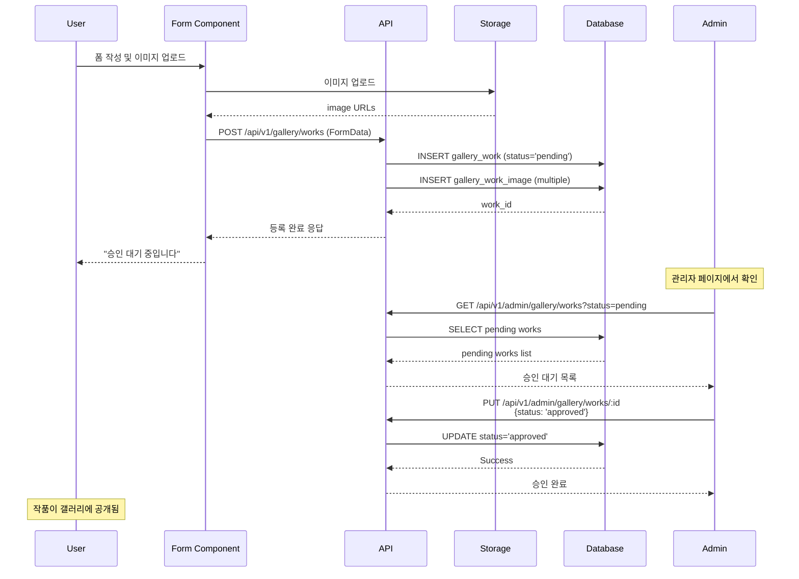
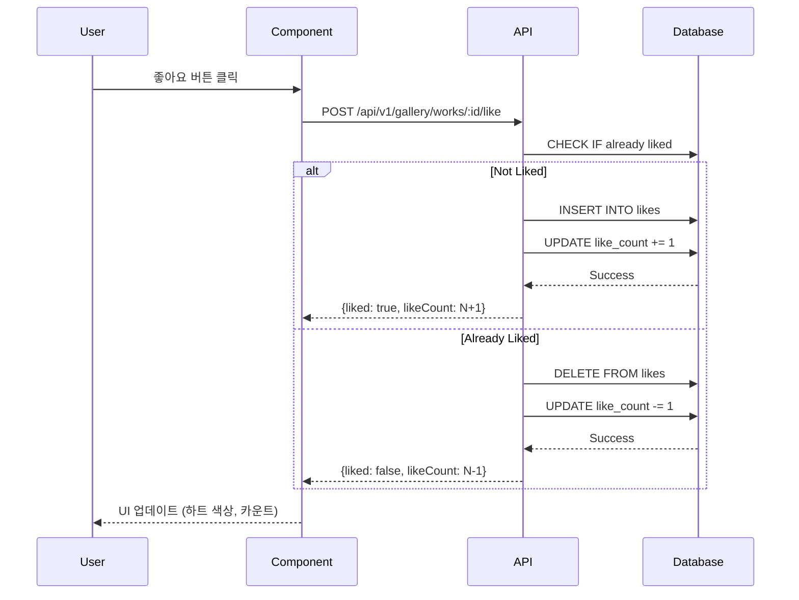
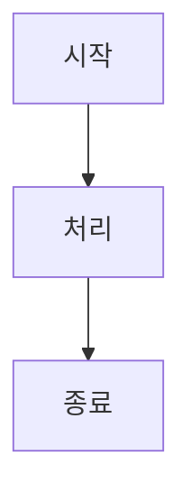

# 갤러리 구현 가이드

## 📋 목차

1. [개요](#-개요)
2. [페이지 구조](#-페이지-구조)
3. [학생 작품 갤러리](#-학생-작품-갤러리)
4. [수업 후기 갤러리](#-수업-후기-갤러리)
5. [컴포넌트 구조](#-컴포넌트-구조)
6. [API 연동](#-api-연동)
7. [상태 관리](#-상태-관리)
8. [데이터 흐름](#-데이터-흐름)

---

## 📖 개요

갤러리는 **학생 작품**과 **수업 후기** 두 가지 섹션으로 구성됩니다.

### 주요 특징

| 구분 | 학생 작품 | 수업 후기 |
|------|----------|----------|
| **목적** | 학생들이 만든 프로젝트 전시 | 수강생들의 솔직한 수업 경험 공유 |
| **주요 콘텐츠** | 프로젝트 이미지, 기술 스택, 제작 과정 | 평점, 만족도, 추천 여부 |
| **필터링** | 카테고리, 난이도, 기술 스택 | 강좌명, 평점, 학년 |
| **정렬** | 최신순, 인기순, 조회수순 | 최신순, 평점순, 추천순 |

---

## 📄 페이지 구조



### 라우팅 구조

```
/gallery
├── /gallery/works                 # 학생 작품 리스트
├── /gallery/works/:id             # 작품 상세
├── /gallery/works/new             # 작품 등록 (로그인 필요)
├── /gallery/works/:id/edit        # 작품 수정 (작성자만)
│
├── /gallery/reviews               # 수업 후기 리스트
├── /gallery/reviews/:id           # 후기 상세
├── /gallery/reviews/new           # 후기 작성 (수강생만)
└── /gallery/reviews/:id/edit      # 후기 수정 (작성자만)
```

---

## 🎨 학생 작품 갤러리

### 1. 작품 리스트 페이지 (`/gallery/works`)

#### 페이지 레이아웃



#### UI 구성 요소

**1. 헤더**
```typescript
interface GalleryHeader {
  title: string;              // "학생 작품"
  description: string;        // "학생들의 창의적인 프로젝트를 만나보세요"
  tabs: {
    label: string;
    value: 'works' | 'reviews';
    href: string;
  }[];
  showCreateButton: boolean;  // 로그인 시 "작품 등록" 버튼
}
```

**2. 필터 바**
```typescript
interface FilterBar {
  category: {
    label: string;
    options: {
      value: string;
      label: string;
      count?: number;
    }[];
  };
  difficulty: {
    label: string;
    options: ('beginner' | 'intermediate' | 'advanced')[];
  };
  sort: {
    label: string;
    options: ('latest' | 'popular' | 'views')[];
  };
  searchQuery: string;        // 검색어
}
```

**카테고리 옵션:**
- IoT (사물인터넷)
- 앱개발
- 로보틱스
- AI/머신러닝
- 게임 개발
- 웹 개발

**3. 작품 카드**
```typescript
interface WorkCard {
  id: number;
  title: string;
  summary: string;
  category: string;
  difficulty: 'beginner' | 'intermediate' | 'advanced';
  mainImage: string;
  authorName: string;
  authorGrade: string;
  techStack: string[];        // 최대 3개 표시
  tags: string[];             // 최대 5개 표시
  viewCount: number;
  likeCount: number;
  isFeatured: boolean;        // 추천 작품 배지
  createdAt: string;
}
```

**카드 디자인:**
```
┌─────────────────────────────────┐
│  ┌──────────────────────────┐   │ ← 추천 배지 (is_featured)
│  │                          │   │
│  │   메인 이미지             │   │
│  │   (16:9 비율)            │   │
│  │                          │   │
│  └──────────────────────────┘   │
│                                  │
│  🏷️ IoT    ⭐ Intermediate      │ ← 카테고리, 난이도
│                                  │
│  스마트 홈 IoT 시스템              │ ← 제목 (Bold)
│  라즈베리파이로 만든 음성 인식...   │ ← 요약 (2줄)
│                                  │
│  👤 김민준 (고1)                   │ ← 작성자
│                                  │
│  [Python] [Raspberry Pi] [IoT]  │ ← 기술 스택 (배지)
│  #라즈베리파이 #음성인식 #스마트홈  │ ← 태그
│                                  │
│  👁️ 234   ❤️ 45   📅 3개월 전      │ ← 통계
└─────────────────────────────────┘
```

#### 데이터 구조

```typescript
// API 응답
interface WorkListResponse {
  success: boolean;
  data: {
    items: WorkCard[];
    pagination: {
      page: number;
      pageSize: number;
      totalItems: number;
      totalPages: number;
      hasNext: boolean;
      hasPrev: boolean;
    };
    filters: {
      appliedFilters: {
        category?: string;
        difficulty?: string;
        sort?: string;
        search?: string;
      };
    };
  };
}
```

#### API 호출

```typescript
// app/gallery/works/page.tsx
import { getWorks } from '@/lib/gallery/api';

export default async function WorksListPage({
  searchParams,
}: {
  searchParams: { 
    page?: string; 
    category?: string;
    difficulty?: string;
    sort?: string;
    search?: string;
  }
}) {
  const page = Number(searchParams.page) || 1;
  const category = searchParams.category;
  const difficulty = searchParams.difficulty;
  const sort = searchParams.sort || 'latest';
  const search = searchParams.search;

  const works = await getWorks({
    page,
    pageSize: 12,
    category,
    difficulty,
    sort,
    search,
  });

  return (
    <div className="container mx-auto px-4 py-8">
      {/* 헤더 */}
      <GalleryHeader type="works" />
      
      {/* 필터 바 */}
      <FilterBar
        category={category}
        difficulty={difficulty}
        sort={sort}
        search={search}
      />
      
      {/* 작품 그리드 */}
      <div className="grid grid-cols-1 md:grid-cols-2 lg:grid-cols-3 xl:grid-cols-4 gap-6">
        {works.data.items.map((work) => (
          <WorkCard key={work.id} work={work} />
        ))}
      </div>
      
      {/* 페이지네이션 */}
      <Pagination pagination={works.data.pagination} />
    </div>
  );
}
```

---

### 2. 작품 상세 페이지 (`/gallery/works/:id`)

#### 페이지 레이아웃



#### UI 구성 요소

**1. 헤더 섹션**
```typescript
interface WorkDetailHeader {
  title: string;
  category: string;
  difficulty: 'beginner' | 'intermediate' | 'advanced';
  authorName: string;
  authorGrade: string;
  authorProfile?: string;
  isFeatured: boolean;
  createdAt: string;
  viewCount: number;
  likeCount: number;
  isLiked: boolean;          // 현재 사용자가 좋아요 했는지
}
```

**2. 이미지 갤러리**
```typescript
interface ImageGallery {
  mainImage: string;
  images: {
    id: number;
    imageUrl: string;
    caption?: string;
    order: number;
  }[];
}
```

**갤러리 디자인:**
- Lightbox 스타일 (확대 가능)
- 썸네일 네비게이션
- 스와이프 제스처 지원 (모바일)

**3. 프로젝트 정보**
```typescript
interface ProjectInfo {
  techStack: string[];       // 기술 스택
  tools: string[];           // 사용 도구
  difficulty: string;        // 난이도
  duration: string;          // 제작 기간
  features: string[];        // 주요 기능
  challenges: string;        // 어려웠던 점
  learnings: string;         // 배운 점
}
```

**4. 상세 레이아웃**

```
┌────────────────────────────────────────────────┐
│ ← 뒤로가기    공유 🔗    좋아요 ❤️ (45)           │
├────────────────────────────────────────────────┤
│                                                │
│  🏷️ IoT                     ⭐ 추천 작품         │
│  스마트 홈 IoT 시스템                            │
│  라즈베리파이로 만든 음성 인식 스마트 홈 제어 시스템│
│                                                │
│  👤 김민준 (고1)        📅 2025년 2월 15일       │
│  👁️ 234 조회            ❤️ 45 좋아요             │
│                                                │
├────────────────────────────────────────────────┤
│                                                │
│  ┌────────────────────────────────────────┐   │
│  │                                        │   │
│  │        메인 이미지 (큰 사이즈)          │   │
│  │                                        │   │
│  └────────────────────────────────────────┘   │
│                                                │
│  [썸네일1] [썸네일2] [썸네일3] [썸네일4]        │
│                                                │
├────────────────────────────────────────────────┤
│  📊 프로젝트 정보                               │
│  ━━━━━━━━━━━━━━━━━━━━━━━━━━━━━━━━━━━━━━━━━  │
│                                                │
│  기술 스택                                      │
│  [Python] [Raspberry Pi] [Google Assistant]   │
│  [MQTT] [Flask]                               │
│                                                │
│  사용 도구                                      │
│  • Raspbian OS                                │
│  • VS Code                                    │
│  • Home Assistant                             │
│                                                │
│  난이도: ⭐⭐⭐ Intermediate                     │
│  제작 기간: 3개월                               │
│                                                │
├────────────────────────────────────────────────┤
│  📝 프로젝트 설명                               │
│  ━━━━━━━━━━━━━━━━━━━━━━━━━━━━━━━━━━━━━━━━━  │
│                                                │
│  라즈베리파이와 다양한 센서를 활용하여           │
│  음성으로 제어할 수 있는 스마트 홈 시스템을...   │
│                                                │
├────────────────────────────────────────────────┤
│  ✨ 주요 기능                                    │
│  ━━━━━━━━━━━━━━━━━━━━━━━━━━━━━━━━━━━━━━━━━  │
│                                                │
│  ✅ 음성 명령으로 조명/온도/습도 제어            │
│  ✅ 모바일 앱 원격 제어                         │
│  ✅ 센서 데이터 실시간 모니터링                 │
│  ✅ 자동화 시나리오 설정                        │
│                                                │
├────────────────────────────────────────────────┤
│  🔧 제작 과정                                   │
│  ━━━━━━━━━━━━━━━━━━━━━━━━━━━━━━━━━━━━━━━━━  │
│                                                │
│  어려웠던 점                                    │
│  여러 센서를 동시에 제어하고 음성 인식의         │
│  정확도를 높이는 것이 어려웠습니다...            │
│                                                │
│  배운 점                                        │
│  IoT 통신 프로토콜(MQTT)과 API 연동 방법을...   │
│                                                │
├────────────────────────────────────────────────┤
│  🏷️ 태그                                        │
│  #라즈베리파이 #IoT #음성인식 #스마트홈         │
│                                                │
├────────────────────────────────────────────────┤
│  👤 작성자 정보                                 │
│  김민준 (고1)                                   │
│  다른 작품 보기 →                               │
│                                                │
├────────────────────────────────────────────────┤
│  🔍 관련 작품                                   │
│  [작품1] [작품2] [작품3]                        │
│                                                │
└────────────────────────────────────────────────┘
```

#### 데이터 구조

```typescript
interface WorkDetail {
  id: number;
  title: string;
  summary: string;
  description: string;
  category: string;
  
  // 작성자
  authorName: string;
  authorGrade: string;
  userId?: number;
  
  // 이미지
  mainImage: string;
  images: {
    id: number;
    imageUrl: string;
    caption?: string;
    order: number;
  }[];
  
  // 프로젝트 상세
  projectDetails: string;
  techStack: string[];
  tools: string[];
  difficulty: 'beginner' | 'intermediate' | 'advanced';
  duration: string;
  features: string[];
  challenges: string;
  learnings: string;
  
  // 태그
  tags: string[];
  
  // 통계
  viewCount: number;
  likeCount: number;
  isLiked: boolean;
  isFeatured: boolean;
  
  // 시스템
  status: string;
  createdAt: string;
  updatedAt: string;
}

interface WorkDetailResponse {
  success: boolean;
  data: WorkDetail;
}
```

#### API 호출

```typescript
// app/gallery/works/[id]/page.tsx
import { getWorkById } from '@/lib/gallery/api';

export default async function WorkDetailPage({
  params,
}: {
  params: { id: string }
}) {
  const work = await getWorkById(params.id);

  if (!work.success) {
    notFound();
  }

  return (
    <div className="container mx-auto px-4 py-8">
      {/* 네비게이션 */}
      <WorkNavigation workId={work.data.id} />
      
      {/* 헤더 */}
      <WorkHeader work={work.data} />
      
      {/* 이미지 갤러리 */}
      <ImageGallery 
        mainImage={work.data.mainImage}
        images={work.data.images}
      />
      
      {/* 프로젝트 정보 */}
      <ProjectInfo
        techStack={work.data.techStack}
        tools={work.data.tools}
        difficulty={work.data.difficulty}
        duration={work.data.duration}
      />
      
      {/* 프로젝트 설명 */}
      <ProjectDescription
        description={work.data.description}
        projectDetails={work.data.projectDetails}
      />
      
      {/* 주요 기능 */}
      <FeatureList features={work.data.features} />
      
      {/* 제작 과정 */}
      <CreationProcess
        challenges={work.data.challenges}
        learnings={work.data.learnings}
      />
      
      {/* 태그 */}
      <TagList tags={work.data.tags} />
      
      {/* 작성자 정보 */}
      <AuthorInfo
        authorName={work.data.authorName}
        authorGrade={work.data.authorGrade}
        userId={work.data.userId}
      />
      
      {/* 관련 작품 */}
      <RelatedWorks 
        category={work.data.category}
        currentWorkId={work.data.id}
      />
    </div>
  );
}
```

---

### 3. 작품 등록/수정 페이지 (`/gallery/works/new`, `/gallery/works/:id/edit`)

#### 폼 구조



#### 폼 필드

```typescript
interface WorkFormData {
  // 필수 필드
  title: string;                    // 제목 (최대 200자)
  category: string;                 // 카테고리
  summary: string;                  // 요약 (최대 500자)
  description: string;              // 설명
  mainImage: File;                  // 메인 이미지
  
  // 선택 필드
  images?: File[];                  // 추가 이미지 (최대 5개)
  projectDetails?: string;          // 프로젝트 상세 설명
  techStack?: string[];             // 기술 스택
  tools?: string[];                 // 사용 도구
  difficulty?: 'beginner' | 'intermediate' | 'advanced';
  duration?: string;                // 제작 기간
  features?: string[];              // 주요 기능
  challenges?: string;              // 어려웠던 점
  learnings?: string;               // 배운 점
  tags?: string[];                  // 태그 (최대 10개)
}
```

#### 폼 레이아웃

```
┌────────────────────────────────────────────────┐
│  작품 등록                                      │
├────────────────────────────────────────────────┤
│                                                │
│  1. 기본 정보                                   │
│  ━━━━━━━━━━━━━━━━━━━━━━━━━━━━━━━━━━━━━━━━━  │
│                                                │
│  작품명 *                                       │
│  ┌──────────────────────────────────────┐     │
│  │                                      │     │
│  └──────────────────────────────────────┘     │
│                                                │
│  카테고리 *                                     │
│  [IoT ▼]                                       │
│                                                │
│  요약 *                                         │
│  ┌──────────────────────────────────────┐     │
│  │                                      │     │
│  │                                      │     │
│  └──────────────────────────────────────┘     │
│  0 / 500자                                     │
│                                                │
├────────────────────────────────────────────────┤
│  2. 이미지 업로드                               │
│  ━━━━━━━━━━━━━━━━━━━━━━━━━━━━━━━━━━━━━━━━━  │
│                                                │
│  메인 이미지 * (1개)                            │
│  ┌────────────────┐                           │
│  │  📷 클릭하여    │                           │
│  │  이미지 업로드  │                           │
│  └────────────────┘                           │
│                                                │
│  추가 이미지 (최대 5개)                         │
│  ┌──┐ ┌──┐ ┌──┐ ┌──┐ ┌──┐                   │
│  │+│  │  │  │  │  │  │  │  │                   │
│  └──┘ └──┘ └──┘ └──┘ └──┘                   │
│                                                │
├────────────────────────────────────────────────┤
│  3. 프로젝트 정보                               │
│  ━━━━━━━━━━━━━━━━━━━━━━━━━━━━━━━━━━━━━━━━━  │
│                                                │
│  기술 스택                                      │
│  ┌──────────────────────────────────────┐     │
│  │ [Python] [Raspberry Pi] [x]          │     │
│  │ + 기술 추가                           │     │
│  └──────────────────────────────────────┘     │
│                                                │
│  사용 도구                                      │
│  ┌──────────────────────────────────────┐     │
│  │                                      │     │
│  └──────────────────────────────────────┘     │
│                                                │
│  난이도                                         │
│  ○ 초급    ○ 중급    ○ 고급                    │
│                                                │
│  제작 기간                                      │
│  ┌────────┐                                   │
│  │ 3개월  │                                   │
│  └────────┘                                   │
│                                                │
├────────────────────────────────────────────────┤
│  4. 상세 설명                                   │
│  ━━━━━━━━━━━━━━━━━━━━━━━━━━━━━━━━━━━━━━━━━  │
│                                                │
│  프로젝트 설명 *                                │
│  ┌──────────────────────────────────────┐     │
│  │                                      │     │
│  │                                      │     │
│  │                                      │     │
│  └──────────────────────────────────────┘     │
│                                                │
│  프로젝트 상세                                  │
│  ┌──────────────────────────────────────┐     │
│  │                                      │     │
│  └──────────────────────────────────────┘     │
│                                                │
├────────────────────────────────────────────────┤
│  5. 주요 기능                                   │
│  ━━━━━━━━━━━━━━━━━━━━━━━━━━━━━━━━━━━━━━━━━  │
│                                                │
│  • 기능 1                                       │
│  • 기능 2                                       │
│  + 기능 추가                                    │
│                                                │
├────────────────────────────────────────────────┤
│  6. 제작 과정                                   │
│  ━━━━━━━━━━━━━━━━━━━━━━━━━━━━━━━━━━━━━━━━━  │
│                                                │
│  어려웠던 점                                    │
│  ┌──────────────────────────────────────┐     │
│  │                                      │     │
│  └──────────────────────────────────────┘     │
│                                                │
│  배운 점                                        │
│  ┌──────────────────────────────────────┐     │
│  │                                      │     │
│  └──────────────────────────────────────┘     │
│                                                │
├────────────────────────────────────────────────┤
│  7. 태그                                        │
│  ━━━━━━━━━━━━━━━━━━━━━━━━━━━━━━━━━━━━━━━━━  │
│                                                │
│  [라즈베리파이] [IoT] [음성인식] [x]            │
│  ┌──────────────────────────────────────┐     │
│  │ 태그 입력 후 Enter                    │     │
│  └──────────────────────────────────────┘     │
│                                                │
├────────────────────────────────────────────────┤
│                                                │
│  [임시저장]              [제출하기]             │
│                                                │
└────────────────────────────────────────────────┘
```

#### API 호출

```typescript
// app/gallery/works/new/page.tsx
'use client';

import { useState } from 'react';
import { createWork } from '@/lib/gallery/api';
import { useRouter } from 'next/navigation';

export default function WorkCreatePage() {
  const router = useRouter();
  const [formData, setFormData] = useState<WorkFormData>({
    title: '',
    category: '',
    summary: '',
    description: '',
    mainImage: null,
    images: [],
    techStack: [],
    difficulty: 'beginner',
    tags: [],
  });

  const handleSubmit = async (e: React.FormEvent) => {
    e.preventDefault();
    
    // FormData 생성 (multipart/form-data)
    const data = new FormData();
    data.append('title', formData.title);
    data.append('category', formData.category);
    data.append('summary', formData.summary);
    data.append('description', formData.description);
    
    if (formData.mainImage) {
      data.append('main_image', formData.mainImage);
    }
    
    formData.images?.forEach((image) => {
      data.append('images[]', image);
    });
    
    formData.techStack?.forEach((tech) => {
      data.append('tech_stack[]', tech);
    });
    
    // ... 나머지 필드들
    
    try {
      const result = await createWork(data);
      
      if (result.success) {
        alert('작품이 등록되었습니다. 관리자 승인 후 공개됩니다.');
        router.push(`/gallery/works/${result.data.id}`);
      }
    } catch (error) {
      console.error('작품 등록 실패:', error);
      alert('작품 등록에 실패했습니다.');
    }
  };

  return (
    <div className="container mx-auto px-4 py-8">
      <h1 className="text-3xl font-bold mb-8">작품 등록</h1>
      
      <form onSubmit={handleSubmit} className="space-y-8">
        {/* 기본 정보 */}
        <section>
          <h2 className="text-2xl font-semibold mb-4">1. 기본 정보</h2>
          
          <div className="space-y-4">
            <div>
              <label className="block mb-2">작품명 *</label>
              <input
                type="text"
                value={formData.title}
                onChange={(e) => setFormData({ ...formData, title: e.target.value })}
                className="w-full px-4 py-2 border rounded"
                required
                maxLength={200}
              />
            </div>
            
            <div>
              <label className="block mb-2">카테고리 *</label>
              <select
                value={formData.category}
                onChange={(e) => setFormData({ ...formData, category: e.target.value })}
                className="w-full px-4 py-2 border rounded"
                required
              >
                <option value="">선택하세요</option>
                <option value="IoT">IoT</option>
                <option value="앱개발">앱개발</option>
                <option value="로보틱스">로보틱스</option>
                <option value="AI">AI/머신러닝</option>
                <option value="게임개발">게임 개발</option>
                <option value="웹개발">웹 개발</option>
              </select>
            </div>
            
            <div>
              <label className="block mb-2">요약 *</label>
              <textarea
                value={formData.summary}
                onChange={(e) => setFormData({ ...formData, summary: e.target.value })}
                className="w-full px-4 py-2 border rounded"
                rows={3}
                required
                maxLength={500}
              />
              <p className="text-sm text-gray-500 mt-1">
                {formData.summary.length} / 500자
              </p>
            </div>
          </div>
        </section>
        
        {/* 이미지 업로드 */}
        <section>
          <h2 className="text-2xl font-semibold mb-4">2. 이미지 업로드</h2>
          <ImageUpload
            mainImage={formData.mainImage}
            images={formData.images}
            onChange={(mainImage, images) => 
              setFormData({ ...formData, mainImage, images })
            }
          />
        </section>
        
        {/* 나머지 섹션들... */}
        
        {/* 제출 버튼 */}
        <div className="flex justify-end gap-4">
          <button
            type="button"
            className="px-6 py-2 border rounded"
            onClick={() => router.back()}
          >
            취소
          </button>
          <button
            type="submit"
            className="px-6 py-2 bg-blue-600 text-white rounded"
          >
            제출하기
          </button>
        </div>
      </form>
    </div>
  );
}
```

---

## 📝 수업 후기 갤러리

### 1. 후기 리스트 페이지 (`/gallery/reviews`)

#### 페이지 레이아웃



#### UI 구성 요소

**1. 통계 요약**
```typescript
interface ReviewStats {
  totalReviews: number;
  averageRating: number;
  ratingDistribution: {
    5: number;
    4: number;
    3: number;
    2: number;
    1: number;
  };
  wouldRecommendPercentage: number;
}
```

**통계 요약 디자인:**
```
┌────────────────────────────────────────────────┐
│  📊 전체 후기 통계                              │
├────────────────────────────────────────────────┤
│                                                │
│     ⭐ 4.8 / 5.0                               │
│     총 158개의 후기                             │
│                                                │
│  5⭐ ████████████████████ 120 (76%)           │
│  4⭐ ██████████ 28 (18%)                       │
│  3⭐ ██ 8 (5%)                                 │
│  2⭐ █ 2 (1%)                                  │
│  1⭐ ▌ 0 (0%)                                  │
│                                                │
│  💯 95% 수강생이 추천합니다                     │
│                                                │
└────────────────────────────────────────────────┘
```

**2. 후기 카드**
```typescript
interface ReviewCard {
  id: number;
  title: string;
  summary: string;
  content: string;           // 일부만 표시
  category: string;
  mainImage?: string;
  
  // 작성자
  authorName: string;
  studentGrade: string;
  
  // 평가
  rating: number;
  courseType: string;
  courseDuration: string;
  classType: string;
  wouldRecommend: boolean;
  
  // 만족도
  satisfaction: {
    curriculum: number;
    instructor: number;
    facility: number;
    management: number;
  };
  
  // 통계
  viewCount: number;
  likeCount: number;
  isFeatured: boolean;
  
  // 강좌 정보
  schedule?: {
    id: number;
    title: string;
  };
  
  createdAt: string;
}
```

**후기 카드 디자인:**
```
┌─────────────────────────────────────┐
│  ⭐⭐⭐⭐⭐ 5.0                       │ ← 평점
│                                     │
│  3개월 동안 로봇코딩을 배우며          │ ← 제목 (Bold)
│  처음에는 어려웠지만 선생님께서...     │ ← 요약 (2줄)
│                                     │
│  👤 박지민 (중1)  📅 3개월 전         │ ← 작성자, 날짜
│                                     │
│  🎓 로봇코딩 정규반                   │ ← 강좌명
│  📆 3개월 수강   👥 소규모반          │ ← 수강 정보
│                                     │
│  💯 이 수업을 추천합니다!             │ ← 추천 여부
│                                     │
│  만족도                              │
│  커리큘럼 ⭐⭐⭐⭐⭐                  │
│  강사     ⭐⭐⭐⭐⭐                  │
│  시설     ⭐⭐⭐⭐                    │
│  운영     ⭐⭐⭐⭐⭐                  │
│                                     │
│  👁️ 123   ❤️ 34                     │ ← 통계
└─────────────────────────────────────┘
```

#### 데이터 구조

```typescript
interface ReviewListResponse {
  success: boolean;
  data: {
    stats: ReviewStats;
    items: ReviewCard[];
    pagination: {
      page: number;
      pageSize: number;
      totalItems: number;
      totalPages: number;
    };
  };
}
```

---

### 2. 후기 상세 페이지 (`/gallery/reviews/:id`)

#### 페이지 레이아웃



#### 상세 레이아웃

```
┌────────────────────────────────────────────────┐
│ ← 뒤로가기    공유 🔗    좋아요 ❤️ (34)           │
├────────────────────────────────────────────────┤
│                                                │
│  ⭐⭐⭐⭐⭐ 5.0                 ✨ 추천 후기      │
│  3개월 동안 로봇코딩을 배우며                    │
│                                                │
│  👤 박지민 (중1)        📅 2025년 3월 10일       │
│  👁️ 123 조회            ❤️ 34 좋아요             │
│                                                │
├────────────────────────────────────────────────┤
│  📚 수강한 강좌                                 │
│  ━━━━━━━━━━━━━━━━━━━━━━━━━━━━━━━━━━━━━━━━━  │
│                                                │
│  로봇코딩 정규반                                │
│  📆 2024년 12월 - 2025년 3월 (3개월)            │
│  👥 소규모반 (6-8명)                            │
│  👨‍🏫 김선생님                                   │
│                                                │
│  강좌 상세보기 →                                │
│                                                │
├────────────────────────────────────────────────┤
│  📷 수업 사진                                   │
│  ┌──────────────────────────────────────┐     │
│  │        이미지 갤러리                  │     │
│  └──────────────────────────────────────┘     │
│                                                │
├────────────────────────────────────────────────┤
│  📝 후기 내용                                   │
│  ━━━━━━━━━━━━━━━━━━━━━━━━━━━━━━━━━━━━━━━━━  │
│                                                │
│  3개월 동안 로봇코딩 정규반을 수강하면서         │
│  많은 것을 배웠습니다. 처음에는 코딩이          │
│  너무 어려워서 걱정했는데, 선생님께서           │
│  차근차근 설명해주셔서 점점 이해가              │
│  되기 시작했습니다...                           │
│                                                │
├────────────────────────────────────────────────┤
│  📊 만족도 평가                                 │
│  ━━━━━━━━━━━━━━━━━━━━━━━━━━━━━━━━━━━━━━━━━  │
│                                                │
│  커리큘럼 ⭐⭐⭐⭐⭐ 5.0                         │
│  체계적인 커리큘럼으로 단계별 학습               │
│                                                │
│  강사 ⭐⭐⭐⭐⭐ 5.0                             │
│  친절하고 열정적인 강의                         │
│                                                │
│  시설 ⭐⭐⭐⭐ 4.0                               │
│  최신 장비와 깨끗한 환경                        │
│                                                │
│  운영 ⭐⭐⭐⭐⭐ 5.0                             │
│  체계적인 수업 관리와 소통                      │
│                                                │
├────────────────────────────────────────────────┤
│  ✨ 성과 및 배운 점                              │
│  ━━━━━━━━━━━━━━━━━━━━━━━━━━━━━━━━━━━━━━━━━  │
│                                                │
│  ✅ 자율주행 로봇 제작                          │
│  ✅ 센서 활용 프로젝트 완성                     │
│  ✅ 팀 프로젝트 발표                            │
│  ✅ 프로그래밍 기초 이해                        │
│                                                │
├────────────────────────────────────────────────┤
│  💡 이런 분들께 추천합니다                      │
│  ━━━━━━━━━━━━━━━━━━━━━━━━━━━━━━━━━━━━━━━━━  │
│                                                │
│  • 중학생                                       │
│  • 코딩 입문자                                  │
│  • 로봇에 관심 있는 학생                        │
│                                                │
├────────────────────────────────────────────────┤
│  💯 이 수업을 추천하시나요?                     │
│  ✅ 네, 추천합니다!                             │
│                                                │
├────────────────────────────────────────────────┤
│  👤 작성자 정보                                 │
│  박지민 (중1)                                   │
│  다른 후기 보기 →                               │
│                                                │
├────────────────────────────────────────────────┤
│  🔍 관련 후기                                   │
│  [후기1] [후기2] [후기3]                        │
│                                                │
└────────────────────────────────────────────────┘
```

---

## 🧩 컴포넌트 구조

### 디렉토리 구조

```
app/gallery/
├── page.tsx                       # 갤러리 홈 (리다이렉트)
├── layout.tsx                     # 갤러리 공통 레이아웃
│
├── works/
│   ├── page.tsx                   # 작품 리스트
│   ├── [id]/
│   │   ├── page.tsx              # 작품 상세
│   │   └── edit/
│   │       └── page.tsx          # 작품 수정
│   └── new/
│       └── page.tsx              # 작품 등록
│
└── reviews/
    ├── page.tsx                   # 후기 리스트
    ├── [id]/
    │   ├── page.tsx              # 후기 상세
    │   └── edit/
    │       └── page.tsx          # 후기 수정
    └── new/
        └── page.tsx              # 후기 작성

components/gallery/
├── shared/
│   ├── GalleryHeader.tsx         # 갤러리 헤더
│   ├── FilterBar.tsx             # 필터 바
│   ├── Pagination.tsx            # 페이지네이션
│   └── ImageGallery.tsx          # 이미지 갤러리
│
├── works/
│   ├── WorkCard.tsx              # 작품 카드
│   ├── WorkList.tsx              # 작품 리스트
│   ├── WorkDetail.tsx            # 작품 상세
│   ├── WorkForm.tsx              # 작품 폼
│   ├── ProjectInfo.tsx           # 프로젝트 정보
│   ├── FeatureList.tsx           # 기능 목록
│   └── TechStackBadge.tsx        # 기술 스택 배지
│
└── reviews/
    ├── ReviewCard.tsx            # 후기 카드
    ├── ReviewList.tsx            # 후기 리스트
    ├── ReviewDetail.tsx          # 후기 상세
    ├── ReviewForm.tsx            # 후기 폼
    ├── ReviewStats.tsx           # 후기 통계
    ├── RatingDisplay.tsx         # 평점 표시
    └── SatisfactionChart.tsx     # 만족도 차트

lib/gallery/
├── api.ts                        # API 함수
├── types.ts                      # 타입 정의
├── hooks.ts                      # 커스텀 훅
└── utils.ts                      # 유틸리티 함수
```

### 주요 컴포넌트

#### 1. WorkCard 컴포넌트

```typescript
// components/gallery/works/WorkCard.tsx
import Image from 'next/image';
import Link from 'next/link';
import { WorkCard as WorkCardType } from '@/lib/gallery/types';
import { TechStackBadge } from './TechStackBadge';

interface WorkCardProps {
  work: WorkCardType;
}

export function WorkCard({ work }: WorkCardProps) {
  return (
    <Link href={`/gallery/works/${work.id}`}>
      <div className="border rounded-lg overflow-hidden hover:shadow-lg transition-shadow">
        {/* 이미지 */}
        <div className="relative aspect-video">
          <Image
            src={work.mainImage}
            alt={work.title}
            fill
            className="object-cover"
          />
          {work.isFeatured && (
            <div className="absolute top-2 right-2 bg-yellow-400 text-black px-2 py-1 rounded text-sm font-semibold">
              ⭐ 추천
            </div>
          )}
        </div>
        
        {/* 내용 */}
        <div className="p-4">
          {/* 카테고리 & 난이도 */}
          <div className="flex items-center gap-2 mb-2">
            <span className="text-sm text-blue-600">🏷️ {work.category}</span>
            <span className="text-sm text-gray-500">
              {getDifficultyLabel(work.difficulty)}
            </span>
          </div>
          
          {/* 제목 */}
          <h3 className="font-bold text-lg mb-2 line-clamp-1">
            {work.title}
          </h3>
          
          {/* 요약 */}
          <p className="text-sm text-gray-600 mb-3 line-clamp-2">
            {work.summary}
          </p>
          
          {/* 작성자 */}
          <p className="text-sm text-gray-700 mb-3">
            👤 {work.authorName} ({work.authorGrade})
          </p>
          
          {/* 기술 스택 */}
          <div className="flex flex-wrap gap-1 mb-2">
            {work.techStack.slice(0, 3).map((tech) => (
              <TechStackBadge key={tech} tech={tech} />
            ))}
            {work.techStack.length > 3 && (
              <span className="text-xs text-gray-500">
                +{work.techStack.length - 3}
              </span>
            )}
          </div>
          
          {/* 태그 */}
          <div className="flex flex-wrap gap-1 mb-3">
            {work.tags.slice(0, 3).map((tag) => (
              <span key={tag} className="text-xs text-gray-500">
                #{tag}
              </span>
            ))}
          </div>
          
          {/* 통계 */}
          <div className="flex items-center gap-3 text-sm text-gray-500">
            <span>👁️ {work.viewCount}</span>
            <span>❤️ {work.likeCount}</span>
            <span>📅 {formatDate(work.createdAt)}</span>
          </div>
        </div>
      </div>
    </Link>
  );
}

function getDifficultyLabel(difficulty: string): string {
  const labels = {
    beginner: '⭐ 초급',
    intermediate: '⭐⭐ 중급',
    advanced: '⭐⭐⭐ 고급',
  };
  return labels[difficulty] || difficulty;
}

function formatDate(dateString: string): string {
  const date = new Date(dateString);
  const now = new Date();
  const diff = now.getTime() - date.getTime();
  const days = Math.floor(diff / (1000 * 60 * 60 * 24));
  
  if (days === 0) return '오늘';
  if (days === 1) return '어제';
  if (days < 7) return `${days}일 전`;
  if (days < 30) return `${Math.floor(days / 7)}주 전`;
  if (days < 365) return `${Math.floor(days / 30)}개월 전`;
  return `${Math.floor(days / 365)}년 전`;
}
```

#### 2. ReviewCard 컴포넌트

```typescript
// components/gallery/reviews/ReviewCard.tsx
import Link from 'next/link';
import { ReviewCard as ReviewCardType } from '@/lib/gallery/types';
import { RatingDisplay } from './RatingDisplay';

interface ReviewCardProps {
  review: ReviewCardType;
}

export function ReviewCard({ review }: ReviewCardProps) {
  return (
    <Link href={`/gallery/reviews/${review.id}`}>
      <div className="border rounded-lg p-6 hover:shadow-lg transition-shadow">
        {/* 평점 */}
        <div className="mb-3">
          <RatingDisplay rating={review.rating} size="lg" />
        </div>
        
        {/* 제목 */}
        <h3 className="font-bold text-lg mb-2 line-clamp-1">
          {review.title}
        </h3>
        
        {/* 요약 */}
        <p className="text-sm text-gray-600 mb-3 line-clamp-2">
          {review.summary}
        </p>
        
        {/* 작성자 & 날짜 */}
        <div className="flex items-center gap-3 text-sm text-gray-500 mb-3">
          <span>👤 {review.authorName} ({review.studentGrade})</span>
          <span>📅 {formatDate(review.createdAt)}</span>
        </div>
        
        {/* 강좌 정보 */}
        <div className="bg-blue-50 rounded p-3 mb-3">
          <p className="text-sm text-blue-800 font-medium">
            🎓 {review.courseType}
          </p>
          <div className="flex gap-3 text-xs text-blue-600 mt-1">
            <span>📆 {review.courseDuration}</span>
            <span>👥 {review.classType}</span>
          </div>
        </div>
        
        {/* 추천 여부 */}
        {review.wouldRecommend && (
          <div className="text-sm text-green-600 font-medium mb-3">
            💯 이 수업을 추천합니다!
          </div>
        )}
        
        {/* 만족도 */}
        <div className="space-y-1 mb-3">
          <div className="text-xs text-gray-700">만족도</div>
          {Object.entries(review.satisfaction).map(([key, value]) => (
            <div key={key} className="flex items-center gap-2 text-xs">
              <span className="w-16 text-gray-600">{getSatisfactionLabel(key)}</span>
              <RatingDisplay rating={value} size="sm" />
            </div>
          ))}
        </div>
        
        {/* 통계 */}
        <div className="flex items-center gap-3 text-sm text-gray-500">
          <span>👁️ {review.viewCount}</span>
          <span>❤️ {review.likeCount}</span>
        </div>
      </div>
    </Link>
  );
}

function getSatisfactionLabel(key: string): string {
  const labels = {
    curriculum: '커리큘럼',
    instructor: '강사',
    facility: '시설',
    management: '운영',
  };
  return labels[key] || key;
}
```

---

## 🔌 API 연동

### API 함수

```typescript
// lib/gallery/api.ts
import { apiClient } from '@/lib/api-client';
import {
  WorkListResponse,
  WorkDetailResponse,
  ReviewListResponse,
  ReviewDetailResponse,
} from './types';

// ============================================
// 학생 작품 API
// ============================================

/**
 * 작품 목록 조회
 */
export async function getWorks(params: {
  page?: number;
  pageSize?: number;
  category?: string;
  difficulty?: string;
  sort?: string;
  search?: string;
}): Promise<WorkListResponse> {
  const { data } = await apiClient.get('/gallery/works', { params });
  return data;
}

/**
 * 작품 상세 조회
 */
export async function getWorkById(id: string): Promise<WorkDetailResponse> {
  const { data } = await apiClient.get(`/gallery/works/${id}`);
  return data;
}

/**
 * 작품 등록
 */
export async function createWork(formData: FormData): Promise<any> {
  const { data } = await apiClient.post('/gallery/works', formData, {
    headers: {
      'Content-Type': 'multipart/form-data',
    },
  });
  return data;
}

/**
 * 작품 수정
 */
export async function updateWork(id: string, formData: FormData): Promise<any> {
  const { data } = await apiClient.put(`/gallery/works/${id}`, formData, {
    headers: {
      'Content-Type': 'multipart/form-data',
    },
  });
  return data;
}

/**
 * 작품 삭제
 */
export async function deleteWork(id: string): Promise<any> {
  const { data } = await apiClient.delete(`/gallery/works/${id}`);
  return data;
}

/**
 * 작품 좋아요
 */
export async function likeWork(id: string): Promise<any> {
  const { data } = await apiClient.post(`/gallery/works/${id}/like`);
  return data;
}

// ============================================
// 수업 후기 API
// ============================================

/**
 * 후기 목록 조회
 */
export async function getReviews(params: {
  page?: number;
  pageSize?: number;
  scheduleId?: string;
  rating?: number;
  sort?: string;
}): Promise<ReviewListResponse> {
  const { data } = await apiClient.get('/gallery/reviews', { params });
  return data;
}

/**
 * 후기 상세 조회
 */
export async function getReviewById(id: string): Promise<ReviewDetailResponse> {
  const { data } = await apiClient.get(`/gallery/reviews/${id}`);
  return data;
}

/**
 * 후기 등록
 */
export async function createReview(formData: FormData): Promise<any> {
  const { data } = await apiClient.post('/gallery/reviews', formData, {
    headers: {
      'Content-Type': 'multipart/form-data',
    },
  });
  return data;
}

/**
 * 후기 수정
 */
export async function updateReview(id: string, formData: FormData): Promise<any> {
  const { data } = await apiClient.put(`/gallery/reviews/${id}`, formData, {
    headers: {
      'Content-Type': 'multipart/form-data',
    },
  });
  return data;
}

/**
 * 후기 삭제
 */
export async function deleteReview(id: string): Promise<any> {
  const { data } = await apiClient.delete(`/gallery/reviews/${id}`);
  return data;
}

/**
 * 후기 좋아요
 */
export async function likeReview(id: string): Promise<any> {
  const { data } = await apiClient.post(`/gallery/reviews/${id}/like`);
  return data;
}
```

### 커스텀 훅

```typescript
// lib/gallery/hooks.ts
'use client';

import { useState, useEffect } from 'react';
import { useRouter } from 'next/navigation';
import { getWorks, getReviews, likeWork, likeReview } from './api';
import type { WorkCard, ReviewCard } from './types';

/**
 * 작품 리스트 훅
 */
export function useWorks(params: {
  page?: number;
  pageSize?: number;
  category?: string;
  difficulty?: string;
  sort?: string;
}) {
  const [works, setWorks] = useState<WorkCard[]>([]);
  const [loading, setLoading] = useState(true);
  const [error, setError] = useState<Error | null>(null);

  useEffect(() => {
    const fetchWorks = async () => {
      try {
        setLoading(true);
        const response = await getWorks(params);
        setWorks(response.data.items);
      } catch (err) {
        setError(err as Error);
      } finally {
        setLoading(false);
      }
    };

    fetchWorks();
  }, [JSON.stringify(params)]);

  return { works, loading, error };
}

/**
 * 좋아요 토글 훅
 */
export function useLike(id: string, type: 'work' | 'review') {
  const [isLiked, setIsLiked] = useState(false);
  const [likeCount, setLikeCount] = useState(0);
  const [loading, setLoading] = useState(false);

  const toggleLike = async () => {
    if (loading) return;

    try {
      setLoading(true);
      
      if (type === 'work') {
        await likeWork(id);
      } else {
        await likeReview(id);
      }
      
      setIsLiked(!isLiked);
      setLikeCount(isLiked ? likeCount - 1 : likeCount + 1);
    } catch (error) {
      console.error('좋아요 실패:', error);
    } finally {
      setLoading(false);
    }
  };

  return { isLiked, likeCount, toggleLike, loading };
}

/**
 * 작품/후기 삭제 훅
 */
export function useDelete(id: string, type: 'work' | 'review') {
  const router = useRouter();
  const [loading, setLoading] = useState(false);

  const handleDelete = async () => {
    if (!confirm('정말 삭제하시겠습니까?')) return;

    try {
      setLoading(true);
      
      if (type === 'work') {
        await deleteWork(id);
        router.push('/gallery/works');
      } else {
        await deleteReview(id);
        router.push('/gallery/reviews');
      }
      
      alert('삭제되었습니다.');
    } catch (error) {
      console.error('삭제 실패:', error);
      alert('삭제에 실패했습니다.');
    } finally {
      setLoading(false);
    }
  };

  return { handleDelete, loading };
}
```

---

## 🔄 상태 관리

### 필터 상태 관리

```typescript
// lib/gallery/filter-store.ts
import { create } from 'zustand';

interface FilterState {
  // 작품 필터
  workFilters: {
    category?: string;
    difficulty?: string;
    sort: string;
    search?: string;
  };
  
  // 후기 필터
  reviewFilters: {
    scheduleId?: string;
    rating?: number;
    sort: string;
  };
  
  // Actions
  setWorkFilters: (filters: Partial<FilterState['workFilters']>) => void;
  setReviewFilters: (filters: Partial<FilterState['reviewFilters']>) => void;
  resetFilters: () => void;
}

export const useFilterStore = create<FilterState>((set) => ({
  workFilters: {
    sort: 'latest',
  },
  reviewFilters: {
    sort: 'latest',
  },
  
  setWorkFilters: (filters) =>
    set((state) => ({
      workFilters: { ...state.workFilters, ...filters },
    })),
    
  setReviewFilters: (filters) =>
    set((state) => ({
      reviewFilters: { ...state.reviewFilters, ...filters },
    })),
    
  resetFilters: () =>
    set({
      workFilters: { sort: 'latest' },
      reviewFilters: { sort: 'latest' },
    }),
}));
```

---

## 📊 데이터 흐름

### 작품 조회 플로우



### 작품 등록 플로우



### 좋아요 플로우



---

## 🎨 스타일링 가이드

### Tailwind CSS 클래스

**작품 카드:**
```css
/* 카드 컨테이너 */
.work-card {
  @apply border rounded-lg overflow-hidden hover:shadow-lg transition-shadow cursor-pointer;
}

/* 이미지 영역 */
.work-card-image {
  @apply relative aspect-video bg-gray-100;
}

/* 제목 */
.work-card-title {
  @apply font-bold text-lg mb-2 line-clamp-1;
}

/* 요약 */
.work-card-summary {
  @apply text-sm text-gray-600 mb-3 line-clamp-2;
}

/* 기술 스택 배지 */
.tech-badge {
  @apply inline-flex items-center px-2 py-1 rounded-full text-xs font-medium bg-blue-100 text-blue-800;
}
```

**후기 카드:**
```css
/* 평점 표시 */
.rating-display {
  @apply flex items-center gap-1;
}

.rating-star {
  @apply text-yellow-400;
}

.rating-star-empty {
  @apply text-gray-300;
}

/* 만족도 바 */
.satisfaction-bar {
  @apply h-2 bg-blue-600 rounded-full transition-all;
}
```

### 반응형 디자인

```css
/* 모바일 (< 768px) */
@media (max-width: 767px) {
  .gallery-grid {
    @apply grid-cols-1 gap-4;
  }
  
  .filter-bar {
    @apply flex-col;
  }
}

/* 태블릿 (768px ~ 1023px) */
@media (min-width: 768px) and (max-width: 1023px) {
  .gallery-grid {
    @apply grid-cols-2 gap-5;
  }
}

/* 데스크톱 (>= 1024px) */
@media (min-width: 1024px) {
  .gallery-grid {
    @apply grid-cols-3 gap-6;
  }
}

/* 큰 화면 (>= 1280px) */
@media (min-width: 1280px) {
  .gallery-grid {
    @apply grid-cols-4 gap-6;
  }
}
```

---

아! 이해했습니다. `.md` 파일을 렌더링해서 보여주는 **교육 게시판 페이지**를 만들고 싶으신 거군요. 

마크다운 문서를 예쁘게 표시하는 게시판 형태의 페이지를 만들어드리겠습니다!

[2 tools called]

이해했습니다! 마크다운 파일을 렌더링해서 보여주는 **교육 게시판 페이지**를 만들어드리겠습니다.

먼저 필요한 라이브러리를 설치하고, 게시판 페이지를 생성하겠습니다.

[1 tool called]

패키지 설치는 나중에 직접 하시고, 먼저 교육 게시판 페이지를 만들어드리겠습니다!

[3 tools called]

이제 헤더에 링크를 추가하고, 필요한 패키지 설치 안내를 만들겠습니다.

[4 tools called]

완벽합니다! 이제 최종 확인을 위한 안내 문서를 만들겠습니다.

[1 tool called]

완벽합니다! 🎉 **AI Maker Lab 교육 게시판**이 완성되었습니다!

---

## 🎓 생성된 교육 게시판 페이지

### 📁 파일 구조

```
frontend/
├── app/
│   └── docs/
│       ├── page.tsx                    ⭐ 문서 목록 페이지
│       └── [slug]/
│           ├── page.tsx                ⭐ 문서 상세 페이지
│           └── MarkdownRenderer.tsx    ⭐ 마크다운 렌더러
│
├── components/header/
│   └── config.ts                       ✏️ "교육 게시판" 메뉴 추가
│
├── documents/                          📚 마크다운 문서들
│   ├── API_INTEGRATION.md
│   ├── API_INTEGRATION_SUMMARY.md
│   ├── GALLERY_IMPLEMENTATION.md
│   └── ... (더 많은 문서)
│
└── DOCS_SETUP.md                       📖 설치 및 사용 가이드
```

---

## 🚀 빠른 시작

### 1. 필수 패키지 설치

```bash
cd frontend
npm install mermaid
```

### 2. 서버 실행

```bash
npm run dev
```

### 3. 브라우저에서 확인

```
http://localhost:3000/docs
```

---

## 🎨 주요 기능

### 1️⃣ 문서 목록 페이지 (`/docs`)

**디자인:**
```
┌─────────────────────────────────────────────┐
│  🎓 AI Maker Lab 교육 게시판                │
│  프로젝트 구조, API 명세, 구현 가이드...     │
│  📄 총 7개 문서 • 4개 카테고리              │
├─────────────────────────────────────────────┤
│                                             │
│  ▌Backend                          [3개 문서]│
│  ┌──────┐  ┌──────┐  ┌──────┐             │
│  │ 📊 │  │ 📊 │  │ 🔒 │             │
│  │ API  │  │ API  │  │인증  │             │
│  │ 통합 │  │ 요약 │  │시스템│             │
│  └──────┘  └──────┘  └──────┘             │
│                                             │
│  ▌Frontend                         [2개 문서]│
│  ┌──────┐  ┌──────┐                       │
│  │ 💻 │  │ 👥 │                       │
│  │갤러리│  │대시  │                       │
│  │구현  │  │보드  │                       │
│  └──────┘  └──────┘                       │
│                                             │
└─────────────────────────────────────────────┘
```

**기능:**
- ✅ 카테고리별 분류 (Backend, Frontend, Architecture, Legal)
- ✅ 문서 카드 (아이콘, 제목, 설명, 날짜, 파일 크기)
- ✅ 호버 효과 (그림자, 테두리 하이라이트)
- ✅ 반응형 그리드 (1/2/3/4 컬럼)

### 2️⃣ 문서 상세 페이지 (`/docs/[slug]`)

**디자인:**
```
┌─────────────────────────────────────────────┐
│ ← 목록으로  [Backend] API 통합 가이드  📥 다운로드│
├─────────────────────────────────────────────┤
│                                             │
│  # API 통합 가이드                          │
│                                             │
│  ## 개요                                    │
│  이 문서는 Django REST API...               │
│                                             │
│  ```typescript                              │
│  const api = async () => { ... }            │
│  ```                                        │
│                                             │
│  ## 데이터베이스 설계                       │
│                                             │
│  ```mermaid                                 │
│  graph TB                                   │
│      A[User] --> B[Post]                    │
│  ```                                        │
│  [Mermaid 다이어그램이 여기 렌더링됨]        │
│                                             │
│  | 컬럼 | 타입 | 설명 |                     │
│  |------|------|------|                     │
│  | id   | INT  | PK   |                     │
│                                             │
│  ← 문서 목록으로 돌아가기                    │
└─────────────────────────────────────────────┘
```

**기능:**
- ✅ **마크다운 렌더링**:
  - 헤더 (H1, H2, H3)
  - 리스트 (ordered, unordered)
  - 코드 블록 (syntax highlighting)
  - 테이블
  - 링크, 볼드, 이탤릭
  - 인라인 코드
  - 수평선

- ✅ **Mermaid 다이어그램**:
  - 플로우차트
  - 시퀀스 다이어그램
  - ERD (Entity Relationship Diagram)
  - 클래스 다이어그램
  - 상태 다이어그램

- ✅ **네비게이션**:
  - 목록으로 돌아가기
  - 다운로드 버튼
  - 카테고리 배지
  - 수정일 표시

### 3️⃣ 헤더 메뉴

```
┌─────────────────────────────────────────────┐
│  AI Maker Lab                               │
│  AI 교육 커리큘럼 | 수업 문의 | 교육 제품(KIT)│
│  갤러리 | [교육 게시판] ⭐ | AI Maker 소개   │
└─────────────────────────────────────────────┘
```

**새로 추가된 메뉴:**
- 📚 **교육 게시판**
  - 기술 문서 (`/docs`)

---

## 📊 현재 등록된 문서

### Backend (3개)
1. **API_INTEGRATION.md** (2,973줄)
   - Django REST API 전체 명세
   - PostgreSQL DB 스키마 설계
   - 92개 API 엔드포인트

2. **API_INTEGRATION_SUMMARY.md** (1,651줄)
   - ERD 다이어그램
   - 테이블 구조 요약
   - CRUD 매트릭스

3. **AUTH_SYSTEM.md**
   - JWT 인증
   - 회원가입/로그인
   - 이메일 인증

### Frontend (2개)
1. **GALLERY_IMPLEMENTATION.md** (2,003줄)
   - 학생 작품 갤러리
   - 수업 후기 갤러리
   - 완전한 구현 가이드

2. **USER_DASHBOARD_GUIDE.md**
   - 학생/교사/관리자 대시보드
   - 기능별 구현 방법

### Architecture (1개)
- **ARCHITECTURE.md**
  - 시스템 아키텍처
  - 프로젝트 구조

### Legal (1개)
- **POLICIES.md**
  - 개인정보처리방침
  - 이용약관

---

## 📝 새 문서 추가 방법

### 1. 마크다운 파일 생성

```bash
cd frontend/documents
touch NEW_DOCUMENT.md
```

### 2. 내용 작성

```markdown
# 새 문서 제목

## 섹션 1

내용...

### Mermaid 다이어그램



### 코드 예제

```typescript
const hello = () => {
  console.log("Hello World!");
};
```
```

### 3. 서버 재시작

```bash
npm run dev
```

자동으로 문서 목록에 표시됩니다!

---

## 🎯 지원하는 마크다운 문법

| 문법 | 예시 | 결과 |
|------|------|------|
| **헤더** | `# H1`, `## H2`, `### H3` | 제목 스타일 |
| **볼드** | `**굵게**` | **굵게** |
| **이탤릭** | `*기울임*` | *기울임* |
| **인라인 코드** | `` `code` `` | `code` |
| **코드 블록** | ` ```typescript` | Syntax highlighting |
| **링크** | `[텍스트](url)` | 클릭 가능한 링크 |
| **리스트** | `- 항목` or `1. 항목` | 불릿/번호 리스트 |
| **테이블** | `\| A \| B \|` | 표 |
| **Mermaid** | ` ```mermaid` | 다이어그램 |
| **수평선** | `---` | 구분선 |

---

## 🔧 고급 설정

### Mermaid 테마 변경

`/app/docs/[slug]/MarkdownRenderer.tsx`:

```typescript
mermaid.initialize({
  theme: 'default', // 또는 'dark', 'forest', 'neutral'
  themeVariables: {
    primaryColor: '#3b82f6',    // 파란색
    secondaryColor: '#10b981',  // 초록색
    tertiaryColor: '#f59e0b',   // 노란색
  },
});
```

### 문서 메타데이터 추가

`/app/docs/page.tsx`:

```typescript
const docMetadata: Record<string, DocMetadata> = {
  'YOUR_DOC.md': {
    title: '문서 제목',
    description: '문서 설명',
    category: 'Frontend',
    icon: Code,
    color: 'green',
  },
};
```

---

## 🐛 트러블슈팅

### 문제 1: Mermaid가 렌더링되지 않음

**해결:**
```bash
npm install mermaid
```

### 문제 2: 문서가 목록에 안 보임

**체크리스트:**
- [ ] 파일이 `/frontend/documents/`에 있나요?
- [ ] 확장자가 `.md`인가요?
- [ ] 파일명이 `.backup`으로 끝나지 않나요?

### 문제 3: 스타일이 이상함

**해결:**
```bash
# 서버 재시작
npm run dev

# 브라우저 캐시 삭제
Cmd + Shift + R (Mac)
Ctrl + Shift + R (Windows)
```

---

## 📚 더 알아보기

**상세 가이드:**
- `/frontend/DOCS_SETUP.md` - 완전한 설치 및 사용 가이드

**참고 문서:**
- Mermaid 공식 문서: https://mermaid.js.org/
- Markdown 가이드: https://www.markdownguide.org/

---

## 🎉 완료!

이제 **교육 게시판**을 사용할 수 있습니다!

1. ✅ 패키지 설치: `npm install mermaid`
2. ✅ 서버 실행: `npm run dev`
3. ✅ 브라우저 접속: `http://localhost:3000/docs`

질문이 있으시면 언제든지 말씀해 주세요! 🚀

## ✅ 체크리스트

### 구현 순서

- [ ] **1단계: 기본 구조**
  - [ ] 라우팅 설정
  - [ ] 레이아웃 컴포넌트
  - [ ] API 함수 작성

- [ ] **2단계: 작품 갤러리**
  - [ ] 작품 리스트 페이지
  - [ ] 작품 상세 페이지
  - [ ] 작품 카드 컴포넌트
  - [ ] 필터링 기능

- [ ] **3단계: 후기 갤러리**
  - [ ] 후기 리스트 페이지
  - [ ] 후기 상세 페이지
  - [ ] 후기 카드 컴포넌트
  - [ ] 통계 표시

- [ ] **4단계: 등록/수정 기능**
  - [ ] 작품 등록 폼
  - [ ] 후기 작성 폼
  - [ ] 이미지 업로드
  - [ ] 폼 유효성 검사

- [ ] **5단계: 인터랙션**
  - [ ] 좋아요 기능
  - [ ] 공유 기능
  - [ ] 댓글 기능
  - [ ] 검색 기능

- [ ] **6단계: 최적화**
  - [ ] 이미지 최적화
  - [ ] 페이지네이션
  - [ ] 로딩 상태
  - [ ] 에러 처리

---

## 📚 참고 자료

- **API 문서**: `/frontend/documents/API_INTEGRATION.md`
- **API 요약**: `/frontend/documents/API_INTEGRATION_SUMMARY.md`
- **Next.js 문서**: https://nextjs.org/docs
- **Tailwind CSS**: https://tailwindcss.com/docs

---

**이 가이드를 활용하여 갤러리를 구현해 주세요!** 🚀

문의사항이 있으면 언제든지 연락주세요.

