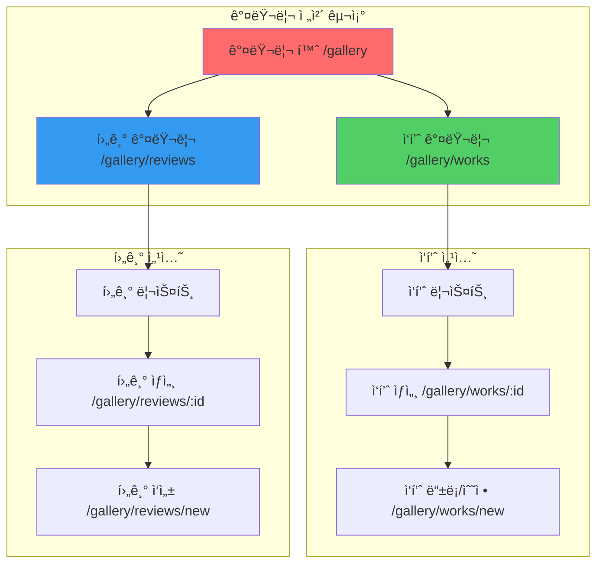
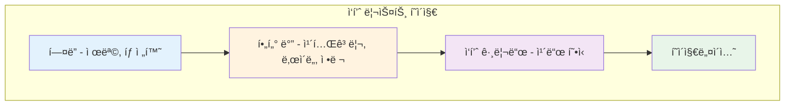
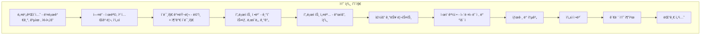
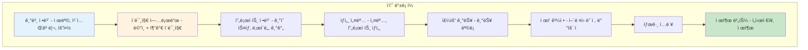
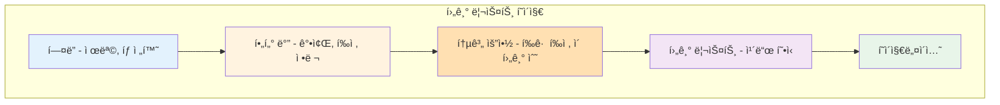
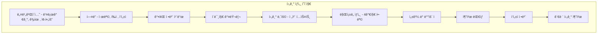
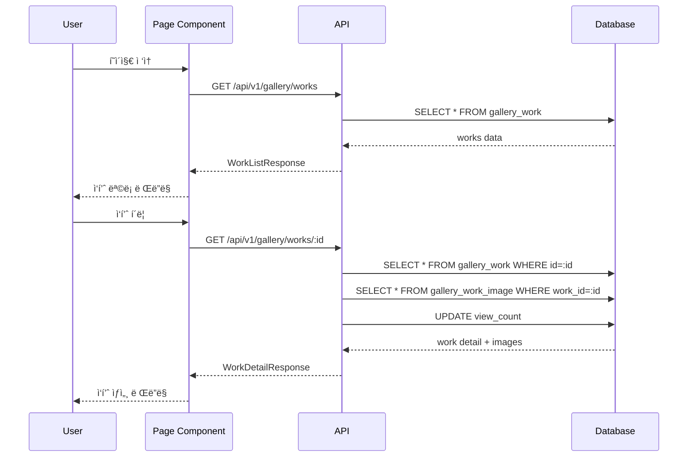
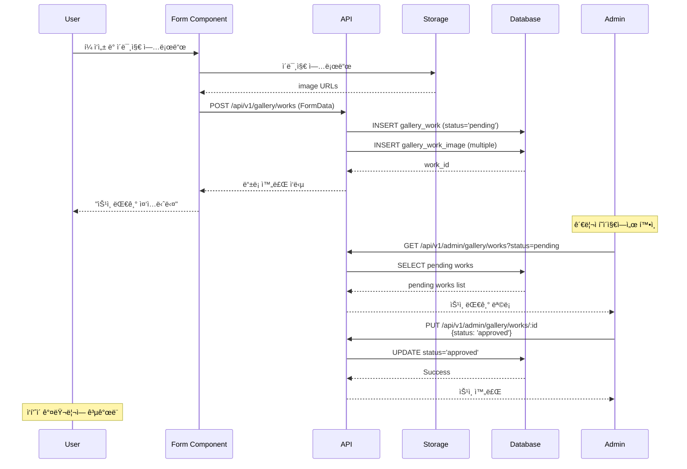
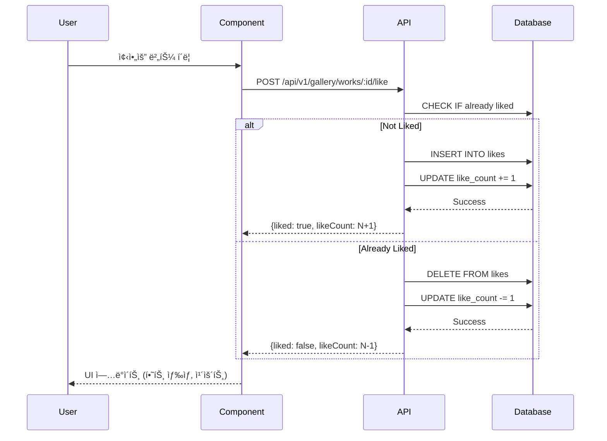
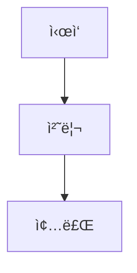

# 갤러리 구현 ê°€ì´ë“œ

## 📋 목차

1. [개요](#-개요)
2. [í˜ì´ì§€ 구조](#-í˜ì´ì§€-구조)
3. [í•™ìƒ ì‘í’ˆ 갤러리](#-í•™ìƒ-ì‘í’ˆ-갤러리)
4. [수업 후기 갤러리](#-수업-후기-갤러리)
5. [ì»´í¬ë„ŒíŠ¸ 구조](#-ì»´í¬ë„ŒíŠ¸-구조)
6. [API ì—°ë™](#-api-ì—°ë™)
7. [ìƒíƒœ 관리](#-ìƒíƒœ-관리)
8. [ë°ì´í„° í름](#-ë°ì´í„°-í름)

---

## 📖 개요

갤러리는 **í•™ìƒ ì‘í’ˆ**ê³¼ **수업 후기** ë‘ ê°€ì§€ 섹션으로 구성ë©ë‹ˆë‹¤.

### 주요 특징

| 구분 | í•™ìƒ ì‘í’ˆ | 수업 후기 |
|------|----------|----------|
| **목ì ** | í•™ìƒë“¤ì´ 만든 프로ì íŠ¸ ì „ì‹œ | 수강ìƒë“¤ì˜ 솔ì§í•œ 수업 경험 공유 |
| **주요 콘í…츠** | 프로ì íŠ¸ ì´ë¯¸ì§€, 기술 스íƒ, ì œì‘ ê³¼ì • | í‰ì , 만족ë„, 추천 여부 |
| **í•„í„°ë§** | 카테고리, ë‚œì´ë„, 기술 ìŠ¤íƒ | 강좌명, í‰ì , 학년 |
| **ì •ë ¬** | 최신순, ì¸ê¸°ìˆœ, 조회수순 | 최신순, í‰ì ìˆœ, 추천순 |

---

## 📄 í˜ì´ì§€ 구조



### ë¼ìš°íŒ… 구조

```
/gallery
├── /gallery/works                 # í•™ìƒ ì‘í’ˆ 리스트
├── /gallery/works/:id             # ì‘í’ˆ ìƒì„¸
├── /gallery/works/new             # ì‘í’ˆ ë“±ë¡ (ë¡œê·¸ì¸ í•„ìš”)
├── /gallery/works/:id/edit        # ì‘í’ˆ 수정 (ì‘성ì만)
│
├── /gallery/reviews               # 수업 후기 리스트
├── /gallery/reviews/:id           # 후기 ìƒì„¸
├── /gallery/reviews/new           # 후기 ì‘성 (수강ìƒë§Œ)
└── /gallery/reviews/:id/edit      # 후기 수정 (ì‘성ì만)
```

---

## ğŸ¨ í•™ìƒ ì‘í’ˆ 갤러리

### 1. ì‘í’ˆ 리스트 í˜ì´ì§€ (`/gallery/works`)

#### í˜ì´ì§€ ë ˆì´ì•„웃



#### UI 구성 요소

**1. í—¤ë”**
```typescript
interface GalleryHeader {
  title: string;              // "í•™ìƒ ì‘í’ˆ"
  description: string;        // "í•™ìƒë“¤ì˜ ì°½ì˜ì ì¸ 프로ì íŠ¸ë¥¼ 만나보세요"
  tabs: {
    label: string;
    value: 'works' | 'reviews';
    href: string;
  }[];
  showCreateButton: boolean;  // ë¡œê·¸ì¸ ì‹œ "ì‘í’ˆ 등ë¡" 버튼
}
```

**2. í•„í„° ë°”**
```typescript
interface FilterBar {
  category: {
    label: string;
    options: {
      value: string;
      label: string;
      count?: number;
    }[];
  };
  difficulty: {
    label: string;
    options: ('beginner' | 'intermediate' | 'advanced')[];
  };
  sort: {
    label: string;
    options: ('latest' | 'popular' | 'views')[];
  };
  searchQuery: string;        // 검색어
}
```

**카테고리 옵션:**
- IoT (사물ì¸í„°ë„·)
- 앱개발
- 로보틱스
- AI/머신러ë‹
- ê²Œì„ ê°œë°œ
- 웹 개발

**3. ì‘í’ˆ ì¹´ë“œ**
```typescript
interface WorkCard {
  id: number;
  title: string;
  summary: string;
  category: string;
  difficulty: 'beginner' | 'intermediate' | 'advanced';
  mainImage: string;
  authorName: string;
  authorGrade: string;
  techStack: string[];        // 최대 3개 표시
  tags: string[];             // 최대 5개 표시
  viewCount: number;
  likeCount: number;
  isFeatured: boolean;        // 추천 ì‘í’ˆ 배지
  createdAt: string;
}
```

**ì¹´ë“œ ë””ìì¸:**
```
┌─────────────────────────────────â”
│  ┌──────────────────────────┠  │ ↠추천 배지 (is_featured)
│  │                          │   │
│  │   ë©”ì¸ ì´ë¯¸ì§€             │   │
│  │   (16:9 비율)            │   │
│  │                          │   │
│  └──────────────────────────┘   │
│                                  │
│  ğŸ·ï¸ IoT    â­ Intermediate      │ ↠카테고리, ë‚œì´ë„
│                                  │
│  스마트 홈 IoT 시스템              │ ↠제목 (Bold)
│  ë¼ì¦ˆë² ë¦¬íŒŒì´ë¡œ 만든 ìŒì„± ì¸ì‹...   │ ↠요약 (2줄)
│                                  │
│  👤 김민준 (ê³ 1)                   │ ↠ì‘성ì
│                                  │
│  [Python] [Raspberry Pi] [IoT]  │ ↠기술 ìŠ¤íƒ (배지)
│  #ë¼ì¦ˆë² ë¦¬íŒŒì´ #ìŒì„±ì¸ì‹ #스마트홈  │ ↠태그
│                                  │
│  ğŸ‘ï¸ 234   â¤ï¸ 45   📅 3개월 ì „      │ ↠통계
└─────────────────────────────────┘
```

#### ë°ì´í„° 구조

```typescript
// API ì‘답
interface WorkListResponse {
  success: boolean;
  data: {
    items: WorkCard[];
    pagination: {
      page: number;
      pageSize: number;
      totalItems: number;
      totalPages: number;
      hasNext: boolean;
      hasPrev: boolean;
    };
    filters: {
      appliedFilters: {
        category?: string;
        difficulty?: string;
        sort?: string;
        search?: string;
      };
    };
  };
}
```

#### API 호출

```typescript
// app/gallery/works/page.tsx
import { getWorks } from '@/lib/gallery/api';

export default async function WorksListPage({
  searchParams,
}: {
  searchParams: { 
    page?: string; 
    category?: string;
    difficulty?: string;
    sort?: string;
    search?: string;
  }
}) {
  const page = Number(searchParams.page) || 1;
  const category = searchParams.category;
  const difficulty = searchParams.difficulty;
  const sort = searchParams.sort || 'latest';
  const search = searchParams.search;

  const works = await getWorks({
    page,
    pageSize: 12,
    category,
    difficulty,
    sort,
    search,
  });

  return (
    <div className="container mx-auto px-4 py-8">
      {/* í—¤ë” */}
      <GalleryHeader type="works" />
      
      {/* í•„í„° ë°” */}
      <FilterBar
        category={category}
        difficulty={difficulty}
        sort={sort}
        search={search}
      />
      
      {/* ì‘í’ˆ 그리드 */}
      <div className="grid grid-cols-1 md:grid-cols-2 lg:grid-cols-3 xl:grid-cols-4 gap-6">
        {works.data.items.map((work) => (
          <WorkCard key={work.id} work={work} />
        ))}
      </div>
      
      {/* í˜ì´ì§€ë„¤ì´ì…˜ */}
      <Pagination pagination={works.data.pagination} />
    </div>
  );
}
```

---

### 2. ì‘í’ˆ ìƒì„¸ í˜ì´ì§€ (`/gallery/works/:id`)

#### í˜ì´ì§€ ë ˆì´ì•„웃



#### UI 구성 요소

**1. í—¤ë” ì„¹ì…˜**
```typescript
interface WorkDetailHeader {
  title: string;
  category: string;
  difficulty: 'beginner' | 'intermediate' | 'advanced';
  authorName: string;
  authorGrade: string;
  authorProfile?: string;
  isFeatured: boolean;
  createdAt: string;
  viewCount: number;
  likeCount: number;
  isLiked: boolean;          // í˜„ì¬ ì‚¬ìš©ìê°€ 좋아요 했는지
}
```

**2. ì´ë¯¸ì§€ 갤러리**
```typescript
interface ImageGallery {
  mainImage: string;
  images: {
    id: number;
    imageUrl: string;
    caption?: string;
    order: number;
  }[];
}
```

**갤러리 ë””ìì¸:**
- Lightbox ìŠ¤íƒ€ì¼ (확대 가능)
- ì¸ë„¤ì¼ 네비게ì´ì…˜
- 스와ì´í”„ 제스처 ì§€ì› (모바ì¼)

**3. 프로ì íŠ¸ ì •ë³´**
```typescript
interface ProjectInfo {
  techStack: string[];       // 기술 스íƒ
  tools: string[];           // 사용 ë„구
  difficulty: string;        // ë‚œì´ë„
  duration: string;          // ì œì‘ ê¸°ê°„
  features: string[];        // 주요 기능
  challenges: string;        // ì–´ë ¤ì› ë˜ ì 
  learnings: string;         // ë°°ìš´ ì 
}
```

**4. ìƒì„¸ ë ˆì´ì•„웃**

```
┌────────────────────────────────────────────────â”
│ ↠뒤로가기    공유 🔗    좋아요 â¤ï¸ (45)           │
├────────────────────────────────────────────────┤
│                                                │
│  ğŸ·ï¸ IoT                     ⭠추천 ì‘í’ˆ         │
│  스마트 홈 IoT 시스템                            │
│  ë¼ì¦ˆë² ë¦¬íŒŒì´ë¡œ 만든 ìŒì„± ì¸ì‹ 스마트 홈 제어 시스템│
│                                                │
│  👤 김민준 (ê³ 1)        📅 2025ë…„ 2ì›” 15ì¼       │
│  ğŸ‘ï¸ 234 조회            â¤ï¸ 45 좋아요             │
│                                                │
├────────────────────────────────────────────────┤
│                                                │
│  ┌────────────────────────────────────────┠  │
│  │                                        │   │
│  │        ë©”ì¸ ì´ë¯¸ì§€ (í° ì‚¬ì´ì¦ˆ)          │   │
│  │                                        │   │
│  └────────────────────────────────────────┘   │
│                                                │
│  [ì¸ë„¤ì¼1] [ì¸ë„¤ì¼2] [ì¸ë„¤ì¼3] [ì¸ë„¤ì¼4]        │
│                                                │
├────────────────────────────────────────────────┤
│  📊 프로ì íŠ¸ ì •ë³´                               │
│  â”â”â”â”â”â”â”â”â”â”â”â”â”â”â”â”â”â”â”â”â”â”â”â”â”â”â”â”â”â”â”â”â”â”â”â”â”â”â”â”â”  │
│                                                │
│  기술 ìŠ¤íƒ                                      │
│  [Python] [Raspberry Pi] [Google Assistant]   │
│  [MQTT] [Flask]                               │
│                                                │
│  사용 ë„구                                      │
│  • Raspbian OS                                │
│  • VS Code                                    │
│  • Home Assistant                             │
│                                                │
│  ë‚œì´ë„: â­â­â­ Intermediate                     │
│  ì œì‘ ê¸°ê°„: 3개월                               │
│                                                │
├────────────────────────────────────────────────┤
│  📠프로ì íŠ¸ 설명                               │
│  â”â”â”â”â”â”â”â”â”â”â”â”â”â”â”â”â”â”â”â”â”â”â”â”â”â”â”â”â”â”â”â”â”â”â”â”â”â”â”â”â”  │
│                                                │
│  ë¼ì¦ˆë² ë¦¬íŒŒì´ì™€ 다양한 센서를 활용하여           │
│  ìŒì„±ìœ¼ë¡œ 제어할 수 ìˆëŠ” 스마트 홈 시스템ì„...   │
│                                                │
├────────────────────────────────────────────────┤
│  ✨ 주요 기능                                    │
│  â”â”â”â”â”â”â”â”â”â”â”â”â”â”â”â”â”â”â”â”â”â”â”â”â”â”â”â”â”â”â”â”â”â”â”â”â”â”â”â”â”  │
│                                                │
│  ✅ ìŒì„± 명령으로 조명/온ë„/ìŠµë„ ì œì–´            │
│  ✅ ëª¨ë°”ì¼ ì•± ì›ê²© 제어                         │
│  ✅ 센서 ë°ì´í„° 실시간 ëª¨ë‹ˆí„°ë§                 │
│  ✅ ìë™í™” 시나리오 설정                        │
│                                                │
├────────────────────────────────────────────────┤
│  🔧 ì œì‘ ê³¼ì •                                   │
│  â”â”â”â”â”â”â”â”â”â”â”â”â”â”â”â”â”â”â”â”â”â”â”â”â”â”â”â”â”â”â”â”â”â”â”â”â”â”â”â”â”  │
│                                                │
│  ì–´ë ¤ì› ë˜ ì                                     │
│  여러 센서를 ë™ì‹œì— 제어하고 ìŒì„± ì¸ì‹ì˜         │
│  정확ë„를 높ì´ëŠ” ê²ƒì´ ì–´ë ¤ì› ìŠµë‹ˆë‹¤...            │
│                                                │
│  ë°°ìš´ ì                                         │
│  IoT 통신 프로토콜(MQTT)ê³¼ API ì—°ë™ ë°©ë²•ì„...   │
│                                                │
├────────────────────────────────────────────────┤
│  ğŸ·ï¸ 태그                                        │
│  #ë¼ì¦ˆë² ë¦¬íŒŒì´ #IoT #ìŒì„±ì¸ì‹ #스마트홈         │
│                                                │
├────────────────────────────────────────────────┤
│  👤 ì‘성ì ì •ë³´                                 │
│  김민준 (고1)                                   │
│  다른 ì‘í’ˆ 보기 →                               │
│                                                │
├────────────────────────────────────────────────┤
│  🔠관련 ì‘í’ˆ                                   │
│  [ì‘í’ˆ1] [ì‘í’ˆ2] [ì‘í’ˆ3]                        │
│                                                │
└────────────────────────────────────────────────┘
```

#### ë°ì´í„° 구조

```typescript
interface WorkDetail {
  id: number;
  title: string;
  summary: string;
  description: string;
  category: string;
  
  // ì‘성ì
  authorName: string;
  authorGrade: string;
  userId?: number;
  
  // ì´ë¯¸ì§€
  mainImage: string;
  images: {
    id: number;
    imageUrl: string;
    caption?: string;
    order: number;
  }[];
  
  // 프로ì íŠ¸ ìƒì„¸
  projectDetails: string;
  techStack: string[];
  tools: string[];
  difficulty: 'beginner' | 'intermediate' | 'advanced';
  duration: string;
  features: string[];
  challenges: string;
  learnings: string;
  
  // 태그
  tags: string[];
  
  // 통계
  viewCount: number;
  likeCount: number;
  isLiked: boolean;
  isFeatured: boolean;
  
  // 시스템
  status: string;
  createdAt: string;
  updatedAt: string;
}

interface WorkDetailResponse {
  success: boolean;
  data: WorkDetail;
}
```

#### API 호출

```typescript
// app/gallery/works/[id]/page.tsx
import { getWorkById } from '@/lib/gallery/api';

export default async function WorkDetailPage({
  params,
}: {
  params: { id: string }
}) {
  const work = await getWorkById(params.id);

  if (!work.success) {
    notFound();
  }

  return (
    <div className="container mx-auto px-4 py-8">
      {/* 네비게ì´ì…˜ */}
      <WorkNavigation workId={work.data.id} />
      
      {/* í—¤ë” */}
      <WorkHeader work={work.data} />
      
      {/* ì´ë¯¸ì§€ 갤러리 */}
      <ImageGallery 
        mainImage={work.data.mainImage}
        images={work.data.images}
      />
      
      {/* 프로ì íŠ¸ ì •ë³´ */}
      <ProjectInfo
        techStack={work.data.techStack}
        tools={work.data.tools}
        difficulty={work.data.difficulty}
        duration={work.data.duration}
      />
      
      {/* 프로ì íŠ¸ 설명 */}
      <ProjectDescription
        description={work.data.description}
        projectDetails={work.data.projectDetails}
      />
      
      {/* 주요 기능 */}
      <FeatureList features={work.data.features} />
      
      {/* ì œì‘ ê³¼ì • */}
      <CreationProcess
        challenges={work.data.challenges}
        learnings={work.data.learnings}
      />
      
      {/* 태그 */}
      <TagList tags={work.data.tags} />
      
      {/* ì‘성ì ì •ë³´ */}
      <AuthorInfo
        authorName={work.data.authorName}
        authorGrade={work.data.authorGrade}
        userId={work.data.userId}
      />
      
      {/* 관련 ì‘í’ˆ */}
      <RelatedWorks 
        category={work.data.category}
        currentWorkId={work.data.id}
      />
    </div>
  );
}
```

---

### 3. ì‘í’ˆ 등ë¡/수정 í˜ì´ì§€ (`/gallery/works/new`, `/gallery/works/:id/edit`)

#### í¼ êµ¬ì¡°



#### í¼ í•„ë“œ

```typescript
interface WorkFormData {
  // 필수 필드
  title: string;                    // 제목 (최대 200ì)
  category: string;                 // 카테고리
  summary: string;                  // 요약 (최대 500ì)
  description: string;              // 설명
  mainImage: File;                  // ë©”ì¸ ì´ë¯¸ì§€
  
  // ì„ íƒ í•„ë“œ
  images?: File[];                  // 추가 ì´ë¯¸ì§€ (최대 5ê°œ)
  projectDetails?: string;          // 프로ì íŠ¸ ìƒì„¸ 설명
  techStack?: string[];             // 기술 스íƒ
  tools?: string[];                 // 사용 ë„구
  difficulty?: 'beginner' | 'intermediate' | 'advanced';
  duration?: string;                // ì œì‘ ê¸°ê°„
  features?: string[];              // 주요 기능
  challenges?: string;              // ì–´ë ¤ì› ë˜ ì 
  learnings?: string;               // ë°°ìš´ ì 
  tags?: string[];                  // 태그 (최대 10개)
}
```

#### í¼ ë ˆì´ì•„웃

```
┌────────────────────────────────────────────────â”
│  ì‘í’ˆ ë“±ë¡                                      │
├────────────────────────────────────────────────┤
│                                                │
│  1. 기본 정보                                   │
│  â”â”â”â”â”â”â”â”â”â”â”â”â”â”â”â”â”â”â”â”â”â”â”â”â”â”â”â”â”â”â”â”â”â”â”â”â”â”â”â”â”  │
│                                                │
│  ì‘품명 *                                       │
│  ┌──────────────────────────────────────┠    │
│  │                                      │     │
│  └──────────────────────────────────────┘     │
│                                                │
│  카테고리 *                                     │
│  [IoT ▼]                                       │
│                                                │
│  요약 *                                         │
│  ┌──────────────────────────────────────┠    │
│  │                                      │     │
│  │                                      │     │
│  └──────────────────────────────────────┘     │
│  0 / 500ì                                     │
│                                                │
├────────────────────────────────────────────────┤
│  2. ì´ë¯¸ì§€ 업로드                               │
│  â”â”â”â”â”â”â”â”â”â”â”â”â”â”â”â”â”â”â”â”â”â”â”â”â”â”â”â”â”â”â”â”â”â”â”â”â”â”â”â”â”  │
│                                                │
│  ë©”ì¸ ì´ë¯¸ì§€ * (1ê°œ)                            │
│  ┌────────────────┠                          │
│  │  📷 í´ë¦­í•˜ì—¬    │                           │
│  │  ì´ë¯¸ì§€ 업로드  │                           │
│  └────────────────┘                           │
│                                                │
│  추가 ì´ë¯¸ì§€ (최대 5ê°œ)                         │
│  ┌──┠┌──┠┌──┠┌──┠┌──┠                  │
│  │+│  │  │  │  │  │  │  │  │                   │
│  └──┘ └──┘ └──┘ └──┘ └──┘                   │
│                                                │
├────────────────────────────────────────────────┤
│  3. 프로ì íŠ¸ ì •ë³´                               │
│  â”â”â”â”â”â”â”â”â”â”â”â”â”â”â”â”â”â”â”â”â”â”â”â”â”â”â”â”â”â”â”â”â”â”â”â”â”â”â”â”â”  │
│                                                │
│  기술 ìŠ¤íƒ                                      │
│  ┌──────────────────────────────────────┠    │
│  │ [Python] [Raspberry Pi] [x]          │     │
│  │ + 기술 추가                           │     │
│  └──────────────────────────────────────┘     │
│                                                │
│  사용 ë„구                                      │
│  ┌──────────────────────────────────────┠    │
│  │                                      │     │
│  └──────────────────────────────────────┘     │
│                                                │
│  ë‚œì´ë„                                         │
│  ○ 초급    ○ 중급    ○ 고급                    │
│                                                │
│  ì œì‘ ê¸°ê°„                                      │
│  ┌────────┠                                  │
│  │ 3개월  │                                   │
│  └────────┘                                   │
│                                                │
├────────────────────────────────────────────────┤
│  4. ìƒì„¸ 설명                                   │
│  â”â”â”â”â”â”â”â”â”â”â”â”â”â”â”â”â”â”â”â”â”â”â”â”â”â”â”â”â”â”â”â”â”â”â”â”â”â”â”â”â”  │
│                                                │
│  프로ì íŠ¸ 설명 *                                │
│  ┌──────────────────────────────────────┠    │
│  │                                      │     │
│  │                                      │     │
│  │                                      │     │
│  └──────────────────────────────────────┘     │
│                                                │
│  프로ì íŠ¸ ìƒì„¸                                  │
│  ┌──────────────────────────────────────┠    │
│  │                                      │     │
│  └──────────────────────────────────────┘     │
│                                                │
├────────────────────────────────────────────────┤
│  5. 주요 기능                                   │
│  â”â”â”â”â”â”â”â”â”â”â”â”â”â”â”â”â”â”â”â”â”â”â”â”â”â”â”â”â”â”â”â”â”â”â”â”â”â”â”â”â”  │
│                                                │
│  • 기능 1                                       │
│  • 기능 2                                       │
│  + 기능 추가                                    │
│                                                │
├────────────────────────────────────────────────┤
│  6. ì œì‘ ê³¼ì •                                   │
│  â”â”â”â”â”â”â”â”â”â”â”â”â”â”â”â”â”â”â”â”â”â”â”â”â”â”â”â”â”â”â”â”â”â”â”â”â”â”â”â”â”  │
│                                                │
│  ì–´ë ¤ì› ë˜ ì                                     │
│  ┌──────────────────────────────────────┠    │
│  │                                      │     │
│  └──────────────────────────────────────┘     │
│                                                │
│  ë°°ìš´ ì                                         │
│  ┌──────────────────────────────────────┠    │
│  │                                      │     │
│  └──────────────────────────────────────┘     │
│                                                │
├────────────────────────────────────────────────┤
│  7. 태그                                        │
│  â”â”â”â”â”â”â”â”â”â”â”â”â”â”â”â”â”â”â”â”â”â”â”â”â”â”â”â”â”â”â”â”â”â”â”â”â”â”â”â”â”  │
│                                                │
│  [ë¼ì¦ˆë² ë¦¬íŒŒì´] [IoT] [ìŒì„±ì¸ì‹] [x]            │
│  ┌──────────────────────────────────────┠    │
│  │ 태그 ì…ë ¥ 후 Enter                    │     │
│  └──────────────────────────────────────┘     │
│                                                │
├────────────────────────────────────────────────┤
│                                                │
│  [ì„시저ì¥]              [제출하기]             │
│                                                │
└────────────────────────────────────────────────┘
```

#### API 호출

```typescript
// app/gallery/works/new/page.tsx
'use client';

import { useState } from 'react';
import { createWork } from '@/lib/gallery/api';
import { useRouter } from 'next/navigation';

export default function WorkCreatePage() {
  const router = useRouter();
  const [formData, setFormData] = useState<WorkFormData>({
    title: '',
    category: '',
    summary: '',
    description: '',
    mainImage: null,
    images: [],
    techStack: [],
    difficulty: 'beginner',
    tags: [],
  });

  const handleSubmit = async (e: React.FormEvent) => {
    e.preventDefault();
    
    // FormData ìƒì„± (multipart/form-data)
    const data = new FormData();
    data.append('title', formData.title);
    data.append('category', formData.category);
    data.append('summary', formData.summary);
    data.append('description', formData.description);
    
    if (formData.mainImage) {
      data.append('main_image', formData.mainImage);
    }
    
    formData.images?.forEach((image) => {
      data.append('images[]', image);
    });
    
    formData.techStack?.forEach((tech) => {
      data.append('tech_stack[]', tech);
    });
    
    // ... 나머지 필드들
    
    try {
      const result = await createWork(data);
      
      if (result.success) {
        alert('ì‘í’ˆì´ ë“±ë¡ë˜ì—ˆìŠµë‹ˆë‹¤. 관리ì ìŠ¹ì¸ í›„ 공개ë©ë‹ˆë‹¤.');
        router.push(`/gallery/works/${result.data.id}`);
      }
    } catch (error) {
      console.error('ì‘í’ˆ ë“±ë¡ ì‹¤íŒ¨:', error);
      alert('ì‘í’ˆ 등ë¡ì— 실패했습니다.');
    }
  };

  return (
    <div className="container mx-auto px-4 py-8">
      <h1 className="text-3xl font-bold mb-8">ì‘í’ˆ 등ë¡</h1>
      
      <form onSubmit={handleSubmit} className="space-y-8">
        {/* 기본 정보 */}
        <section>
          <h2 className="text-2xl font-semibold mb-4">1. 기본 정보</h2>
          
          <div className="space-y-4">
            <div>
              <label className="block mb-2">ì‘품명 *</label>
              <input
                type="text"
                value={formData.title}
                onChange={(e) => setFormData({ ...formData, title: e.target.value })}
                className="w-full px-4 py-2 border rounded"
                required
                maxLength={200}
              />
            </div>
            
            <div>
              <label className="block mb-2">카테고리 *</label>
              <select
                value={formData.category}
                onChange={(e) => setFormData({ ...formData, category: e.target.value })}
                className="w-full px-4 py-2 border rounded"
                required
              >
                <option value="">ì„ íƒí•˜ì„¸ìš”</option>
                <option value="IoT">IoT</option>
                <option value="앱개발">앱개발</option>
                <option value="로보틱스">로보틱스</option>
                <option value="AI">AI/머신러ë‹</option>
                <option value="게ì„개발">ê²Œì„ ê°œë°œ</option>
                <option value="웹개발">웹 개발</option>
              </select>
            </div>
            
            <div>
              <label className="block mb-2">요약 *</label>
              <textarea
                value={formData.summary}
                onChange={(e) => setFormData({ ...formData, summary: e.target.value })}
                className="w-full px-4 py-2 border rounded"
                rows={3}
                required
                maxLength={500}
              />
              <p className="text-sm text-gray-500 mt-1">
                {formData.summary.length} / 500ì
              </p>
            </div>
          </div>
        </section>
        
        {/* ì´ë¯¸ì§€ 업로드 */}
        <section>
          <h2 className="text-2xl font-semibold mb-4">2. ì´ë¯¸ì§€ 업로드</h2>
          <ImageUpload
            mainImage={formData.mainImage}
            images={formData.images}
            onChange={(mainImage, images) => 
              setFormData({ ...formData, mainImage, images })
            }
          />
        </section>
        
        {/* 나머지 섹션들... */}
        
        {/* 제출 버튼 */}
        <div className="flex justify-end gap-4">
          <button
            type="button"
            className="px-6 py-2 border rounded"
            onClick={() => router.back()}
          >
            취소
          </button>
          <button
            type="submit"
            className="px-6 py-2 bg-blue-600 text-white rounded"
          >
            제출하기
          </button>
        </div>
      </form>
    </div>
  );
}
```

---

## 📠수업 후기 갤러리

### 1. 후기 리스트 í˜ì´ì§€ (`/gallery/reviews`)

#### í˜ì´ì§€ ë ˆì´ì•„웃



#### UI 구성 요소

**1. 통계 요약**
```typescript
interface ReviewStats {
  totalReviews: number;
  averageRating: number;
  ratingDistribution: {
    5: number;
    4: number;
    3: number;
    2: number;
    1: number;
  };
  wouldRecommendPercentage: number;
}
```

**통계 요약 ë””ìì¸:**
```
┌────────────────────────────────────────────────â”
│  📊 전체 후기 통계                              │
├────────────────────────────────────────────────┤
│                                                │
│     ⭠4.8 / 5.0                               │
│     ì´ 158ê°œì˜ í›„ê¸°                             │
│                                                │
│  5⭠████████████████████ 120 (76%)           │
│  4⭠██████████ 28 (18%)                       │
│  3⭠██ 8 (5%)                                 │
│  2⭠█ 2 (1%)                                  │
│  1⭠▌ 0 (0%)                                  │
│                                                │
│  💯 95% 수강ìƒì´ 추천합니다                     │
│                                                │
└────────────────────────────────────────────────┘
```

**2. 후기 카드**
```typescript
interface ReviewCard {
  id: number;
  title: string;
  summary: string;
  content: string;           // ì¼ë¶€ë§Œ 표시
  category: string;
  mainImage?: string;
  
  // ì‘성ì
  authorName: string;
  studentGrade: string;
  
  // í‰ê°€
  rating: number;
  courseType: string;
  courseDuration: string;
  classType: string;
  wouldRecommend: boolean;
  
  // 만족ë„
  satisfaction: {
    curriculum: number;
    instructor: number;
    facility: number;
    management: number;
  };
  
  // 통계
  viewCount: number;
  likeCount: number;
  isFeatured: boolean;
  
  // 강좌 정보
  schedule?: {
    id: number;
    title: string;
  };
  
  createdAt: string;
}
```

**후기 ì¹´ë“œ ë””ìì¸:**
```
┌─────────────────────────────────────â”
│  â­â­â­â­â­ 5.0                       │ ↠í‰ì 
│                                     │
│  3개월 ë™ì•ˆ ë¡œë´‡ì½”ë”©ì„ ë°°ìš°ë©°          │ ↠제목 (Bold)
│  처ìŒì—는 어려웠지만 ì„ ìƒë‹˜ê»˜ì„œ...     │ ↠요약 (2줄)
│                                     │
│  👤 박지민 (중1)  📅 3개월 ì „         │ ↠ì‘성ì, 날짜
│                                     │
│  📠로봇코딩 정규반                   │ ↠강좌명
│  📆 3개월 수강   👥 소규모반          │ ↠수강 정보
│                                     │
│  💯 ì´ ìˆ˜ì—…ì„ ì¶”ì²œí•©ë‹ˆë‹¤!             │ ↠추천 여부
│                                     │
│  ë§Œì¡±ë„                              │
│  커리í˜ëŸ¼ â­â­â­â­â­                  │
│  강사     â­â­â­â­â­                  │
│  시설     â­â­â­â­                    │
│  ìš´ì˜     â­â­â­â­â­                  │
│                                     │
│  ğŸ‘ï¸ 123   â¤ï¸ 34                     │ ↠통계
└─────────────────────────────────────┘
```

#### ë°ì´í„° 구조

```typescript
interface ReviewListResponse {
  success: boolean;
  data: {
    stats: ReviewStats;
    items: ReviewCard[];
    pagination: {
      page: number;
      pageSize: number;
      totalItems: number;
      totalPages: number;
    };
  };
}
```

---

### 2. 후기 ìƒì„¸ í˜ì´ì§€ (`/gallery/reviews/:id`)

#### í˜ì´ì§€ ë ˆì´ì•„웃



#### ìƒì„¸ ë ˆì´ì•„웃

```
┌────────────────────────────────────────────────â”
│ ↠뒤로가기    공유 🔗    좋아요 â¤ï¸ (34)           │
├────────────────────────────────────────────────┤
│                                                │
│  â­â­â­â­â­ 5.0                 ✨ 추천 후기      │
│  3개월 ë™ì•ˆ ë¡œë´‡ì½”ë”©ì„ ë°°ìš°ë©°                    │
│                                                │
│  👤 박지민 (중1)        📅 2025ë…„ 3ì›” 10ì¼       │
│  ğŸ‘ï¸ 123 조회            â¤ï¸ 34 좋아요             │
│                                                │
├────────────────────────────────────────────────┤
│  📚 수강한 강좌                                 │
│  â”â”â”â”â”â”â”â”â”â”â”â”â”â”â”â”â”â”â”â”â”â”â”â”â”â”â”â”â”â”â”â”â”â”â”â”â”â”â”â”â”  │
│                                                │
│  로봇코딩 정규반                                │
│  📆 2024년 12월 - 2025년 3월 (3개월)            │
│  👥 소규모반 (6-8명)                            │
│  👨â€ğŸ« 김선ìƒë‹˜                                   │
│                                                │
│  강좌 ìƒì„¸ë³´ê¸° →                                │
│                                                │
├────────────────────────────────────────────────┤
│  📷 수업 사진                                   │
│  ┌──────────────────────────────────────┠    │
│  │        ì´ë¯¸ì§€ 갤러리                  │     │
│  └──────────────────────────────────────┘     │
│                                                │
├────────────────────────────────────────────────┤
│  📠후기 내용                                   │
│  â”â”â”â”â”â”â”â”â”â”â”â”â”â”â”â”â”â”â”â”â”â”â”â”â”â”â”â”â”â”â”â”â”â”â”â”â”â”â”â”â”  │
│                                                │
│  3개월 ë™ì•ˆ 로봇코딩 ì •ê·œë°˜ì„ ìˆ˜ê°•í•˜ë©´ì„œ         │
│  ë§ì€ ê²ƒì„ ë°°ì› ìŠµë‹ˆë‹¤. 처ìŒì—는 ì½”ë”©ì´          │
│  너무 어려워서 걱정했는ë°, ì„ ìƒë‹˜ê»˜ì„œ           │
│  차근차근 설명해주셔서 ì ì  ì´í•´ê°€              │
│  ë˜ê¸° ì‹œì‘했습니다...                           │
│                                                │
├────────────────────────────────────────────────┤
│  📊 ë§Œì¡±ë„ í‰ê°€                                 │
│  â”â”â”â”â”â”â”â”â”â”â”â”â”â”â”â”â”â”â”â”â”â”â”â”â”â”â”â”â”â”â”â”â”â”â”â”â”â”â”â”â”  │
│                                                │
│  커리í˜ëŸ¼ â­â­â­â­â­ 5.0                         │
│  체계ì ì¸ 커리í˜ëŸ¼ìœ¼ë¡œ 단계별 학습               │
│                                                │
│  강사 â­â­â­â­â­ 5.0                             │
│  친절하고 ì—´ì •ì ì¸ ê°•ì˜                         │
│                                                │
│  시설 â­â­â­â­ 4.0                               │
│  최신 ì¥ë¹„와 깨ë—í•œ 환경                        │
│                                                │
│  ìš´ì˜ â­â­â­â­â­ 5.0                             │
│  체계ì ì¸ 수업 관리와 소통                      │
│                                                │
├────────────────────────────────────────────────┤
│  ✨ 성과 ë° ë°°ìš´ ì                               │
│  â”â”â”â”â”â”â”â”â”â”â”â”â”â”â”â”â”â”â”â”â”â”â”â”â”â”â”â”â”â”â”â”â”â”â”â”â”â”â”â”â”  │
│                                                │
│  ✅ ì율주행 로봇 ì œì‘                          │
│  ✅ 센서 활용 프로ì íŠ¸ 완성                     │
│  ✅ 팀 프로ì íŠ¸ 발표                            │
│  ✅ 프로그ë˜ë° 기초 ì´í•´                        │
│                                                │
├────────────────────────────────────────────────┤
│  💡 ì´ëŸ° 분들께 추천합니다                      │
│  â”â”â”â”â”â”â”â”â”â”â”â”â”â”â”â”â”â”â”â”â”â”â”â”â”â”â”â”â”â”â”â”â”â”â”â”â”â”â”â”â”  │
│                                                │
│  • ì¤‘í•™ìƒ                                       │
│  • 코딩 ì…ë¬¸ì                                  │
│  • ë¡œë´‡ì— ê´€ì‹¬ ìˆëŠ” í•™ìƒ                        │
│                                                │
├────────────────────────────────────────────────┤
│  💯 ì´ ìˆ˜ì—…ì„ ì¶”ì²œí•˜ì‹œë‚˜ìš”?                     │
│  ✅ 네, 추천합니다!                             │
│                                                │
├────────────────────────────────────────────────┤
│  👤 ì‘성ì ì •ë³´                                 │
│  박지민 (중1)                                   │
│  다른 후기 보기 →                               │
│                                                │
├────────────────────────────────────────────────┤
│  🔠관련 후기                                   │
│  [후기1] [후기2] [후기3]                        │
│                                                │
└────────────────────────────────────────────────┘
```

---

## 🧩 ì»´í¬ë„ŒíŠ¸ 구조

### 디렉토리 구조

```
app/gallery/
├── page.tsx                       # 갤러리 홈 (리다ì´ë ‰íŠ¸)
├── layout.tsx                     # 갤러리 공통 ë ˆì´ì•„웃
│
├── works/
│   ├── page.tsx                   # ì‘í’ˆ 리스트
│   ├── [id]/
│   │   ├── page.tsx              # ì‘í’ˆ ìƒì„¸
│   │   └── edit/
│   │       └── page.tsx          # ì‘í’ˆ 수정
│   └── new/
│       └── page.tsx              # ì‘í’ˆ 등ë¡
│
└── reviews/
    ├── page.tsx                   # 후기 리스트
    ├── [id]/
    │   ├── page.tsx              # 후기 ìƒì„¸
    │   └── edit/
    │       └── page.tsx          # 후기 수정
    └── new/
        └── page.tsx              # 후기 ì‘성

components/gallery/
├── shared/
│   ├── GalleryHeader.tsx         # 갤러리 í—¤ë”
│   ├── FilterBar.tsx             # 필터 바
│   ├── Pagination.tsx            # í˜ì´ì§€ë„¤ì´ì…˜
│   └── ImageGallery.tsx          # ì´ë¯¸ì§€ 갤러리
│
├── works/
│   ├── WorkCard.tsx              # ì‘í’ˆ ì¹´ë“œ
│   ├── WorkList.tsx              # ì‘í’ˆ 리스트
│   ├── WorkDetail.tsx            # ì‘í’ˆ ìƒì„¸
│   ├── WorkForm.tsx              # ì‘í’ˆ í¼
│   ├── ProjectInfo.tsx           # 프로ì íŠ¸ ì •ë³´
│   ├── FeatureList.tsx           # 기능 목ë¡
│   └── TechStackBadge.tsx        # 기술 ìŠ¤íƒ ë°°ì§€
│
└── reviews/
    ├── ReviewCard.tsx            # 후기 카드
    ├── ReviewList.tsx            # 후기 리스트
    ├── ReviewDetail.tsx          # 후기 ìƒì„¸
    ├── ReviewForm.tsx            # 후기 í¼
    ├── ReviewStats.tsx           # 후기 통계
    ├── RatingDisplay.tsx         # í‰ì  표시
    └── SatisfactionChart.tsx     # ë§Œì¡±ë„ ì°¨íŠ¸

lib/gallery/
├── api.ts                        # API 함수
├── types.ts                      # íƒ€ì… ì •ì˜
├── hooks.ts                      # 커스텀 훅
└── utils.ts                      # 유틸리티 함수
```

### 주요 ì»´í¬ë„ŒíŠ¸

#### 1. WorkCard ì»´í¬ë„ŒíŠ¸

```typescript
// components/gallery/works/WorkCard.tsx
import Image from 'next/image';
import Link from 'next/link';
import { WorkCard as WorkCardType } from '@/lib/gallery/types';
import { TechStackBadge } from './TechStackBadge';

interface WorkCardProps {
  work: WorkCardType;
}

export function WorkCard({ work }: WorkCardProps) {
  return (
    <Link href={`/gallery/works/${work.id}`}>
      <div className="border rounded-lg overflow-hidden hover:shadow-lg transition-shadow">
        {/* ì´ë¯¸ì§€ */}
        <div className="relative aspect-video">
          <Image
            src={work.mainImage}
            alt={work.title}
            fill
            className="object-cover"
          />
          {work.isFeatured && (
            <div className="absolute top-2 right-2 bg-yellow-400 text-black px-2 py-1 rounded text-sm font-semibold">
              ⭠추천
            </div>
          )}
        </div>
        
        {/* ë‚´ìš© */}
        <div className="p-4">
          {/* 카테고리 & ë‚œì´ë„ */}
          <div className="flex items-center gap-2 mb-2">
            <span className="text-sm text-blue-600">ğŸ·ï¸ {work.category}</span>
            <span className="text-sm text-gray-500">
              {getDifficultyLabel(work.difficulty)}
            </span>
          </div>
          
          {/* 제목 */}
          <h3 className="font-bold text-lg mb-2 line-clamp-1">
            {work.title}
          </h3>
          
          {/* 요약 */}
          <p className="text-sm text-gray-600 mb-3 line-clamp-2">
            {work.summary}
          </p>
          
          {/* ì‘성ì */}
          <p className="text-sm text-gray-700 mb-3">
            👤 {work.authorName} ({work.authorGrade})
          </p>
          
          {/* 기술 ìŠ¤íƒ */}
          <div className="flex flex-wrap gap-1 mb-2">
            {work.techStack.slice(0, 3).map((tech) => (
              <TechStackBadge key={tech} tech={tech} />
            ))}
            {work.techStack.length > 3 && (
              <span className="text-xs text-gray-500">
                +{work.techStack.length - 3}
              </span>
            )}
          </div>
          
          {/* 태그 */}
          <div className="flex flex-wrap gap-1 mb-3">
            {work.tags.slice(0, 3).map((tag) => (
              <span key={tag} className="text-xs text-gray-500">
                #{tag}
              </span>
            ))}
          </div>
          
          {/* 통계 */}
          <div className="flex items-center gap-3 text-sm text-gray-500">
            <span>ğŸ‘ï¸ {work.viewCount}</span>
            <span>â¤ï¸ {work.likeCount}</span>
            <span>📅 {formatDate(work.createdAt)}</span>
          </div>
        </div>
      </div>
    </Link>
  );
}

function getDifficultyLabel(difficulty: string): string {
  const labels = {
    beginner: '⭠초급',
    intermediate: 'â­â­ 중급',
    advanced: 'â­â­â­ 고급',
  };
  return labels[difficulty] || difficulty;
}

function formatDate(dateString: string): string {
  const date = new Date(dateString);
  const now = new Date();
  const diff = now.getTime() - date.getTime();
  const days = Math.floor(diff / (1000 * 60 * 60 * 24));
  
  if (days === 0) return '오늘';
  if (days === 1) return '어제';
  if (days < 7) return `${days}ì¼ ì „`;
  if (days < 30) return `${Math.floor(days / 7)}주 전`;
  if (days < 365) return `${Math.floor(days / 30)}개월 전`;
  return `${Math.floor(days / 365)}ë…„ ì „`;
}
```

#### 2. ReviewCard ì»´í¬ë„ŒíŠ¸

```typescript
// components/gallery/reviews/ReviewCard.tsx
import Link from 'next/link';
import { ReviewCard as ReviewCardType } from '@/lib/gallery/types';
import { RatingDisplay } from './RatingDisplay';

interface ReviewCardProps {
  review: ReviewCardType;
}

export function ReviewCard({ review }: ReviewCardProps) {
  return (
    <Link href={`/gallery/reviews/${review.id}`}>
      <div className="border rounded-lg p-6 hover:shadow-lg transition-shadow">
        {/* í‰ì  */}
        <div className="mb-3">
          <RatingDisplay rating={review.rating} size="lg" />
        </div>
        
        {/* 제목 */}
        <h3 className="font-bold text-lg mb-2 line-clamp-1">
          {review.title}
        </h3>
        
        {/* 요약 */}
        <p className="text-sm text-gray-600 mb-3 line-clamp-2">
          {review.summary}
        </p>
        
        {/* ì‘성ì & 날짜 */}
        <div className="flex items-center gap-3 text-sm text-gray-500 mb-3">
          <span>👤 {review.authorName} ({review.studentGrade})</span>
          <span>📅 {formatDate(review.createdAt)}</span>
        </div>
        
        {/* 강좌 정보 */}
        <div className="bg-blue-50 rounded p-3 mb-3">
          <p className="text-sm text-blue-800 font-medium">
            📠{review.courseType}
          </p>
          <div className="flex gap-3 text-xs text-blue-600 mt-1">
            <span>📆 {review.courseDuration}</span>
            <span>👥 {review.classType}</span>
          </div>
        </div>
        
        {/* 추천 여부 */}
        {review.wouldRecommend && (
          <div className="text-sm text-green-600 font-medium mb-3">
            💯 ì´ ìˆ˜ì—…ì„ ì¶”ì²œí•©ë‹ˆë‹¤!
          </div>
        )}
        
        {/* ë§Œì¡±ë„ */}
        <div className="space-y-1 mb-3">
          <div className="text-xs text-gray-700">만족ë„</div>
          {Object.entries(review.satisfaction).map(([key, value]) => (
            <div key={key} className="flex items-center gap-2 text-xs">
              <span className="w-16 text-gray-600">{getSatisfactionLabel(key)}</span>
              <RatingDisplay rating={value} size="sm" />
            </div>
          ))}
        </div>
        
        {/* 통계 */}
        <div className="flex items-center gap-3 text-sm text-gray-500">
          <span>ğŸ‘ï¸ {review.viewCount}</span>
          <span>â¤ï¸ {review.likeCount}</span>
        </div>
      </div>
    </Link>
  );
}

function getSatisfactionLabel(key: string): string {
  const labels = {
    curriculum: '커리í˜ëŸ¼',
    instructor: '강사',
    facility: '시설',
    management: 'ìš´ì˜',
  };
  return labels[key] || key;
}
```

---

## 🔌 API ì—°ë™

### API 함수

```typescript
// lib/gallery/api.ts
import { apiClient } from '@/lib/api-client';
import {
  WorkListResponse,
  WorkDetailResponse,
  ReviewListResponse,
  ReviewDetailResponse,
} from './types';

// ============================================
// í•™ìƒ ì‘í’ˆ API
// ============================================

/**
 * ì‘í’ˆ ëª©ë¡ ì¡°íšŒ
 */
export async function getWorks(params: {
  page?: number;
  pageSize?: number;
  category?: string;
  difficulty?: string;
  sort?: string;
  search?: string;
}): Promise<WorkListResponse> {
  const { data } = await apiClient.get('/gallery/works', { params });
  return data;
}

/**
 * ì‘í’ˆ ìƒì„¸ 조회
 */
export async function getWorkById(id: string): Promise<WorkDetailResponse> {
  const { data } = await apiClient.get(`/gallery/works/${id}`);
  return data;
}

/**
 * ì‘í’ˆ 등ë¡
 */
export async function createWork(formData: FormData): Promise<any> {
  const { data } = await apiClient.post('/gallery/works', formData, {
    headers: {
      'Content-Type': 'multipart/form-data',
    },
  });
  return data;
}

/**
 * ì‘í’ˆ 수정
 */
export async function updateWork(id: string, formData: FormData): Promise<any> {
  const { data } = await apiClient.put(`/gallery/works/${id}`, formData, {
    headers: {
      'Content-Type': 'multipart/form-data',
    },
  });
  return data;
}

/**
 * ì‘í’ˆ ì‚­ì œ
 */
export async function deleteWork(id: string): Promise<any> {
  const { data } = await apiClient.delete(`/gallery/works/${id}`);
  return data;
}

/**
 * ì‘í’ˆ 좋아요
 */
export async function likeWork(id: string): Promise<any> {
  const { data } = await apiClient.post(`/gallery/works/${id}/like`);
  return data;
}

// ============================================
// 수업 후기 API
// ============================================

/**
 * 후기 ëª©ë¡ ì¡°íšŒ
 */
export async function getReviews(params: {
  page?: number;
  pageSize?: number;
  scheduleId?: string;
  rating?: number;
  sort?: string;
}): Promise<ReviewListResponse> {
  const { data } = await apiClient.get('/gallery/reviews', { params });
  return data;
}

/**
 * 후기 ìƒì„¸ 조회
 */
export async function getReviewById(id: string): Promise<ReviewDetailResponse> {
  const { data } = await apiClient.get(`/gallery/reviews/${id}`);
  return data;
}

/**
 * 후기 등ë¡
 */
export async function createReview(formData: FormData): Promise<any> {
  const { data } = await apiClient.post('/gallery/reviews', formData, {
    headers: {
      'Content-Type': 'multipart/form-data',
    },
  });
  return data;
}

/**
 * 후기 수정
 */
export async function updateReview(id: string, formData: FormData): Promise<any> {
  const { data } = await apiClient.put(`/gallery/reviews/${id}`, formData, {
    headers: {
      'Content-Type': 'multipart/form-data',
    },
  });
  return data;
}

/**
 * 후기 삭제
 */
export async function deleteReview(id: string): Promise<any> {
  const { data } = await apiClient.delete(`/gallery/reviews/${id}`);
  return data;
}

/**
 * 후기 좋아요
 */
export async function likeReview(id: string): Promise<any> {
  const { data } = await apiClient.post(`/gallery/reviews/${id}/like`);
  return data;
}
```

### 커스텀 훅

```typescript
// lib/gallery/hooks.ts
'use client';

import { useState, useEffect } from 'react';
import { useRouter } from 'next/navigation';
import { getWorks, getReviews, likeWork, likeReview } from './api';
import type { WorkCard, ReviewCard } from './types';

/**
 * ì‘í’ˆ 리스트 í›…
 */
export function useWorks(params: {
  page?: number;
  pageSize?: number;
  category?: string;
  difficulty?: string;
  sort?: string;
}) {
  const [works, setWorks] = useState<WorkCard[]>([]);
  const [loading, setLoading] = useState(true);
  const [error, setError] = useState<Error | null>(null);

  useEffect(() => {
    const fetchWorks = async () => {
      try {
        setLoading(true);
        const response = await getWorks(params);
        setWorks(response.data.items);
      } catch (err) {
        setError(err as Error);
      } finally {
        setLoading(false);
      }
    };

    fetchWorks();
  }, [JSON.stringify(params)]);

  return { works, loading, error };
}

/**
 * 좋아요 토글 훅
 */
export function useLike(id: string, type: 'work' | 'review') {
  const [isLiked, setIsLiked] = useState(false);
  const [likeCount, setLikeCount] = useState(0);
  const [loading, setLoading] = useState(false);

  const toggleLike = async () => {
    if (loading) return;

    try {
      setLoading(true);
      
      if (type === 'work') {
        await likeWork(id);
      } else {
        await likeReview(id);
      }
      
      setIsLiked(!isLiked);
      setLikeCount(isLiked ? likeCount - 1 : likeCount + 1);
    } catch (error) {
      console.error('좋아요 실패:', error);
    } finally {
      setLoading(false);
    }
  };

  return { isLiked, likeCount, toggleLike, loading };
}

/**
 * ì‘í’ˆ/후기 ì‚­ì œ í›…
 */
export function useDelete(id: string, type: 'work' | 'review') {
  const router = useRouter();
  const [loading, setLoading] = useState(false);

  const handleDelete = async () => {
    if (!confirm('ì •ë§ ì‚­ì œí•˜ì‹œê² ìŠµë‹ˆê¹Œ?')) return;

    try {
      setLoading(true);
      
      if (type === 'work') {
        await deleteWork(id);
        router.push('/gallery/works');
      } else {
        await deleteReview(id);
        router.push('/gallery/reviews');
      }
      
      alert('ì‚­ì œë˜ì—ˆìŠµë‹ˆë‹¤.');
    } catch (error) {
      console.error('삭제 실패:', error);
      alert('ì‚­ì œì— ì‹¤íŒ¨í–ˆìŠµë‹ˆë‹¤.');
    } finally {
      setLoading(false);
    }
  };

  return { handleDelete, loading };
}
```

---

## 🔄 ìƒíƒœ 관리

### í•„í„° ìƒíƒœ 관리

```typescript
// lib/gallery/filter-store.ts
import { create } from 'zustand';

interface FilterState {
  // ì‘í’ˆ í•„í„°
  workFilters: {
    category?: string;
    difficulty?: string;
    sort: string;
    search?: string;
  };
  
  // 후기 필터
  reviewFilters: {
    scheduleId?: string;
    rating?: number;
    sort: string;
  };
  
  // Actions
  setWorkFilters: (filters: Partial<FilterState['workFilters']>) => void;
  setReviewFilters: (filters: Partial<FilterState['reviewFilters']>) => void;
  resetFilters: () => void;
}

export const useFilterStore = create<FilterState>((set) => ({
  workFilters: {
    sort: 'latest',
  },
  reviewFilters: {
    sort: 'latest',
  },
  
  setWorkFilters: (filters) =>
    set((state) => ({
      workFilters: { ...state.workFilters, ...filters },
    })),
    
  setReviewFilters: (filters) =>
    set((state) => ({
      reviewFilters: { ...state.reviewFilters, ...filters },
    })),
    
  resetFilters: () =>
    set({
      workFilters: { sort: 'latest' },
      reviewFilters: { sort: 'latest' },
    }),
}));
```

---

## 📊 ë°ì´í„° í름

### ì‘í’ˆ 조회 플로우



### ì‘í’ˆ ë“±ë¡ í”Œë¡œìš°



### 좋아요 플로우



---

## 🨠스타ì¼ë§ ê°€ì´ë“œ

### Tailwind CSS í´ë˜ìŠ¤

**ì‘í’ˆ ì¹´ë“œ:**
```css
/* ì¹´ë“œ 컨테ì´ë„ˆ */
.work-card {
  @apply border rounded-lg overflow-hidden hover:shadow-lg transition-shadow cursor-pointer;
}

/* ì´ë¯¸ì§€ ì˜ì—­ */
.work-card-image {
  @apply relative aspect-video bg-gray-100;
}

/* 제목 */
.work-card-title {
  @apply font-bold text-lg mb-2 line-clamp-1;
}

/* 요약 */
.work-card-summary {
  @apply text-sm text-gray-600 mb-3 line-clamp-2;
}

/* 기술 ìŠ¤íƒ ë°°ì§€ */
.tech-badge {
  @apply inline-flex items-center px-2 py-1 rounded-full text-xs font-medium bg-blue-100 text-blue-800;
}
```

**후기 카드:**
```css
/* í‰ì  표시 */
.rating-display {
  @apply flex items-center gap-1;
}

.rating-star {
  @apply text-yellow-400;
}

.rating-star-empty {
  @apply text-gray-300;
}

/* ë§Œì¡±ë„ ë°” */
.satisfaction-bar {
  @apply h-2 bg-blue-600 rounded-full transition-all;
}
```

### ë°˜ì‘형 ë””ìì¸

```css
/* ëª¨ë°”ì¼ (< 768px) */
@media (max-width: 767px) {
  .gallery-grid {
    @apply grid-cols-1 gap-4;
  }
  
  .filter-bar {
    @apply flex-col;
  }
}

/* 태블릿 (768px ~ 1023px) */
@media (min-width: 768px) and (max-width: 1023px) {
  .gallery-grid {
    @apply grid-cols-2 gap-5;
  }
}

/* ë°ìŠ¤í¬í†± (>= 1024px) */
@media (min-width: 1024px) {
  .gallery-grid {
    @apply grid-cols-3 gap-6;
  }
}

/* í° í™”ë©´ (>= 1280px) */
@media (min-width: 1280px) {
  .gallery-grid {
    @apply grid-cols-4 gap-6;
  }
}
```

---

ì•„! ì´í•´í–ˆìŠµë‹ˆë‹¤. `.md` 파ì¼ì„ ë Œë”ë§í•´ì„œ 보여주는 **êµìœ¡ ê²Œì‹œíŒ í˜ì´ì§€**를 만들고 싶으신 ê±°êµ°ìš”. 

마í¬ë‹¤ìš´ 문서를 예ì˜ê²Œ 표시하는 ê²Œì‹œíŒ í˜•íƒœì˜ í˜ì´ì§€ë¥¼ 만들어드리겠습니다!

[2 tools called]

ì´í•´í–ˆìŠµë‹ˆë‹¤! 마í¬ë‹¤ìš´ 파ì¼ì„ ë Œë”ë§í•´ì„œ 보여주는 **êµìœ¡ ê²Œì‹œíŒ í˜ì´ì§€**를 만들어드리겠습니다.

먼저 필요한 ë¼ì´ë¸ŒëŸ¬ë¦¬ë¥¼ 설치하고, ê²Œì‹œíŒ í˜ì´ì§€ë¥¼ ìƒì„±í•˜ê² ìŠµë‹ˆë‹¤.

[1 tool called]

패키지 설치는 ë‚˜ì¤‘ì— ì§ì ‘ 하시고, 먼저 êµìœ¡ ê²Œì‹œíŒ í˜ì´ì§€ë¥¼ 만들어드리겠습니다!

[3 tools called]

ì´ì œ í—¤ë”ì— ë§í¬ë¥¼ 추가하고, 필요한 패키지 설치 안내를 만들겠습니다.

[4 tools called]

완벽합니다! ì´ì œ 최종 확ì¸ì„ 위한 안내 문서를 만들겠습니다.

[1 tool called]

완벽합니다! 🉠**AI Maker Lab êµìœ¡ 게시íŒ**ì´ ì™„ì„±ë˜ì—ˆìŠµë‹ˆë‹¤!

---

## 📠ìƒì„±ëœ êµìœ¡ ê²Œì‹œíŒ í˜ì´ì§€

### ğŸ“ íŒŒì¼ êµ¬ì¡°

```
frontend/
├── app/
│   └── docs/
│       ├── page.tsx                    ⭠문서 ëª©ë¡ í˜ì´ì§€
│       └── [slug]/
│           ├── page.tsx                ⭠문서 ìƒì„¸ í˜ì´ì§€
│           └── MarkdownRenderer.tsx    ⭠마í¬ë‹¤ìš´ ë Œë”러
│
├── components/header/
│   └── config.ts                       âœï¸ "êµìœ¡ 게시íŒ" 메뉴 추가
│
├── documents/                          📚 마í¬ë‹¤ìš´ 문서들
│   ├── API_INTEGRATION.md
│   ├── API_INTEGRATION_SUMMARY.md
│   ├── GALLERY_IMPLEMENTATION.md
│   └── ... (ë” ë§ì€ 문서)
│
└── DOCS_SETUP.md                       📖 설치 ë° ì‚¬ìš© ê°€ì´ë“œ
```

---

## 🚀 빠른 ì‹œì‘

### 1. 필수 패키지 설치

```bash
cd frontend
npm install mermaid
```

### 2. 서버 실행

```bash
npm run dev
```

### 3. 브ë¼ìš°ì €ì—ì„œ 확ì¸

```
http://localhost:3000/docs
```

---

## 🨠주요 기능

### 1ï¸âƒ£ 문서 ëª©ë¡ í˜ì´ì§€ (`/docs`)

**ë””ìì¸:**
```
┌─────────────────────────────────────────────â”
│  📠AI Maker Lab êµìœ¡ ê²Œì‹œíŒ                │
│  프로ì íŠ¸ 구조, API 명세, 구현 ê°€ì´ë“œ...     │
│  📄 ì´ 7ê°œ 문서 • 4ê°œ 카테고리              │
├─────────────────────────────────────────────┤
│                                             │
│  ▌Backend                          [3개 문서]│
│  ┌──────┠ ┌──────┠ ┌──────┠            │
│  │ 📊 │  │ 📊 │  │ 🔒 │             │
│  │ API  │  │ API  │  │ì¸ì¦  │             │
│  │ 통합 │  │ 요약 │  │시스템│             │
│  └──────┘  └──────┘  └──────┘             │
│                                             │
│  ▌Frontend                         [2개 문서]│
│  ┌──────┠ ┌──────┠                      │
│  │ 💻 │  │ 👥 │                       │
│  │갤러리│  │대시  │                       │
│  │구현  │  │보드  │                       │
│  └──────┘  └──────┘                       │
│                                             │
└─────────────────────────────────────────────┘
```

**기능:**
- ✅ 카테고리별 분류 (Backend, Frontend, Architecture, Legal)
- ✅ 문서 ì¹´ë“œ (ì•„ì´ì½˜, 제목, 설명, 날짜, íŒŒì¼ í¬ê¸°)
- ✅ 호버 효과 (그림ì, í…Œë‘리 하ì´ë¼ì´íŠ¸)
- ✅ ë°˜ì‘형 그리드 (1/2/3/4 컬럼)

### 2ï¸âƒ£ 문서 ìƒì„¸ í˜ì´ì§€ (`/docs/[slug]`)

**ë””ìì¸:**
```
┌─────────────────────────────────────────────â”
│ ↠목ë¡ìœ¼ë¡œ  [Backend] API 통합 ê°€ì´ë“œ  📥 다운로드│
├─────────────────────────────────────────────┤
│                                             │
│  # API 통합 ê°€ì´ë“œ                          │
│                                             │
│  ## 개요                                    │
│  ì´ ë¬¸ì„œëŠ” Django REST API...               │
│                                             │
│  ```typescript                              │
│  const api = async () => { ... }            │
│  ```                                        │
│                                             │
│  ## ë°ì´í„°ë² ì´ìŠ¤ 설계                       │
│                                             │
│  ```mermaid                                 │
│  graph TB                                   │
│      A[User] --> B[Post]                    │
│  ```                                        │
│  [Mermaid 다ì´ì–´ê·¸ë¨ì´ 여기 ë Œë”ë§ë¨]        │
│                                             │
│  | 컬럼 | íƒ€ì… | 설명 |                     │
│  |------|------|------|                     │
│  | id   | INT  | PK   |                     │
│                                             │
│  ↠문서 목ë¡ìœ¼ë¡œ ëŒì•„가기                    │
└─────────────────────────────────────────────┘
```

**기능:**
- ✅ **마í¬ë‹¤ìš´ ë Œë”ë§**:
  - í—¤ë” (H1, H2, H3)
  - 리스트 (ordered, unordered)
  - 코드 ë¸”ë¡ (syntax highlighting)
  - í…Œì´ë¸”
  - ë§í¬, 볼드, ì´íƒ¤ë¦­
  - ì¸ë¼ì¸ 코드
  - 수í‰ì„ 

- ✅ **Mermaid 다ì´ì–´ê·¸ë¨**:
  - 플로우차트
  - 시퀀스 다ì´ì–´ê·¸ë¨
  - ERD (Entity Relationship Diagram)
  - í´ë˜ìŠ¤ 다ì´ì–´ê·¸ë¨
  - ìƒíƒœ 다ì´ì–´ê·¸ë¨

- ✅ **네비게ì´ì…˜**:
  - 목ë¡ìœ¼ë¡œ ëŒì•„가기
  - 다운로드 버튼
  - 카테고리 배지
  - ìˆ˜ì •ì¼ í‘œì‹œ

### 3ï¸âƒ£ í—¤ë” ë©”ë‰´

```
┌─────────────────────────────────────────────â”
│  AI Maker Lab                               │
│  AI êµìœ¡ 커리í˜ëŸ¼ | 수업 ë¬¸ì˜ | êµìœ¡ 제품(KIT)│
│  갤러리 | [êµìœ¡ 게시íŒ] â­ | AI Maker 소개   │
└─────────────────────────────────────────────┘
```

**새로 ì¶”ê°€ëœ ë©”ë‰´:**
- 📚 **êµìœ¡ 게시íŒ**
  - 기술 문서 (`/docs`)

---

## 📊 í˜„ì¬ ë“±ë¡ëœ 문서

### Backend (3개)
1. **API_INTEGRATION.md** (2,973줄)
   - Django REST API 전체 명세
   - PostgreSQL DB 스키마 설계
   - 92ê°œ API 엔드í¬ì¸íŠ¸

2. **API_INTEGRATION_SUMMARY.md** (1,651줄)
   - ERD 다ì´ì–´ê·¸ë¨
   - í…Œì´ë¸” 구조 요약
   - CRUD 매트릭스

3. **AUTH_SYSTEM.md**
   - JWT ì¸ì¦
   - 회ì›ê°€ì…/로그ì¸
   - ì´ë©”ì¼ ì¸ì¦

### Frontend (2개)
1. **GALLERY_IMPLEMENTATION.md** (2,003줄)
   - í•™ìƒ ì‘í’ˆ 갤러리
   - 수업 후기 갤러리
   - 완전한 구현 ê°€ì´ë“œ

2. **USER_DASHBOARD_GUIDE.md**
   - í•™ìƒ/êµì‚¬/관리ì 대시보드
   - 기능별 구현 방법

### Architecture (1개)
- **ARCHITECTURE.md**
  - 시스템 아키í…처
  - 프로ì íŠ¸ 구조

### Legal (1개)
- **POLICIES.md**
  - ê°œì¸ì •ë³´ì²˜ë¦¬ë°©ì¹¨
  - ì´ìš©ì•½ê´€

---

## 📠새 문서 추가 방법

### 1. 마í¬ë‹¤ìš´ íŒŒì¼ ìƒì„±

```bash
cd frontend/documents
touch NEW_DOCUMENT.md
```

### 2. ë‚´ìš© ì‘성

```markdown
# 새 문서 제목

## 섹션 1

ë‚´ìš©...

### Mermaid 다ì´ì–´ê·¸ë¨



### 코드 예제

```typescript
const hello = () => {
  console.log("Hello World!");
};
```
```

### 3. 서버 ì¬ì‹œì‘

```bash
npm run dev
```

ìë™ìœ¼ë¡œ 문서 목ë¡ì— 표시ë©ë‹ˆë‹¤!

---

## 🯠지ì›í•˜ëŠ” 마í¬ë‹¤ìš´ 문법

| 문법 | 예시 | 결과 |
|------|------|------|
| **í—¤ë”** | `# H1`, `## H2`, `### H3` | 제목 ìŠ¤íƒ€ì¼ |
| **볼드** | `**굵게**` | **굵게** |
| **ì´íƒ¤ë¦­** | `*기울ì„*` | *기울ì„* |
| **ì¸ë¼ì¸ 코드** | `` `code` `` | `code` |
| **코드 블ë¡** | ` ```typescript` | Syntax highlighting |
| **ë§í¬** | `[í…스트](url)` | í´ë¦­ 가능한 ë§í¬ |
| **리스트** | `- 항목` or `1. 항목` | 불릿/번호 리스트 |
| **í…Œì´ë¸”** | `\| A \| B \|` | í‘œ |
| **Mermaid** | ` ```mermaid` | 다ì´ì–´ê·¸ë¨ |
| **수í‰ì„ ** | `---` | 구분선 |

---

## 🔧 고급 설정

### Mermaid 테마 변경

`/app/docs/[slug]/MarkdownRenderer.tsx`:

```typescript
mermaid.initialize({
  theme: 'default', // ë˜ëŠ” 'dark', 'forest', 'neutral'
  themeVariables: {
    primaryColor: '#3b82f6',    // 파ë€ìƒ‰
    secondaryColor: '#10b981',  // ì´ˆë¡ìƒ‰
    tertiaryColor: '#f59e0b',   // ë…¸ë€ìƒ‰
  },
});
```

### 문서 메타ë°ì´í„° 추가

`/app/docs/page.tsx`:

```typescript
const docMetadata: Record<string, DocMetadata> = {
  'YOUR_DOC.md': {
    title: '문서 제목',
    description: '문서 설명',
    category: 'Frontend',
    icon: Code,
    color: 'green',
  },
};
```

---

## 🛠트러블슈팅

### 문제 1: Mermaidê°€ ë Œë”ë§ë˜ì§€ ì•ŠìŒ

**í•´ê²°:**
```bash
npm install mermaid
```

### 문제 2: 문서가 목ë¡ì— 안 ë³´ì„

**ì²´í¬ë¦¬ìŠ¤íŠ¸:**
- [ ] 파ì¼ì´ `/frontend/documents/`ì— ìˆë‚˜ìš”?
- [ ] 확ì¥ìê°€ `.md`ì¸ê°€ìš”?
- [ ] 파ì¼ëª…ì´ `.backup`으로 ë나지 않나요?

### 문제 3: 스타ì¼ì´ ì´ìƒí•¨

**í•´ê²°:**
```bash
# 서버 ì¬ì‹œì‘
npm run dev

# 브ë¼ìš°ì € ìºì‹œ ì‚­ì œ
Cmd + Shift + R (Mac)
Ctrl + Shift + R (Windows)
```

---

## 📚 ë” ì•Œì•„ë³´ê¸°

**ìƒì„¸ ê°€ì´ë“œ:**
- `/frontend/DOCS_SETUP.md` - 완전한 설치 ë° ì‚¬ìš© ê°€ì´ë“œ

**참고 문서:**
- Mermaid ê³µì‹ ë¬¸ì„œ: https://mermaid.js.org/
- Markdown ê°€ì´ë“œ: https://www.markdownguide.org/

---

## 🉠완료!

ì´ì œ **êµìœ¡ 게시íŒ**ì„ ì‚¬ìš©í•  수 ìˆìŠµë‹ˆë‹¤!

1. ✅ 패키지 설치: `npm install mermaid`
2. ✅ 서버 실행: `npm run dev`
3. ✅ 브ë¼ìš°ì € ì ‘ì†: `http://localhost:3000/docs`

ì§ˆë¬¸ì´ ìˆìœ¼ì‹œë©´ 언제든지 ë§ì”€í•´ 주세요! 🚀

## ✅ ì²´í¬ë¦¬ìŠ¤íŠ¸

### 구현 순서

- [ ] **1단계: 기본 구조**
  - [ ] ë¼ìš°íŒ… 설정
  - [ ] ë ˆì´ì•„웃 ì»´í¬ë„ŒíŠ¸
  - [ ] API 함수 ì‘성

- [ ] **2단계: ì‘í’ˆ 갤러리**
  - [ ] ì‘í’ˆ 리스트 í˜ì´ì§€
  - [ ] ì‘í’ˆ ìƒì„¸ í˜ì´ì§€
  - [ ] ì‘í’ˆ ì¹´ë“œ ì»´í¬ë„ŒíŠ¸
  - [ ] í•„í„°ë§ ê¸°ëŠ¥

- [ ] **3단계: 후기 갤러리**
  - [ ] 후기 리스트 í˜ì´ì§€
  - [ ] 후기 ìƒì„¸ í˜ì´ì§€
  - [ ] 후기 ì¹´ë“œ ì»´í¬ë„ŒíŠ¸
  - [ ] 통계 표시

- [ ] **4단계: 등ë¡/수정 기능**
  - [ ] ì‘í’ˆ ë“±ë¡ í¼
  - [ ] 후기 ì‘성 í¼
  - [ ] ì´ë¯¸ì§€ 업로드
  - [ ] í¼ ìœ íš¨ì„± 검사

- [ ] **5단계: ì¸í„°ë™ì…˜**
  - [ ] 좋아요 기능
  - [ ] 공유 기능
  - [ ] 댓글 기능
  - [ ] 검색 기능

- [ ] **6단계: 최ì í™”**
  - [ ] ì´ë¯¸ì§€ 최ì í™”
  - [ ] í˜ì´ì§€ë„¤ì´ì…˜
  - [ ] 로딩 ìƒíƒœ
  - [ ] ì—러 처리

---

## 📚 참고 ì료

- **API 문서**: `/frontend/documents/API_INTEGRATION.md`
- **API 요약**: `/frontend/documents/API_INTEGRATION_SUMMARY.md`
- **Next.js 문서**: https://nextjs.org/docs
- **Tailwind CSS**: https://tailwindcss.com/docs

---

**ì´ ê°€ì´ë“œë¥¼ 활용하여 갤러리를 구현해 주세요!** 🚀

문ì˜ì‚¬í•­ì´ ìˆìœ¼ë©´ 언제든지 ì—°ë½ì£¼ì„¸ìš”.

