# 정책 페이지 가이드

## 📋 개요

이 문서는 AIMakerLab Web의 **정책 페이지** (이용약관, 개인정보취급방침, 이메일무단수집거부)에 대한 구현 가이드입니다.

### 핵심 설계 원칙

| 원칙 | 설명 | 구현 |
|------|------|------|
| **UI/비즈니스 로직 분리** | UI 컴포넌트와 데이터 로딩 로직 완전 분리 | Hooks 패턴 |
| **데이터 외부화** | 법적 텍스트를 코드에서 분리 | JSON 파일 관리 |
| **localStorage DB** | UI 동작 테스트 가능 | localStorage 활용 |
| **테마 시스템** | 페이지별 일관된 색상 테마 | 색상 매핑 |
| **반응형 디자인** | 모든 디바이스에서 최적 경험 | Tailwind CSS |

---

## 🏗️ 아키텍처 다이어그램

### 전체 구조

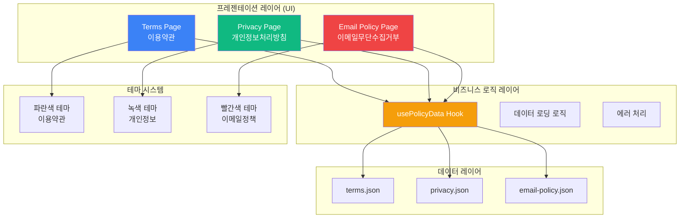

### 데이터 흐름

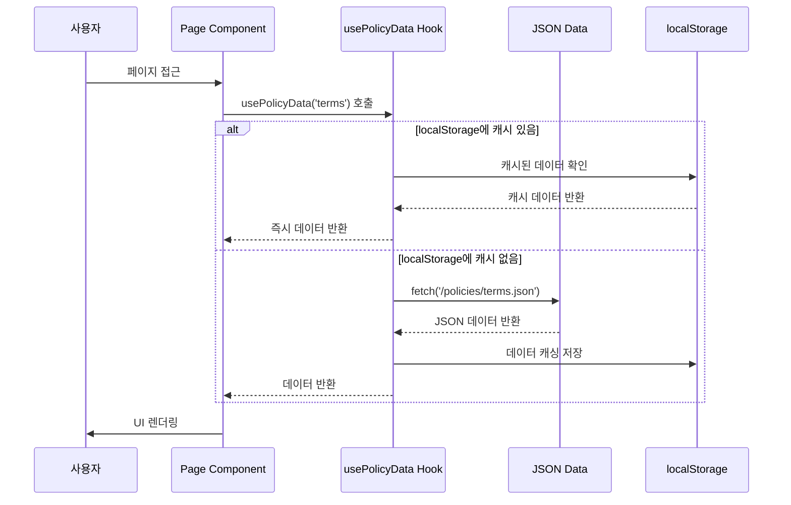

---

## 🗂️ 파일 구조

### 디렉터리 구조

```
frontend/
├── app/
│   ├── terms/                    # 📘 이용약관
│   │   └── page.tsx              #    Client Component
│   │
│   ├── privacy/                  # 📗 개인정보취급방침
│   │   └── page.tsx              #    Client Component
│   │
│   └── email-policy/             # 📕 이메일무단수집거부
│       └── page.tsx              #    Client Component
│
├── hooks/ (향후 추가 예정)
│   └── use-policy-data.ts        # 🎣 정책 데이터 로딩 훅
│
└── public/policies/              # 📦 JSON 데이터
    ├── terms.json                #    이용약관 데이터
    ├── privacy.json              #    개인정보취급방침 데이터
    └── email-policy.json         #    이메일무단수집거부 데이터
```

### 파일별 역할

| 파일 | 타입 | 역할 | 의존성 |
|------|------|------|--------|
| **page.tsx** | UI | 페이지 레이아웃 및 렌더링 | JSON Data, Lucide Icons |
| **use-policy-data.ts** | 로직 | 데이터 로딩 및 캐싱 | fetch, localStorage |
| **terms.json** | 데이터 | 이용약관 컨텐츠 | - |
| **privacy.json** | 데이터 | 개인정보처리방침 컨텐츠 | - |
| **email-policy.json** | 데이터 | 이메일무단수집거부 컨텐츠 | - |

---

## 🧩 아키텍처 상세

### 1. UI / 비즈니스 로직 분리

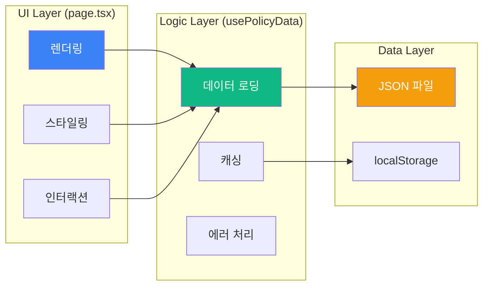

#### UI 레이어 (page.tsx)

**역할**: 오직 렌더링과 사용자 인터랙션에만 집중

```typescript
// app/terms/page.tsx
"use client"

export default function TermsPage() {
  // ❌ 비즈니스 로직 없음 (데이터 로딩, 상태 관리 등)
  // ✅ 오직 UI 렌더링만
  
  const { data, loading, error } = usePolicyData('terms') // Hook 사용
  
  if (loading) return <LoadingSpinner />
  if (error) return <ErrorState />
  
  return (
    <div className="policy-container">
      <HeroSection data={data} theme="blue" />
      <ContentSection data={data} />
    </div>
  )
}
```

#### 비즈니스 로직 레이어 (usePolicyData Hook)

**역할**: 데이터 로딩, 캐싱, 에러 처리

```typescript
// hooks/use-policy-data.ts (향후 구현 예정)

interface UsePolicyDataOptions {
  cacheExpiry?: number  // 캐시 만료 시간 (ms)
  enableCache?: boolean // 캐싱 사용 여부
}

/**
 * 정책 데이터를 로딩하는 Hook
 * - JSON 파일에서 데이터 로딩
 * - localStorage를 통한 캐싱
 * - 에러 처리 및 재시도 로직
 */
export function usePolicyData(
  policyType: 'terms' | 'privacy' | 'email-policy',
  options: UsePolicyDataOptions = {}
) {
  const { cacheExpiry = 3600000, enableCache = true } = options
  
  const [data, setData] = useState(null)
  const [loading, setLoading] = useState(true)
  const [error, setError] = useState<Error | null>(null)
  
  useEffect(() => {
    const loadData = async () => {
      try {
        // 1️⃣ localStorage 캐시 체크
        if (enableCache) {
          const cached = checkCache(policyType, cacheExpiry)
          if (cached) {
            setData(cached)
            setLoading(false)
            return
          }
        }
        
        // 2️⃣ JSON 파일에서 로딩
        const response = await fetch(`/policies/${policyType}.json`)
        if (!response.ok) throw new Error(`HTTP ${response.status}`)
        
        const jsonData = await response.json()
        
        // 3️⃣ localStorage에 캐싱
        if (enableCache) {
          saveToCache(policyType, jsonData)
        }
        
        setData(jsonData)
      } catch (err) {
        console.error('정책 데이터 로딩 실패:', err)
        setError(err instanceof Error ? err : new Error('Unknown error'))
      } finally {
        setLoading(false)
      }
    }
    
    loadData()
  }, [policyType, enableCache, cacheExpiry])
  
  return { data, loading, error }
}

/** localStorage에서 캐시 확인 */
function checkCache(key: string, expiry: number) {
  const cached = localStorage.getItem(`policy_${key}`)
  if (!cached) return null
  
  const { data, timestamp } = JSON.parse(cached)
  if (Date.now() - timestamp > expiry) {
    localStorage.removeItem(`policy_${key}`)
    return null
  }
  
  return data
}

/** localStorage에 캐시 저장 */
function saveToCache(key: string, data: any) {
  localStorage.setItem(`policy_${key}`, JSON.stringify({
    data,
    timestamp: Date.now()
  }))
}
```

### 2. 데이터 관리 방식

#### 이점

| 이점 | 설명 | 구현 |
|------|------|------|
| **컨텐츠 분리** | 법적 텍스트와 코드 완전 분리 | JSON 파일 |
| **유지보수 용이성** | 내용 변경 시 코드 수정 불필요 | JSON만 수정 |
| **백엔드 연동 준비** | API로 쉽게 전환 가능 | Hook 패턴 |
| **다국어 지원** | 언어별 JSON 파일 관리 | i18n 대응 |
| **버전 관리** | Git으로 변경 이력 추적 | Git 연동 |
| **테스트 가능** | localStorage로 UI 동작 테스트 | Mock Data |

### 3. localStorage를 DB로 활용

#### 활용 방안

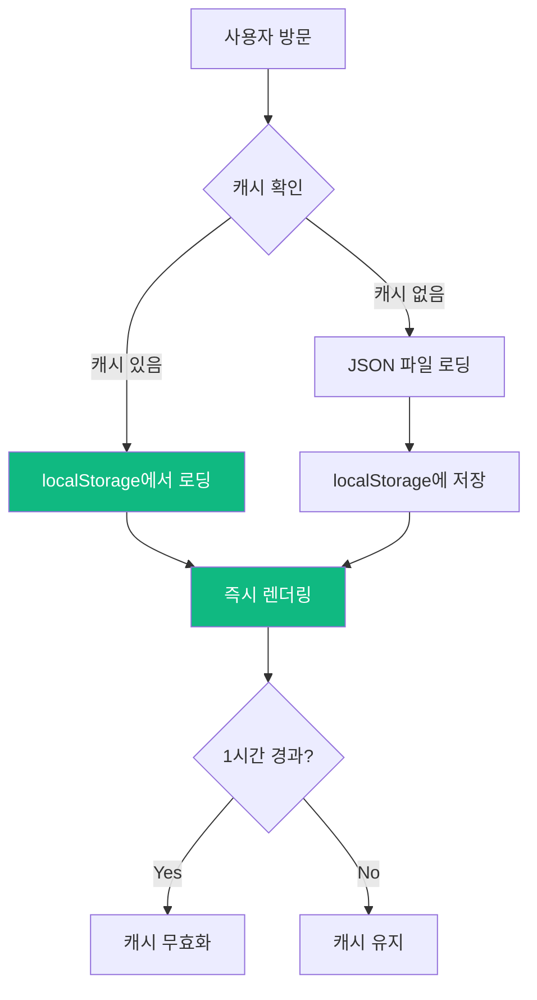

#### 장점

| 장점 | 설명 |
|------|------|
| **빠른 로딩** | 두 번째 방문부터 즉시 로딩 |
| **네트워크 절약** | 불필요한 중복 요청 방지 |
| **오프라인 지원** | 캐시된 데이터로 오프라인 동작 |
| **테스트 용이** | localStorage 조작으로 다양한 시나리오 테스트 |

### 4. 페이지 구현 방식

각 정책 페이지는 다음과 같은 구조를 가집니다:

| 요소 | 설명 |
|------|------|
| **1. Client Component** | `"use client"` 지시문 사용 (상태 관리 필요) |
| **2. 데이터 로딩** | `useEffect`를 통한 JSON 데이터 로드 |
| **3. 로딩 상태** | 데이터 로딩 중 스피너 표시 |
| **4. 에러 처리** | 네트워크 오류 시 에러 메시지 |
| **5. 테마 적용** | 페이지별 일관된 색상 테마 |
| **6. 반응형 디자인** | 모든 디바이스 대응 |

---

## 🎨 테마 시스템

### 페이지별 색상 테마

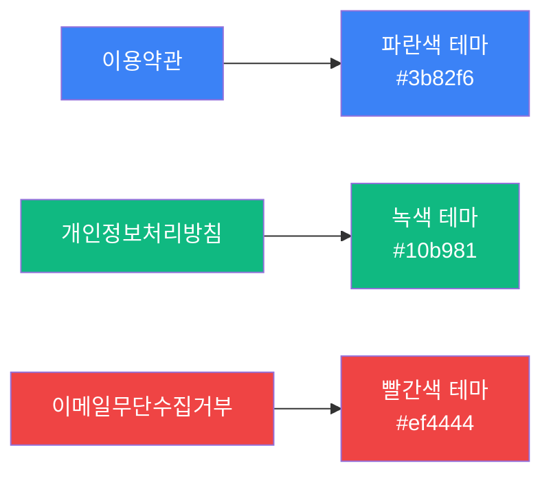

### 테마 매핑 테이블

| 정책 페이지 | 주요 색상 | Tailwind 클래스 | 용도 |
|------------|----------|------------------|------|
| **이용약관** | 파란색 | `blue-500`, `blue-600` | 법적 문서의 신뢰감 |
| **개인정보처리방침** | 녹색 | `green-500`, `green-600` | 보안/안전의 느낌 |
| **이메일무단수집거부** | 빨간색 | `red-500`, `red-600` | 경고/금지의 느낌 |

### 테마 구현

```typescript
// 각 페이지에서 테마 색상 적용
const THEME_CONFIG = {
  terms: {
    gradient: "from-blue-500 via-blue-600 to-blue-700",
    badge: "bg-blue-100/20 text-white",
    icon: "text-blue-100",
    cardBorder: "border-blue-200",
  },
  privacy: {
    gradient: "from-green-500 via-green-600 to-green-700",
    badge: "bg-green-100/20 text-white",
    icon: "text-green-100",
    cardBorder: "border-green-200",
  },
  emailPolicy: {
    gradient: "from-red-500 via-red-600 to-red-700",
    badge: "bg-red-100/20 text-white",
    icon: "text-red-100",
    cardBorder: "border-red-200",
  },
}
```

### 일관성 유지 가이드

| 요소 | 규칙 |
|------|------|
| **히어로 섹션** | 해당 테마 색상의 그라디언트 배경 |
| **배지** | 반투명 배경 + 흰색 텍스트 |
| **아이콘** | 섹션별 관련 아이콘 + 테마 색상 |
| **강조 텍스트** | 테마 색상 적용 |
| **구분선** | 테마 색상의 연한 버전 |

---

## 📝 JSON 데이터 구조

### 이용약관 (terms.json)

```json
{
  "title": "이용약관",
  "lastUpdated": "2025년 1월 1일",
  "sections": [
    {
      "id": "article1",
      "title": "제1조 (목적)",
      "icon": "target",
      "content": ["이 약관은..."]
    },
    // 추가 섹션...
  ]
}
```

### 개인정보취급방침 (privacy.json)

```json
{
  "title": "개인정보취급방침",
  "lastUpdated": "2025년 1월 1일",
  "intro": "만랩(이하 \"회사\")은...",
  "sections": [
    {
      "id": "collection",
      "title": "1. 수집하는 개인정보의 항목 및 수집방법",
      "icon": "database",
      "subsections": [
        // 하위 섹션...
      ]
    },
    // 추가 섹션...
  ]
}
```

### 이메일무단수집거부 (email-policy.json)

```json
{
  "title": "이메일무단수집거부",
  "lastUpdated": "2025년 1월 1일",
  "alert": {
    "type": "warning",
    "title": "이메일 무단 수집 거부 안내",
    "content": "본 웹사이트에 게시된 이메일 주소가..."
  },
  "sections": [
    // 섹션...
  ]
}
```

---

## 🎨 디자인 가이드

### 공통 UI 요소

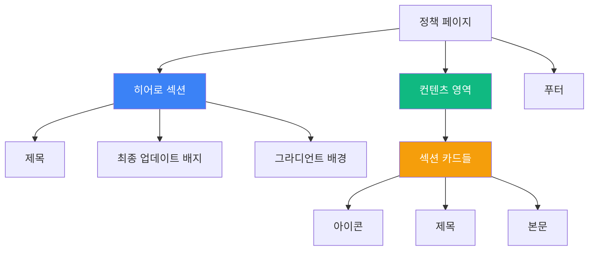

### 공통 요소 스펙

| 요소 | 스펙 | 클래스 예시 |
|------|------|------------|
| **히어로 섹션** | 그라디언트 배경, 중앙 정렬 | `bg-gradient-to-br from-blue-500 to-blue-700` |
| **제목** | 3xl ~ 4xl, 굵게 | `text-3xl md:text-4xl font-bold` |
| **최종 업데이트** | 반투명 배지 | `bg-white/20 px-4 py-2 rounded-full` |
| **섹션 카드** | 흰색, 그림자, 둥근 모서리 | `bg-white rounded-lg shadow-md p-6` |
| **아이콘** | Lucide Icons, 테마 색상 | `h-6 w-6 text-blue-600` |

### 페이지별 특징 상세

#### 📘 이용약관 (Terms)

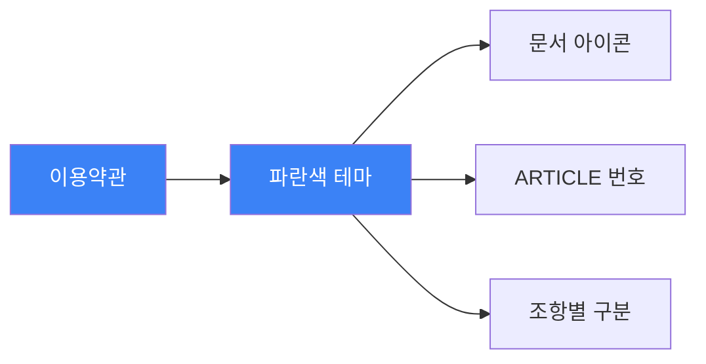

| 특징 | 설명 | 구현 |
|------|------|------|
| **색상 테마** | 파란색 계열 (#3b82f6) | 신뢰감, 전문성 |
| **아이콘** | FileText, Shield, Users 등 | Lucide React |
| **조항 번호** | "ARTICLE 1", "ARTICLE 2" | 대문자 + 번호 |
| **구조** | 명확한 조항별 구분 | 카드 형태 |

#### 📗 개인정보취급방침 (Privacy)

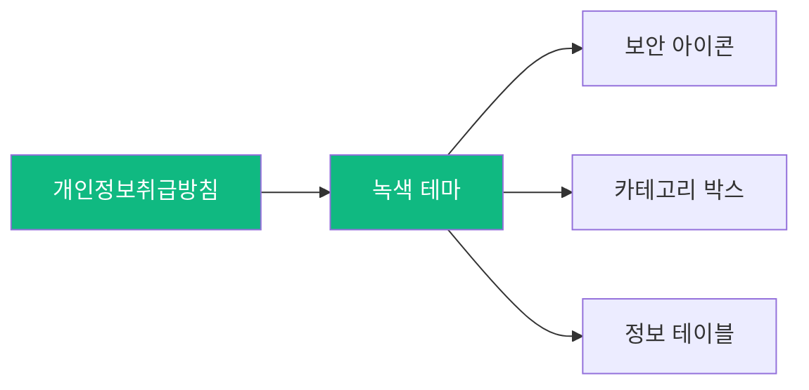

| 특징 | 설명 | 구현 |
|------|------|------|
| **색상 테마** | 녹색 계열 (#10b981) | 안전, 보안 |
| **카테고리 박스** | 필수/선택 항목 구분 | 색상 코딩된 박스 |
| **정보 테이블** | 수집 항목 표 형식 | Table 컴포넌트 |
| **보안 섹션** | 암호화 방법 강조 | Alert 컴포넌트 |

#### 📕 이메일무단수집거부 (Email Policy)

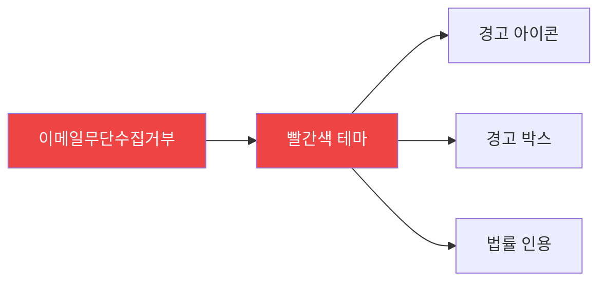

| 특징 | 설명 | 구현 |
|------|------|------|
| **색상 테마** | 빨간색 계열 (#ef4444) | 경고, 금지 |
| **경고 박스** | 상단에 강조 표시 | Alert 컴포넌트 (destructive) |
| **법률 인용** | 들여쓰기 + 경계선 | `border-l-4 pl-4` |
| **강조 텍스트** | 핵심 내용 하이라이트 | 굵은 글씨 + 색상 |

### UI 컴포넌트 매핑

| 요소 | 사용 컴포넌트 | Shadcn/ui |
|------|--------------|-----------|
| **카드** | `Card`, `CardHeader`, `CardContent` | ✅ |
| **배지** | `Badge` | ✅ |
| **경고** | `Alert`, `AlertTitle`, `AlertDescription` | ✅ |
| **스피너** | Custom `LoadingSpinner` | ❌ |
| **아이콘** | Lucide React Icons | ✅ |

---

## 🔄 백엔드 연동 계획

### API 전환 전략

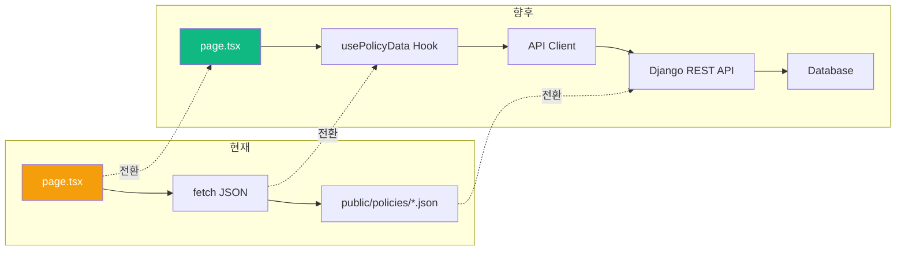

### 코드 전환 예시

**Before (현재 - JSON):**
```typescript
useEffect(() => {
  const loadData = async () => {
    try {
      const response = await fetch('/policies/terms.json')
      const data = await response.json()
      setTermsData(data)
    } catch (err) {
      console.error('Error loading terms data:', err)
    }
  }
  loadData()
}, [])
```

**After (향후 - API):**
```typescript
// Hook 사용
const { data, loading, error } = usePolicyData('terms')

// 또는 직접 API 호출
useEffect(() => {
  const loadData = async () => {
    try {
      const response = await apiClient.get('/api/policies/terms/')
      setTermsData(response.data)
    } catch (err) {
      console.error('Error loading terms data:', err)
    }
  }
  loadData()
}, [])
```

---

## 📱 반응형 디자인

### 브레이크포인트 전략

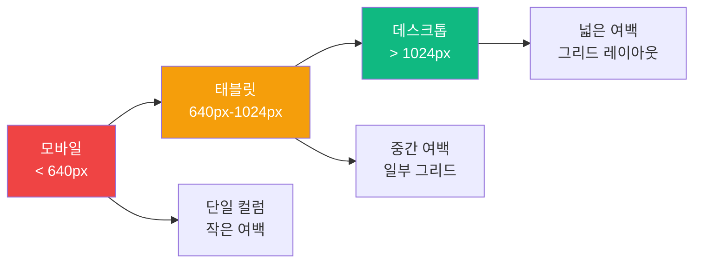

### 반응형 클래스 가이드

| 요소 | 모바일 (< 640px) | 태블릿 (640-1024px) | 데스크톱 (> 1024px) |
|------|------------------|---------------------|---------------------|
| **컨테이너** | `px-4` | `px-6` | `px-8` |
| **제목** | `text-2xl` | `text-3xl` | `text-4xl` |
| **여백** | `py-8` | `py-12` | `py-16` |
| **카드 그리드** | `grid-cols-1` | `grid-cols-1` | `grid-cols-2` |
| **최대 너비** | `max-w-full` | `max-w-3xl` | `max-w-4xl` |

### 구현 예시

```tsx
// 반응형 컨테이너
<div className="container mx-auto px-4 sm:px-6 lg:px-8 py-8 sm:py-12 lg:py-16">
  <div className="max-w-4xl mx-auto">
    {/* 컨텐츠 */}
  </div>
</div>

// 반응형 제목
<h1 className="text-2xl sm:text-3xl lg:text-4xl font-bold">
  {title}
</h1>

// 반응형 그리드
<div className="grid gap-4 sm:gap-6 grid-cols-1 lg:grid-cols-2">
  {/* 카드들 */}
</div>
```

---

## 🔍 SEO 최적화

### SEO 체크리스트

| 요소 | 구현 상태 | 설명 |
|------|----------|------|
| **시맨틱 HTML** | ✅ 완료 | `<h1>`, `<h2>`, `<section>` 등 |
| **메타 태그** | ⏳ 예정 | `metadata` 객체 |
| **구조화된 컨텐츠** | ✅ 완료 | 명확한 계층 구조 |
| **JSON-LD** | ⏳ 예정 | 구조화 데이터 |
| **Open Graph** | ⏳ 예정 | SNS 공유 최적화 |

### 시맨틱 HTML 구조

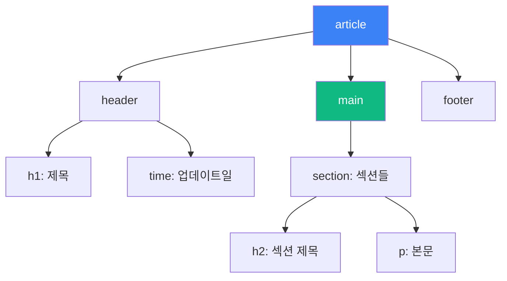

### 향후 개선 사항

```typescript
// app/terms/page.tsx
export const metadata: Metadata = {
  title: '이용약관 | AI메이커랩',
  description: 'AI메이커랩 서비스 이용약관입니다.',
  openGraph: {
    title: '이용약관',
    description: 'AI메이커랩 서비스 이용약관',
    type: 'website',
    url: 'https://aimakerlab.com/terms',
  },
}
```

---

## 🧪 테스트 가이드

### UI 동작 테스트 (localStorage 활용)

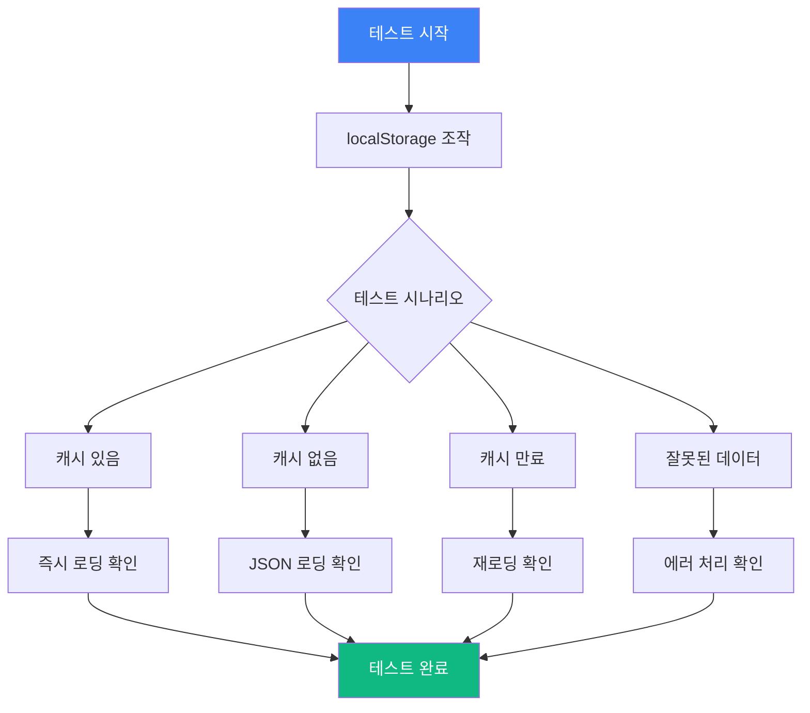

### 수동 테스트 체크리스트

| 카테고리 | 테스트 항목 | 예상 결과 | 상태 |
|----------|------------|----------|------|
| **데이터 로딩** | JSON 파일 로드 | 3초 이내 로딩 | ✅ |
| | localStorage 캐싱 | 두 번째 방문 시 즉시 표시 | ✅ |
| | 네트워크 오류 처리 | 에러 메시지 표시 | ✅ |
| **반응형** | 모바일 (< 640px) | 단일 컬럼, 읽기 편한 크기 | ✅ |
| | 태블릿 (640-1024px) | 중간 여백, 적절한 배치 | ✅ |
| | 데스크톱 (> 1024px) | 최대 너비 제한, 넓은 여백 | ✅ |
| **접근성** | 키보드 네비게이션 | Tab으로 모든 요소 접근 가능 | ✅ |
| | 스크린 리더 | ARIA 레이블 및 시맨틱 HTML | ✅ |
| | 색상 대비 | WCAG AA 기준 통과 | ✅ |
| **성능** | 초기 로딩 | < 2초 | ✅ |
| | 캐시 로딩 | < 0.5초 | ✅ |
| | 이미지 최적화 | WebP 사용 | ⏳ |

### localStorage 테스트 시나리오

#### 1️⃣ 캐시 존재 테스트
```typescript
// 개발자 도구 Console에서
localStorage.setItem('policy_terms', JSON.stringify({
  data: { /* 목업 데이터 */ },
  timestamp: Date.now()
}))

// 페이지 새로고침 → 즉시 표시 확인
```

#### 2️⃣ 캐시 만료 테스트
```typescript
// 1시간 이상 지난 캐시 설정
localStorage.setItem('policy_terms', JSON.stringify({
  data: { /* 목업 데이터 */ },
  timestamp: Date.now() - (2 * 60 * 60 * 1000) // 2시간 전
}))

// 페이지 새로고침 → 캐시 무효화 및 재로딩 확인
```

#### 3️⃣ 잘못된 데이터 테스트
```typescript
// 잘못된 JSON 저장
localStorage.setItem('policy_terms', 'invalid_json')

// 페이지 새로고침 → 에러 처리 확인
```

### 자동화 테스트 계획 (향후)

```typescript
// tests/policies/terms.test.tsx
import { render, screen, waitFor } from '@testing-library/react'
import TermsPage from '@/app/terms/page'

describe('Terms Page', () => {
  beforeEach(() => {
    // localStorage 초기화
    localStorage.clear()
  })

  it('should load terms data correctly', async () => {
    render(<TermsPage />)
    
    await waitFor(() => {
      expect(screen.getByText('이용약관')).toBeInTheDocument()
    })
  })
  
  it('should display all sections', async () => {
    render(<TermsPage />)
    
    await waitFor(() => {
      expect(screen.getByText('제1조')).toBeInTheDocument()
      expect(screen.getByText('제2조')).toBeInTheDocument()
    })
  })
  
  it('should cache data in localStorage', async () => {
    render(<TermsPage />)
    
    await waitFor(() => {
      const cached = localStorage.getItem('policy_terms')
      expect(cached).not.toBeNull()
    })
  })
})
```

---

## 🎯 주의사항 및 베스트 프랙티스

### ⚠️ 주의사항

| 항목 | 내용 | 해결 방법 |
|------|------|-----------|
| **하드코딩 금지** | 텍스트를 JSX에 직접 작성 금지 | JSON 파일로 분리 |
| **인라인 스타일 금지** | `style={{}}` 사용 금지 | Tailwind 클래스 사용 |
| **비즈니스 로직 혼재** | page.tsx에 데이터 로직 금지 | Hook으로 분리 |
| **캐시 관리** | 무한정 캐시 저장 금지 | 만료 시간 설정 |
| **에러 처리 누락** | fetch 실패 시 처리 필수 | try-catch 블록 |

### ✅ 베스트 프랙티스

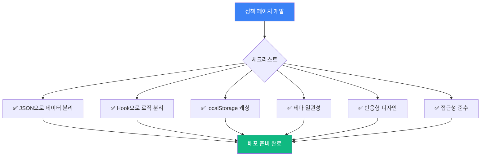

1. **데이터 분리**: 모든 텍스트를 JSON 파일로 관리
2. **로직 분리**: 비즈니스 로직을 Hook으로 분리
3. **캐싱 활용**: localStorage로 성능 최적화
4. **테마 일관성**: 페이지별 일관된 색상 적용
5. **반응형 디자인**: 모든 디바이스 대응
6. **접근성**: 시맨틱 HTML + ARIA
7. **에러 처리**: 모든 비동기 작업에 에러 처리
8. **성능 최적화**: 불필요한 리렌더링 방지

---

## 📚 참고 자료

### 법률 및 규정
- [개인정보 보호법](https://www.law.go.kr/)
- [정보통신망법](https://www.law.go.kr/)
- [전자상거래법](https://www.law.go.kr/)

### 기술 문서
- [Next.js Client Components](https://nextjs.org/docs/app/building-your-application/rendering/client-components)
- [localStorage API](https://developer.mozilla.org/ko/docs/Web/API/Window/localStorage)
- [Tailwind CSS](https://tailwindcss.com/docs)
- [Lucide React Icons](https://lucide.dev/)

### 디자인 가이드
- [WCAG 2.1 접근성 가이드](https://www.w3.org/WAI/WCAG21/quickref/)
- [Material Design 색상](https://material.io/design/color/)
- [Responsive Design](https://web.dev/responsive-web-design-basics/)

---

## 📊 문서 요약

### 핵심 원칙 요약표

| 레이어 | 역할 | 구현 | 도구 |
|--------|------|------|------|
| **UI** | 렌더링 & 스타일링 | page.tsx | React + Tailwind |
| **로직** | 데이터 로딩 & 캐싱 | usePolicyData Hook | fetch + localStorage |
| **데이터** | 컨텐츠 관리 | JSON 파일 | public/policies/ |
| **테마** | 일관된 색상 | 페이지별 테마 | Tailwind 색상 |

---

**최종 업데이트**: 2025-12-27  
**작성자**: AI Maker Lab 개발팀  
**문서 버전**: 2.0
