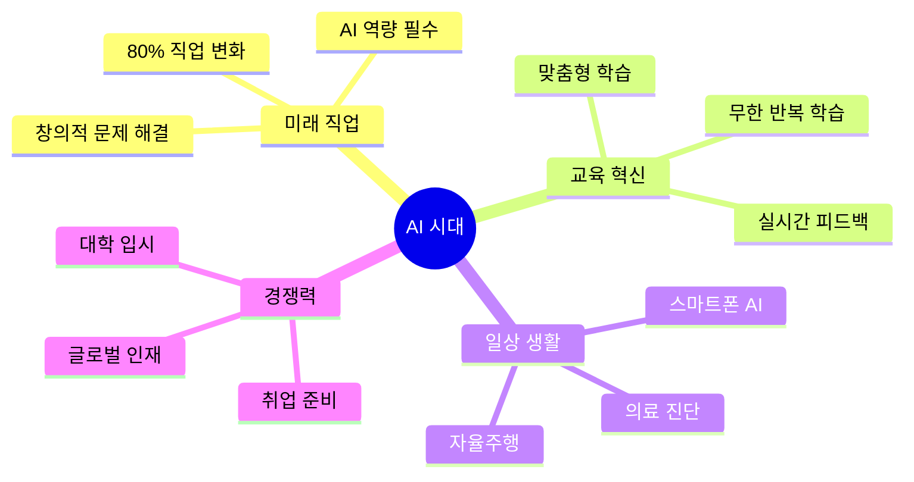
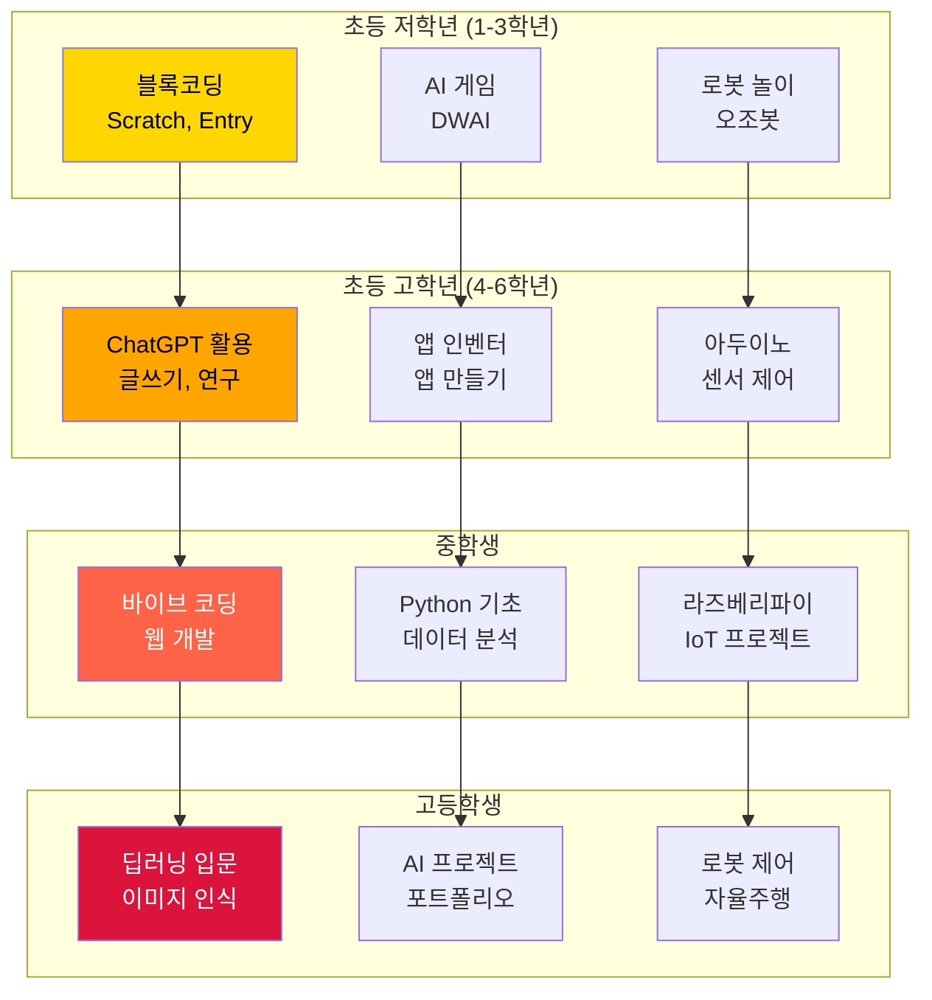
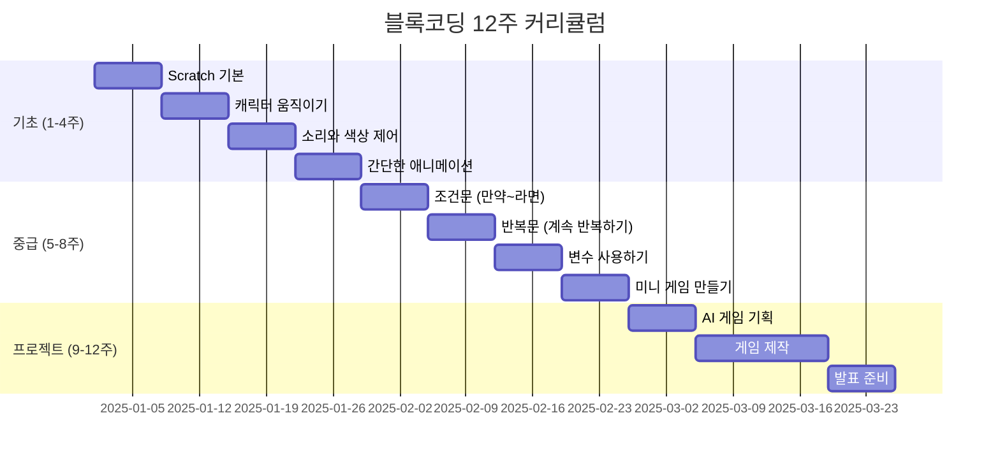
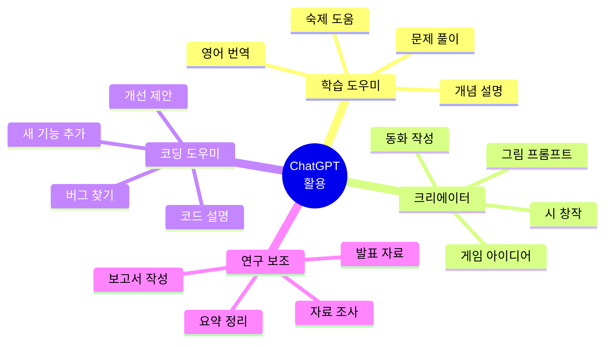
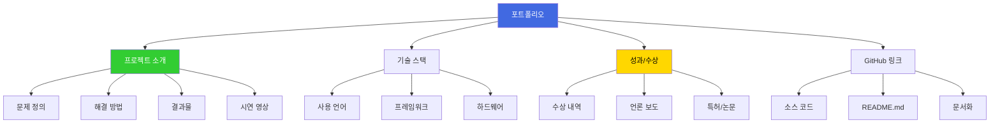
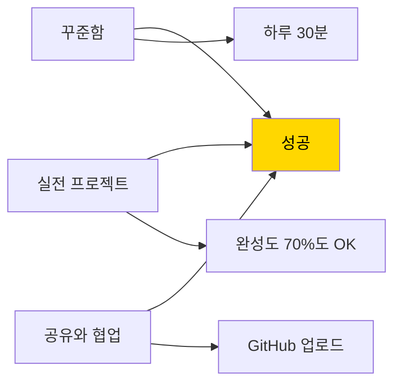

# AI 교육 시작 가이드

> **초보자를 위한 AI 교육 입문 완벽 가이드**

## 📚 목차

### Part 1: AI 교육이란?
1. [AI 교육의 중요성](#ai-교육의-중요성)
2. [학습 대상별 추천 과정](#학습-대상별-추천-과정)
3. [필요한 준비물](#필요한-준비물)

### Part 2: 단계별 학습 로드맵
4. [1단계: 블록코딩 (초등 1-3학년)](#1단계-블록코딩)
5. [2단계: ChatGPT 활용 (초등 4-6학년)](#2단계-chatgpt-활용)
6. [3단계: 바이브 코딩 (중학생)](#3단계-바이브-코딩)
7. [4단계: 피지컬 컴퓨팅 (고등학생)](#4단계-피지컬-컴퓨팅)

### Part 3: 실전 프로젝트
8. [프로젝트 추천](#프로젝트-추천)
9. [포트폴리오 만들기](#포트폴리오-만들기)

---

# Part 1: AI 교육이란?

## 1.1 AI 교육의 중요성

### 왜 지금 AI를 배워야 하는가?



### 세계 AI 교육 현황

| 국가 | AI 교육 의무화 | 시작 연령 | 주요 내용 |
|------|-------------|---------|---------|
| **미국** | 일부 주 의무 | 초등 3학년 | 블록코딩, AI 윤리 |
| **중국** | 전국 의무 | 초등 1학년 | 로봇 제어, 머신러닝 |
| **일본** | 2025년 의무화 | 초등 5학년 | 데이터 분석, AI 활용 |
| **한국** | 2025년 도입 | 초등 5학년 | 블록코딩, 데이터 |
| **싱가포르** | 전국 의무 | 초등 4학년 | 프로그래밍, AI 프로젝트 |

---

## 1.2 학습 대상별 추천 과정

### 연령별 최적 커리큘럼



### 실력별 추천 과정

#### 🟢 입문자 (코딩 경험 없음)
- **추천 과정**: 블록코딩 → ChatGPT 크리에이터
- **기간**: 3개월
- **목표**: 프로그래밍 개념 이해, AI 도구 활용

#### 🟡 초급자 (블록코딩 경험)
- **추천 과정**: 앱 인벤터 → 아두이노 AI
- **기간**: 6개월
- **목표**: 실제 작동하는 프로젝트 완성

#### 🟠 중급자 (텍스트 코딩 가능)
- **추천 과정**: 바이브 코딩 → 라즈베리파이 AI
- **기간**: 9개월
- **목표**: 웹/IoT 통합 프로젝트

#### 🔴 고급자 (Python 가능)
- **추천 과정**: 딥러닝 → 로봇팔 비전 융합
- **기간**: 12개월
- **목표**: 대학 입시 포트폴리오

---

## 1.3 필요한 준비물

### 하드웨어

#### 필수 장비
| 항목 | 사양 | 가격 | 용도 |
|------|------|------|------|
| **노트북** | RAM 8GB 이상<br/>저장 256GB | 60만원~ | 코딩, AI 학습 |
| **마우스** | 유선/무선 | 1만원~ | 편한 작업 |

#### 단계별 추가 장비
| 단계 | 장비 | 가격 | 설명 |
|------|------|------|------|
| **블록코딩** | 오조봇 | 8만원 | 라인 트레이싱 로봇 |
| **아두이노** | Arduino Uno 키트 | 5만원 | 센서, LED, 모터 포함 |
| **라즈베리파이** | Raspberry Pi 4 키트 | 15만원 | 카메라, 케이스 포함 |
| **AI 비전** | USB 카메라 | 3만원 | 이미지 인식 학습 |
| **로봇 제어** | 로봇 팔 키트 | 50만원 | 서보모터 6개 |

### 소프트웨어

#### 무료 도구
```
✅ 블록코딩
- Scratch: https://scratch.mit.edu
- Entry: https://playentry.org
- Code.org: https://code.org

✅ AI 도구
- ChatGPT: https://chat.openai.com
- Copilot: https://copilot.microsoft.com
- Gemini: https://gemini.google.com

✅ 개발 환경
- VS Code: https://code.visualstudio.com
- Python: https://python.org
- Arduino IDE: https://arduino.cc

✅ AI 라이브러리
- TensorFlow: 딥러닝
- OpenCV: 컴퓨터 비전
- Scikit-learn: 머신러닝
```

---

# Part 2: 단계별 학습 로드맵

## 2.1 1단계: 블록코딩 (초등 1-3학년)

### 학습 목표
- 프로그래밍 기본 개념 (순차, 반복, 조건)
- 논리적 사고력 향상
- 간단한 게임/애니메이션 제작

### 커리큘럼 (12주)



### 프로젝트 예시: 고양이 피하기 게임

```
게임 규칙:
1. 화살표 키로 캐릭터 이동
2. 떨어지는 장애물 피하기
3. 10초 버티면 승리!

필요한 개념:
- 키보드 입력 감지
- 랜덤 위치 생성
- 충돌 감지
- 타이머 변수
```

---

## 2.2 2단계: ChatGPT 활용 (초등 4-6학년)

### 학습 목표
- AI 도구의 올바른 사용법
- 프롬프트 엔지니어링 기초
- 창의적 문제 해결

### ChatGPT 활용 분야



### 프롬프트 작성 팁

#### 나쁜 예 ❌
```
"코드 만들어줘"
```

#### 좋은 예 ✅
```
"초등학생이 이해할 수 있게 
Scratch로 간단한 퀴즈 게임을 만들고 싶어요.

요구사항:
1. 문제 5개 출력
2. 정답 맞히면 점수 +1
3. 틀리면 정답 알려주기

코드와 함께 각 블록의 역할을 설명해주세요."
```

---

## 2.3 3단계: 바이브 코딩 (중학생)

### 학습 목표
- HTML/CSS/JavaScript 기초
- 웹 페이지 제작
- AI 협업 코딩 (Cursor, GitHub Copilot)

### 커리큘럼 (16주)

| 주차 | 주제 | 내용 | 프로젝트 |
|------|------|------|---------|
| 1-4 | HTML 기초 | 태그, 구조, 시맨틱 | 자기소개 페이지 |
| 5-8 | CSS 스타일링 | 색상, 레이아웃, 반응형 | 포트폴리오 사이트 |
| 9-12 | JavaScript | 변수, 함수, 이벤트 | 계산기 앱 |
| 13-16 | AI 협업 | Cursor AI, Copilot | 날씨 앱 |

### AI 협업 코딩 예시

**Cursor AI 활용**
```javascript
// 사용자가 원하는 기능을 주석으로 작성
// AI가 자동으로 코드 생성

// 버튼 클릭 시 랜덤 색상으로 배경 변경
// → Cursor가 아래 코드 자동 생성

button.addEventListener('click', () => {
  const randomColor = '#' + Math.floor(Math.random()*16777215).toString(16);
  document.body.style.backgroundColor = randomColor;
});
```

---

## 2.4 4단계: 피지컬 컴퓨팅 (고등학생)

### 학습 목표
- 센서/액추에이터 제어
- IoT 개념 이해
- 실생활 문제 해결 프로젝트

### 아두이노 프로젝트 예시

#### 1. 스마트 화분
```
기능:
- 토양 습도 센서 → 물 부족 시 LED 점등
- 온도/습도 센서 → LCD에 표시
- 물 펌프 자동 제어

사용 부품:
- Arduino Uno
- 토양 습도 센서
- DHT11 온도/습도 센서
- LCD 1602
- 릴레이 모듈
- 워터 펌프
```

#### 2. 얼굴 인식 도어락 (라즈베리파이)
```
기능:
- 카메라로 얼굴 촬영
- AI 모델로 얼굴 인식
- 등록된 사람이면 서보모터로 문 열림
- Telegram으로 알림 전송

기술 스택:
- Raspberry Pi 4
- USB 카메라
- OpenCV (얼굴 인식)
- TensorFlow Lite (AI 모델)
- Servo Motor
- Python
```

---

# Part 3: 실전 프로젝트

## 3.1 프로젝트 추천

### 초급 프로젝트 (1-2개월)

#### 1. AI 챗봇 친구
```
목표: ChatGPT API로 나만의 챗봇 만들기

기능:
- 텍스트 입력 → AI 답변
- 대화 기록 저장
- 감정 분석 (긍정/부정)

기술:
- Python
- OpenAI API
- Flask (웹 서버)
- HTML/CSS
```

#### 2. 이미지 분류기
```
목표: 사진을 보고 동물 종류 맞히기

기능:
- 사진 업로드
- AI가 동물 분류 (개, 고양이, 새 등)
- 신뢰도 점수 표시

기술:
- Python
- TensorFlow
- Teachable Machine (학습)
- Streamlit (UI)
```

### 중급 프로젝트 (3-4개월)

#### 3. 스마트 홈 제어
```
목표: 음성으로 집안 기기 제어

기능:
- 음성 인식 → 텍스트 변환
- ChatGPT로 명령 이해
- Arduino/라즈베리파이로 기기 제어
  - 조명 ON/OFF
  - 에어컨 온도 조절
  - 커튼 열기/닫기

기술:
- 라즈베리파이
- Arduino
- Python
- Google Speech API
- 릴레이 모듈
```

#### 4. 자율주행 RC카
```
목표: 카메라로 길 찾아가는 RC카

기능:
- 카메라로 도로 인식
- AI로 조향 판단
- 장애물 회피
- 속도 제어

기술:
- 라즈베리파이
- USB 카메라
- OpenCV (라인 트레이싱)
- TensorFlow (딥러닝 모델)
- L298N 모터 드라이버
```

### 고급 프로젝트 (6개월+)

#### 5. AI 로봇 팔 (대학 입시용)
```
목표: 카메라로 물체 인식 후 로봇 팔로 집기

기능:
- 카메라로 물체 위치 파악
- AI로 물체 종류 분류
- 역기구학 계산
- 로봇 팔 제어
- 물체 집어서 분류함에 넣기

기술:
- 라즈베리파이
- USB 카메라
- YOLO (객체 인식)
- 6축 로봇 팔
- 역기구학 알고리즘
- Python, ROS (선택)

예상 성과:
- 과학 경진대회 금상
- 대학 입시 포트폴리오
- 특허 출원 가능
```

---

## 3.2 포트폴리오 만들기

### 포트폴리오 구성



### GitHub 포트폴리오 예시

```markdown
# 김AI의 AI 프로젝트 포트폴리오

## 👋 소개
- 이름: 김AI
- 학교: OO중학교 2학년
- 관심 분야: AI, 로봇 공학
- 이메일: kimai@example.com

## 🚀 프로젝트

### 1. 스마트 화분 (2024.03 - 2024.05)
**문제**: 식물을 자주 말라 죽게 만듦  
**해결**: 자동 물주기 시스템 개발

**기술 스택**
- Arduino Uno
- 토양 습도 센서
- 워터 펌프
- C/C++

**성과**
- 학교 과학 전람회 금상
- 30일 동안 물 안 줘도 식물 생존

[📺 시연 영상](링크) | [💻 소스 코드](GitHub링크)

---

### 2. 얼굴 인식 도어락 (2024.06 - 2024.09)
**문제**: 열쇠 자주 잃어버림  
**해결**: 얼굴로 여는 스마트 도어락

**기술 스택**
- Raspberry Pi 4
- USB 카메라
- OpenCV, TensorFlow
- Python

**성과**
- 인식률 95% 달성
- 지역 발명 대회 은상
- 특허 출원 진행 중

[📺 시연 영상](링크) | [💻 소스 코드](GitHub링크)

---

## 🏆 수상 내역
- 2024 과학 전람회 금상
- 2024 발명 대회 은상
- 2024 AI 경진대회 장려상

## 📚 기술 스택
   

## 📝 블로그
- [AI 공부 일지](링크)
- [프로젝트 후기](링크)
```

---

## 부록: 학습 자료

### 📺 추천 유튜브 채널
- **코딩애플**: 웹 개발 입문
- **동빈나**: 알고리즘
- **노마드 코더**: 실전 프로젝트
- **생활코딩**: 기초 개념

### 📖 추천 도서
- **초등**: "모두의 스크래치"
- **중등**: "모두의 파이썬"
- **고등**: "혼자 공부하는 머신러닝"

### 🔗 유용한 사이트
- **Kaggle**: AI 대회, 데이터셋
- **GitHub**: 오픈소스 프로젝트
- **Stack Overflow**: 질문/답변

---

## 결론

### 성공적인 AI 학습을 위한 3가지 원칙



1. **꾸준함**: 하루 30분이라도 매일 학습
2. **실전**: 완벽하지 않아도 일단 만들어보기
3. **공유**: GitHub에 올리고 피드백 받기

---

**AI Maker Lab과 함께라면 누구나 AI 크리에이터가 될 수 있습니다!** 🚀

문의: [홈페이지] | [이메일] | [전화번호]

