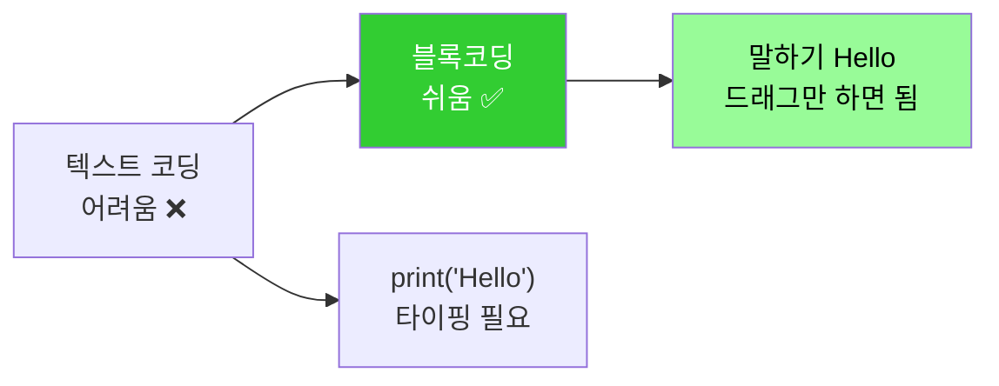
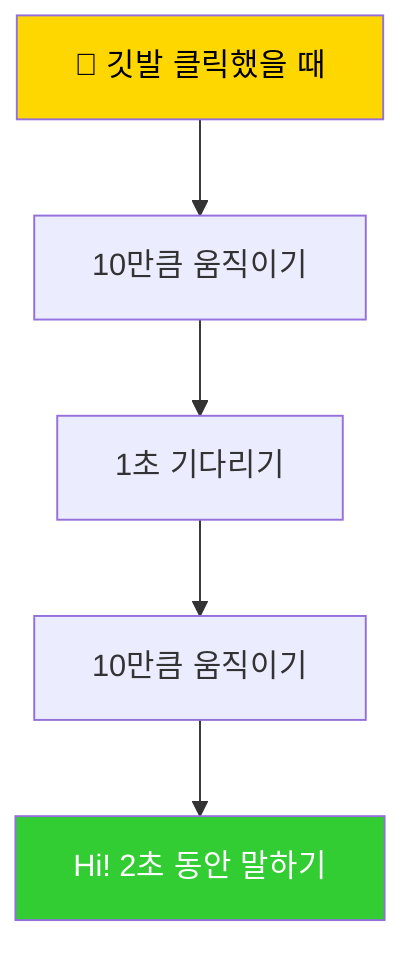
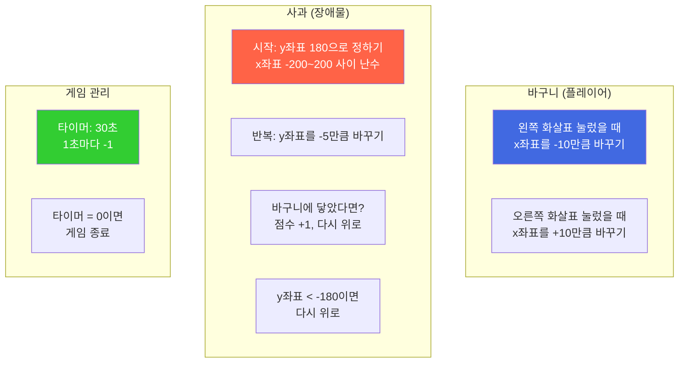
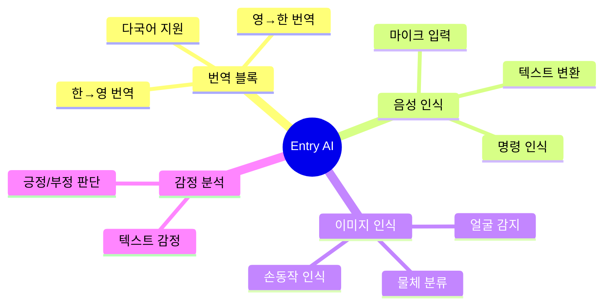
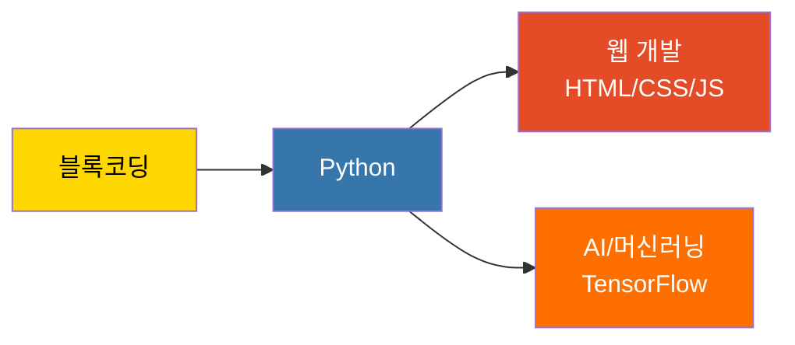
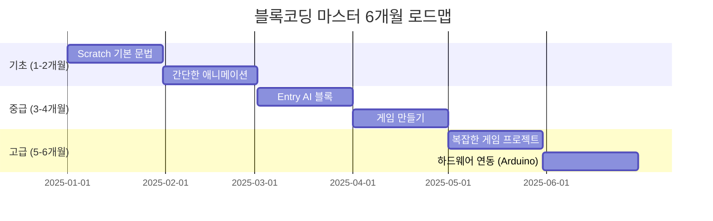

# 블록코딩 완벽 가이드

> **초등학생을 위한 Scratch & Entry 마스터 과정**

## 📚 목차

1. [블록코딩이란?](#블록코딩이란)
2. [Scratch 시작하기](#scratch-시작하기)
3. [Entry 활용하기](#entry-활용하기)
4. [게임 만들기 프로젝트](#게임-만들기-프로젝트)
5. [AI 블록 활용](#ai-블록-활용)

---

## 1. 블록코딩이란?

### 개념



### 장점

| 특징 | 설명 | 효과 |
|------|------|------|
| **시각적** | 블록을 보면서 코딩 | 직관적 이해 |
| **즉시 실행** | 코드 실행 결과를 바로 확인 | 빠른 피드백 |
| **오류 방지** | 문법 오류 원천 차단 | 좌절감 감소 |
| **재미** | 게임, 애니메이션 즉시 제작 | 흥미 유발 |

---

## 2. Scratch 시작하기

### 화면 구성

```
┌─────────────────────────────────────────────────┐
│  Scratch 3.0                              ☁️ 저장 │
├─────────┬───────────────────┬────────────────────┤
│         │                   │                    │
│  블록   │   코드 영역        │   무대 (실행 화면)  │
│  팔레트 │                   │                    │
│         │   [블록 드래그]    │   [캐릭터 움직임]  │
│  🐱동작  │                   │                    │
│  🎨형태  │   시작 클릭했을때  │   480 x 360        │
│  🔊소리  │   10만큼 움직이기  │                    │
│  ⚡이벤트│   1초 기다리기     │                    │
│  🎮제어  │   90도 회전하기    │                    │
│         │                   │                    │
└─────────┴───────────────────┴────────────────────┘
```

### 첫 프로젝트: 고양이 움직이기

#### Step 1: 블록 준비
```
📦 이벤트 블록
└─ [깃발 클릭했을 때] ← 시작 신호

📦 동작 블록
└─ [10만큼 움직이기] ← 캐릭터 이동

📦 제어 블록
└─ [1초 기다리기] ← 시간 지연
```

#### Step 2: 블록 조립


---

## 3. Entry 활용하기

### Scratch vs Entry

| 항목 | Scratch | Entry |
|------|---------|-------|
| **개발** | MIT (미국) | 네이버 (한국) |
| **언어** | 영어 (한글 지원) | 한글 기본 |
| **AI 블록** | 제한적 | 다양함 (번역, 음성인식) |
| **하드웨어** | 없음 | Arduino, 센서 연동 |
| **추천 대상** | 초등 1-3학년 | 초등 4-6학년 |

### Entry만의 특별한 기능

#### 1. AI 블록 - 번역하기
```
사용자가 입력한 텍스트 → Entry AI → 다른 언어로 번역

예시:
입력: "안녕하세요"
번역(영어): "Hello"
번역(일본어): "こんにちは"
```

#### 2. 음성 인식
```
마이크로 말하기 → Entry AI → 텍스트 변환

예시:
음성: "고양이야 앞으로 가"
→ Entry가 인식
→ 고양이 캐릭터 10만큼 이동
```

#### 3. 하드웨어 연동
```
Entry 블록 → Arduino → LED 켜기/끄기

예시:
[13번 핀 켜기] 블록
→ Arduino 13번 핀에 연결된 LED 점등
```

---

## 4. 게임 만들기 프로젝트

### 프로젝트 1: 사과 받기 게임

#### 게임 규칙
```
🎯 목표: 떨어지는 사과를 바구니로 받기
⏰ 시간: 30초
🏆 목표 점수: 10개
```

#### 필요한 블록



#### 소스 코드 (의사코드)
```
[바구니 오브젝트]
깃발 클릭했을 때
  x: 0, y: -150 이동
  
  계속 반복하기
    만약 [왼쪽 화살표] 키를 눌렀다면
      x좌표를 -10만큼 바꾸기
    만약 [오른쪽 화살표] 키를 눌렀다면
      x좌표를 +10만큼 바꾸기
---

[사과 오브젝트]
깃발 클릭했을 때
  점수 = 0
  
  계속 반복하기
    만약 y좌표 > 180이라면
      x: -200~200 사이 난수, y: 180 이동
    
    y좌표를 -5만큼 바꾸기 (아래로 떨어짐)
    
    만약 [바구니]에 닿았다면
      점수 = 점수 + 1
      y: 180 이동 (다시 위로)
    
    만약 y좌표 < -180이라면
      y: 180 이동
---

[타이머]
깃발 클릭했을 때
  타이머 = 30
  
  30번 반복하기
    1초 기다리기
    타이머 = 타이머 - 1
  
  "게임 종료! 점수:" 말하기
  모두 멈추기
```

---

### 프로젝트 2: 미로 탈출 게임

#### 게임 규칙
```
🎯 목표: 미로를 통과해 출구 도달
⚠️  조건: 벽에 닿으면 처음부터 다시
⭐ 보너스: 코인 3개 수집
```

#### 미로 설계

```
┌─────────────────────────────────┐
│ 🟢 시작                          │
│ ┌───┐ ┌─────┬───┐ ┌───────┐    │
│ │   │ │     │   │ │       │    │
│ │ ⭐│ └───┐ │ ⭐│ │ ┌───┐ │    │
│ │   │     │ │   │ │ │   │ │    │
│ └───┴───┐ │ └───┘ │ │ ⭐│ │    │
│         │ │       │ │   │ │    │
│ ┌───────┘ └───────┘ └───┘ │    │
│ │                         🏁 출구│
└─────────────────────────────────┘
```

#### 핵심 알고리즘: 벽 충돌 감지

```
계속 반복하기
  만약 [위 화살표] 눌렀다면
    y좌표를 +5만큼 바꾸기
    만약 [검은색]에 닿았다면 (벽)
      y좌표를 -5만큼 바꾸기 (원위치)
  
  만약 [아래 화살표] 눌렀다면
    y좌표를 -5만큼 바꾸기
    만약 [검은색]에 닿았다면
      y좌표를 +5만큼 바꾸기
  
  ... (왼쪽, 오른쪽 동일)
  
  만약 [출구]에 닿았다면
    "클리어!" 말하기
    모두 멈추기
```

---

## 5. AI 블록 활용

### Entry AI 블록 종류



### 프로젝트 3: AI 번역 앵무새

#### 기능
```
1. 사용자가 한글 입력
2. Entry AI가 영어로 번역
3. 앵무새가 영어로 말하기
4. 다시 한글로 번역해서 확인
```

#### 블록 구성
```
[입력] 물어보기: "번역할 문장을 입력하세요"
  ↓
[AI] 번역하기 (한글 → 영어)
  ↓
[출력] 앵무새가 (번역 결과) 말하기
  ↓
[AI] 번역하기 (영어 → 한글)
  ↓
[출력] "원래 뜻:" (번역 결과) 말하기
```

---

### 프로젝트 4: 손동작 제어 게임

#### 준비물
- 웹캠
- Entry (브라우저)

#### 게임 방식
```
📹 웹캠으로 손 인식
✋ 손의 위치로 캐릭터 제어
  - 손을 왼쪽 → 캐릭터 왼쪽 이동
  - 손을 오른쪽 → 캐릭터 오른쪽 이동
  - 손을 위로 → 점프
```

#### AI 블록 활용
```
[비디오 켜기]
  ↓
계속 반복하기
  [손 위치 감지] → (x좌표, y좌표)
  ↓
  캐릭터 x좌표 = 손 x좌표
  캐릭터 y좌표 = 손 y좌표
```

---

## 부록: 자주 묻는 질문

### Q1. Scratch와 Entry 중 뭐가 더 좋아요?
**A1**: 
- **Scratch**: 전 세계적으로 사용, 영어 학습도 됨
- **Entry**: 한글 지원, AI 기능 많음, 하드웨어 연동

→ 둘 다 배우는 것을 추천!

### Q2. 블록코딩 후에는 뭘 배워야 하나요?
**A2**:


### Q3. 블록코딩으로 진짜 프로그래머가 될 수 있나요?
**A3**: 물론입니다!
- **Scratch → MIT 공대생** 다수 배출
- **블록코딩 → Python → AI 개발자** 경로 많음
- 중요한 것은 **논리적 사고**입니다!

---

## 학습 로드맵



---

**블록코딩은 프로그래밍의 시작입니다!** 🚀

AI Maker Lab과 함께 즐겁게 배워보세요!

