# Python AI 프로그래밍 완벽 가이드

> **중고등학생을 위한 Python & 머신러닝 실전 과정**

## 📚 목차

1. [Python 기초](#python-기초)
2. [데이터 분석](#데이터-분석)
3. [머신러닝 입문](#머신러닝-입문)
4. [딥러닝 프로젝트](#딥러닝-프로젝트)
5. [실전 AI 프로젝트](#실전-ai-프로젝트)

---

## 1. Python 기초

### 왜 Python인가?

```mermaid
mindmap
  root((Python))
    쉬운 문법
      영어처럼 읽힘
      들여쓰기 기반
      초보자 친화적
    강력한 라이브러리
      TensorFlow
      PyTorch
      Scikit-learn
      OpenCV
    AI 표준 언어
      Google
      Facebook
      Netflix
      대학 연구
```



### 설치 및 환경 설정

#### 1. Python 설치
```bash
# Windows
https://python.org 에서 다운로드

# Mac
brew install python3

# 설치 확인
python --version
# Python 3.11.0 (출력 예시)
```

#### 2. VS Code 설치 및 설정
```
1. VS Code 다운로드: https://code.visualstudio.com
2. 확장 프로그램 설치:
   - Python (Microsoft)
   - Pylance (코드 자동완성)
   - Jupyter (노트북)
```

### Python 기본 문법

#### 변수와 데이터 타입
```python
# 변수 선언
name = "김AI"      # 문자열 (string)
age = 15          # 정수 (integer)
height = 165.5    # 실수 (float)
is_student = True # 불리언 (boolean)

# 출력
print(f"{name}님은 {age}살입니다.")
# 출력: 김AI님은 15살입니다.
```

#### 조건문
```python
score = 85

if score >= 90:
    print("A학점")
elif score >= 80:
    print("B학점")  # 이것이 실행됨
elif score >= 70:
    print("C학점")
else:
    print("F학점")
```

#### 반복문
```python
# for 루프
for i in range(5):
    print(f"반복 {i+1}회")

# while 루프
count = 0
while count < 3:
    print(f"카운트: {count}")
    count += 1
```

#### 함수
```python
def calculate_average(scores):
    """점수 리스트의 평균을 계산"""
    total = sum(scores)
    count = len(scores)
    return total / count

# 사용
my_scores = [85, 90, 95, 88]
avg = calculate_average(my_scores)
print(f"평균: {avg}")  # 평균: 89.5
```

---

## 2. 데이터 분석

### Pandas 기초

```python
import pandas as pd

# CSV 파일 읽기
df = pd.read_csv('students.csv')

# 데이터 확인
print(df.head())  # 처음 5줄 출력
print(df.info())  # 데이터 정보
print(df.describe())  # 통계 요약

# 데이터 필터링
high_scores = df[df['score'] >= 90]
print(high_scores)

# 그룹별 평균
avg_by_class = df.groupby('class')['score'].mean()
print(avg_by_class)
```

### 데이터 시각화

```python
import matplotlib.pyplot as plt
import seaborn as sns

# 선 그래프
plt.plot([1, 2, 3, 4], [10, 20, 25, 30])
plt.title('시간별 성적 향상')
plt.xlabel('개월')
plt.ylabel('점수')
plt.show()

# 막대 그래프
subjects = ['수학', '영어', '과학']
scores = [85, 90, 88]
plt.bar(subjects, scores)
plt.title('과목별 점수')
plt.show()

# 히트맵
data = [[85, 90], [88, 92], [78, 85]]
sns.heatmap(data, annot=True, cmap='YlGnBu')
plt.title('학생별 과목별 점수')
plt.show()
```

---

## 3. 머신러닝 입문

### 머신러닝이란?

```mermaid
graph LR
    A[데이터 수집] --> B[데이터 전처리]
    B --> C[모델 선택]
    C --> D[모델 학습]
    D --> E[모델 평가]
    E --> F{성능 OK?}
    F -->|아니오| C
    F -->|예| G[모델 배포]
    
    style D fill:#4169e1,color:#fff
    style G fill:#32cd32,color:#fff
```



### 프로젝트 1: 꽃 분류하기 (Iris Dataset)

```python
from sklearn.datasets import load_iris
from sklearn.model_selection import train_test_split
from sklearn.tree import DecisionTreeClassifier
from sklearn.metrics import accuracy_score

# 1. 데이터 로드
iris = load_iris()
X = iris.data   # 특징 (꽃잎 길이/너비 등)
y = iris.target # 라벨 (꽃 종류)

# 2. 학습/테스트 데이터 분리
X_train, X_test, y_train, y_test = train_test_split(
    X, y, test_size=0.2, random_state=42
)

# 3. 모델 생성 및 학습
model = DecisionTreeClassifier()
model.fit(X_train, y_train)

# 4. 예측
y_pred = model.predict(X_test)

# 5. 평가
accuracy = accuracy_score(y_test, y_pred)
print(f"정확도: {accuracy * 100:.2f}%")
# 출력: 정확도: 96.67%

# 6. 새로운 데이터 예측
new_flower = [[5.1, 3.5, 1.4, 0.2]]
prediction = model.predict(new_flower)
print(f"예측된 꽃 종류: {iris.target_names[prediction[0]]}")
# 출력: 예측된 꽃 종류: setosa
```

### 알고리즘 비교

| 알고리즘 | 장점 | 단점 | 적합한 문제 |
|---------|------|------|-----------|
| **Decision Tree** | 해석 쉬움 | 과적합 위험 | 분류, 회귀 |
| **Random Forest** | 정확도 높음 | 학습 느림 | 복잡한 분류 |
| **SVM** | 소량 데이터에 강함 | 대량 데이터 느림 | 이미지 분류 |
| **K-NN** | 구현 간단 | 예측 느림 | 추천 시스템 |

---

## 4. 딥러닝 프로젝트

### TensorFlow/Keras 기초

```python
import tensorflow as tf
from tensorflow import keras

# 1. 데이터 로드 (손글씨 숫자)
(X_train, y_train), (X_test, y_test) = keras.datasets.mnist.load_data()

# 2. 데이터 전처리
X_train = X_train / 255.0  # 0-1 사이로 정규화
X_test = X_test / 255.0

# 3. 모델 구조 정의
model = keras.Sequential([
    keras.layers.Flatten(input_shape=(28, 28)),  # 입력층
    keras.layers.Dense(128, activation='relu'),   # 은닉층
    keras.layers.Dropout(0.2),                    # 드롭아웃
    keras.layers.Dense(10, activation='softmax')  # 출력층
])

# 4. 모델 컴파일
model.compile(
    optimizer='adam',
    loss='sparse_categorical_crossentropy',
    metrics=['accuracy']
)

# 5. 모델 학습
history = model.fit(
    X_train, y_train,
    epochs=5,
    validation_split=0.2,
    batch_size=32
)

# 6. 모델 평가
test_loss, test_acc = model.evaluate(X_test, y_test)
print(f"테스트 정확도: {test_acc * 100:.2f}%")
# 출력: 테스트 정확도: 97.85%

# 7. 예측
import numpy as np
predictions = model.predict(X_test[:5])
for i, pred in enumerate(predictions):
    predicted_digit = np.argmax(pred)
    actual_digit = y_test[i]
    print(f"예측: {predicted_digit}, 실제: {actual_digit}")
```

### 학습 과정 시각화

```python
import matplotlib.pyplot as plt

# 정확도 그래프
plt.plot(history.history['accuracy'], label='학습 정확도')
plt.plot(history.history['val_accuracy'], label='검증 정확도')
plt.xlabel('Epoch')
plt.ylabel('정확도')
plt.legend()
plt.show()

# 손실 그래프
plt.plot(history.history['loss'], label='학습 손실')
plt.plot(history.history['val_loss'], label='검증 손실')
plt.xlabel('Epoch')
plt.ylabel('손실')
plt.legend()
plt.show()
```

---

## 5. 실전 AI 프로젝트

### 프로젝트 1: 이미지 분류기

#### 목표
웹캠으로 찍은 사진을 보고 개/고양이 분류

#### 단계별 구현

**1. 데이터셋 준비**
```python
# Kaggle에서 Dogs vs Cats 데이터셋 다운로드
# 폴더 구조:
# dataset/
#   train/
#     dogs/
#       dog.0.jpg
#       dog.1.jpg
#       ...
#     cats/
#       cat.0.jpg
#       cat.1.jpg
#       ...
```

**2. 데이터 증강**
```python
from tensorflow.keras.preprocessing.image import ImageDataGenerator

train_datagen = ImageDataGenerator(
    rescale=1./255,
    rotation_range=20,
    width_shift_range=0.2,
    height_shift_range=0.2,
    horizontal_flip=True,
    validation_split=0.2
)

train_generator = train_datagen.flow_from_directory(
    'dataset/train',
    target_size=(150, 150),
    batch_size=32,
    class_mode='binary',
    subset='training'
)

validation_generator = train_datagen.flow_from_directory(
    'dataset/train',
    target_size=(150, 150),
    batch_size=32,
    class_mode='binary',
    subset='validation'
)
```

**3. CNN 모델 구축**
```python
from tensorflow.keras import layers, models

model = models.Sequential([
    layers.Conv2D(32, (3, 3), activation='relu', input_shape=(150, 150, 3)),
    layers.MaxPooling2D((2, 2)),
    
    layers.Conv2D(64, (3, 3), activation='relu'),
    layers.MaxPooling2D((2, 2)),
    
    layers.Conv2D(128, (3, 3), activation='relu'),
    layers.MaxPooling2D((2, 2)),
    
    layers.Flatten(),
    layers.Dense(512, activation='relu'),
    layers.Dropout(0.5),
    layers.Dense(1, activation='sigmoid')
])

model.compile(
    optimizer='adam',
    loss='binary_crossentropy',
    metrics=['accuracy']
)
```

**4. 학습**
```python
history = model.fit(
    train_generator,
    epochs=25,
    validation_data=validation_generator
)

# 모델 저장
model.save('dog_cat_classifier.h5')
```

**5. 실시간 예측**
```python
import cv2
import numpy as np

# 웹캠 열기
cap = cv2.VideoCapture(0)

while True:
    ret, frame = cap.read()
    if not ret:
        break
    
    # 이미지 전처리
    img = cv2.resize(frame, (150, 150))
    img = img / 255.0
    img = np.expand_dims(img, axis=0)
    
    # 예측
    prediction = model.predict(img)[0][0]
    
    # 결과 표시
    if prediction > 0.5:
        label = f"개 ({prediction*100:.1f}%)"
        color = (0, 255, 0)
    else:
        label = f"고양이 ({(1-prediction)*100:.1f}%)"
        color = (255, 0, 0)
    
    cv2.putText(frame, label, (10, 30), 
                cv2.FONT_HERSHEY_SIMPLEX, 1, color, 2)
    cv2.imshow('Dog vs Cat Classifier', frame)
    
    if cv2.waitKey(1) & 0xFF == ord('q'):
        break

cap.release()
cv2.destroyAllWindows()
```

---

### 프로젝트 2: 챗봇 만들기

#### 목표
간단한 질문에 답하는 AI 챗봇

#### 구현
```python
from transformers import pipeline

# GPT-2 기반 챗봇
chatbot = pipeline('text-generation', model='gpt2')

def chat(user_input):
    response = chatbot(user_input, max_length=50, num_return_sequences=1)
    return response[0]['generated_text']

# 사용
while True:
    user_input = input("You: ")
    if user_input.lower() in ['quit', 'exit', '종료']:
        break
    
    bot_response = chat(user_input)
    print(f"Bot: {bot_response}")
```

---

## 부록: 학습 자료

### 추천 라이브러리

```mermaid
graph TB
    subgraph "데이터 처리"
        A1[NumPy<br/>수치 계산]
        A2[Pandas<br/>데이터 분석]
    end
    
    subgraph "시각화"
        B1[Matplotlib<br/>기본 그래프]
        B2[Seaborn<br/>통계 시각화]
    end
    
    subgraph "머신러닝"
        C1[Scikit-learn<br/>전통적 ML]
        C2[TensorFlow<br/>딥러닝]
        C3[PyTorch<br/>연구용 DL]
    end
    
    subgraph "컴퓨터 비전"
        D1[OpenCV<br/>이미지 처리]
        D2[PIL<br/>이미지 조작]
    end
    
    style C2 fill:#ff6f00,color:#fff
    style C3 fill:#ee4c2c,color:#fff
```



### 학습 로드맵 (6개월)

```mermaid
gantt
    title Python AI 6개월 마스터 플랜
    dateFormat YYYY-MM-DD
    
    section Python 기초 (1개월)
    문법 기초                :a1, 2025-01-01, 15d
    자료구조, 함수            :a2, after a1, 15d
    
    section 데이터 분석 (1개월)
    Pandas, NumPy           :b1, after a2, 15d
    Matplotlib 시각화        :b2, after b1, 15d
    
    section 머신러닝 (2개월)
    Scikit-learn 기초        :c1, after b2, 20d
    회귀, 분류 알고리즘       :c2, after c1, 20d
    프로젝트 1               :c3, after c2, 20d
    
    section 딥러닝 (2개월)
    TensorFlow 기초          :d1, after c3, 20d
    CNN, RNN 구조            :d2, after d1, 20d
    프로젝트 2               :d3, after d2, 20d
```



---

**Python으로 AI의 세계를 탐험하세요!** 🐍🤖

AI Maker Lab과 함께라면 누구나 AI 개발자가 될 수 있습니다!

