# 로봇팔 + 컴퓨터 비전 융합 교육 커리큘럼

## 📚 목차
1. [교육 개요](#교육-개요)
2. [시스템 아키텍처](#시스템-아키텍처)
3. [입출력 시스템 분석](#입출력-시스템-분석)
4. [ESP32 버전 커리큘럼](#esp32-버전-커리큘럼)
5. [라즈베리파이 버전 커리큘럼](#라즈베리파이-버전-커리큘럼)
6. [프로젝트 기반 학습](#프로젝트-기반-학습)
7. [가상 시뮬레이션 → 실제 적용](#가상-시뮬레이션--실제-적용)

---

## 🎯 교육 개요

### 교육 철학: 가상 → 실제 → 최적화


### 학습 목표

**기술적 목표:**
- 센서(입력)와 액추에이터(출력)의 명확한 이해
- 컴퓨터 비전을 통한 객체 인식 및 위치 파악
- 역기구학(Inverse Kinematics) 알고리즘 이해
- 센서 데이터 → 의사결정 → 동작 제어 프로세스 설계

**융합적 사고력:**
- 물리학: 로봇팔의 각도와 토크
- 수학: 삼각함수, 벡터, 좌표 변환
- 컴퓨터 과학: 알고리즘, 데이터 구조, 영상 처리
- 공학: 시스템 설계, 제어 이론

---

## 🏗️ 시스템 아키텍처

### 전체 시스템 구조

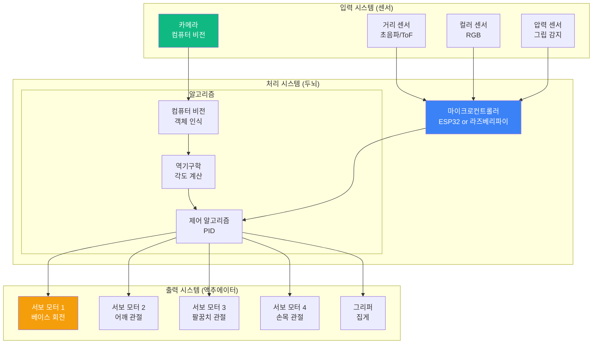

### 로봇팔 기구학 구조

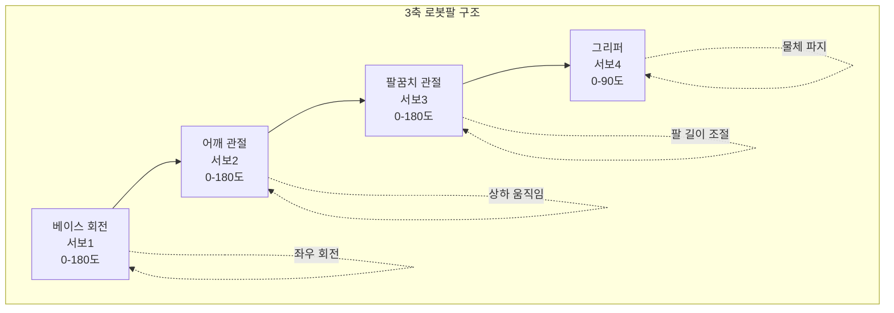

---

## 🔌 입출력 시스템 분석

### 입력(센서) 시스템

| 센서 종류 | 측정 데이터 | 데이터 타입 | 용도 | 통신 방식 |
|---------|-----------|-----------|-----|---------|
| **카메라** | 영상 (640x480 픽셀) | 이미지 배열 | 객체 인식, 위치 파악 | USB/CSI |
| **초음파 거리 센서** | 거리 (2-400cm) | 정수 (cm) | 장애물 회피, 거리 측정 | GPIO (Trigger/Echo) |
| **컬러 센서** | RGB 값 (0-255) | 정수 3개 | 색상 분류, 물체 구별 | I2C |
| **압력 센서** | 압력 (0-1023) | 아날로그 값 | 그립 힘 조절, 물체 감지 | ADC |
| **자이로/가속도계** | 각속도, 가속도 | 부동소수점 6개 | 로봇팔 기울기, 안정성 | I2C/SPI |

### 출력(액추에이터) 시스템

| 액추에이터 | 제어 신호 | 제어 범위 | 물리적 동작 | 통신 방식 |
|----------|---------|---------|-----------|---------|
| **서보 모터 1 (베이스)** | PWM 신호 | 0-180도 | 좌우 회전 | PWM (50Hz) |
| **서보 모터 2 (어깨)** | PWM 신호 | 0-180도 | 상하 움직임 | PWM (50Hz) |
| **서보 모터 3 (팔꿈치)** | PWM 신호 | 0-180도 | 팔 펼침/접힘 | PWM (50Hz) |
| **서보 모터 4 (그리퍼)** | PWM 신호 | 0-90도 | 물체 파지/해제 | PWM (50Hz) |
| **LED 피드백** | 디지털 신호 | ON/OFF | 상태 표시 | GPIO |
| **부저** | PWM 주파수 | 20Hz-20kHz | 소리 알림 | PWM |

### 데이터 흐름 다이어그램

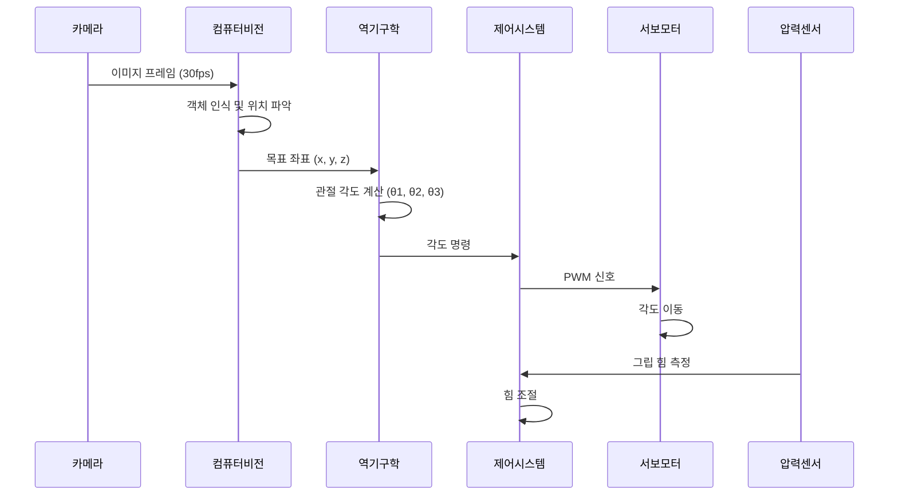

---

## 🤖 ESP32 버전 커리큘럼 (총 20시간)

### ESP32의 장점과 한계

**장점:**
- ✅ 저가 (약 8,000원)
- ✅ WiFi/Bluetooth 내장 → 무선 제어 가능
- ✅ 듀얼 코어 → 센서 읽기와 모터 제어 병렬 처리
- ✅ 저전력 → 배터리 구동 가능

**한계:**
- ❌ 카메라 처리 능력 제한 (ESP32-CAM: 저해상도만 가능)
- ❌ AI 모델 실행 어려움 (TinyML로 간단한 모델만)
- ❌ 복잡한 영상 처리 불가

**해결책:**
- 컴퓨터 비전은 **PC나 스마트폰에서 처리**
- ESP32는 센서 데이터 수집 + 모터 제어에만 집중
- WiFi로 PC/스마트폰과 통신

---

### 1단계: 가상 시뮬레이션 (2시간)

#### 학습 목표
- 로봇팔의 동작 원리 이해
- 좌표계와 각도의 관계 파악
- 시뮬레이터로 안전하게 실험

#### 순서도: 시뮬레이터 사용 흐름

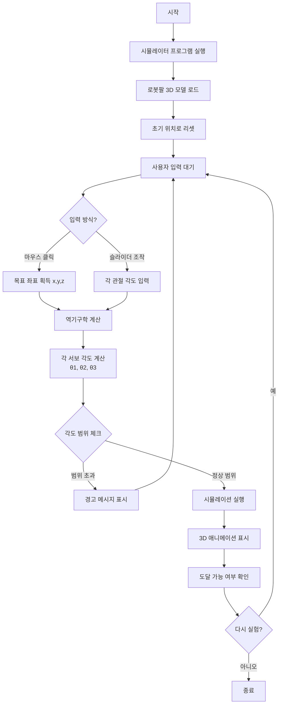

#### 사용 도구
- **PC 시뮬레이터**: 
  - [Robot Arm Simulator (Web)](https://github.com/RobotLocomotion/drake)
  - Tinkercad Circuits (온라인, 무료)
- **앱**: 
  - Robot Arm Controller (Android/iOS)

#### 실습 활동

**활동 1: 순기구학 이해**
```
입력: 각 관절 각도 (θ1, θ2, θ3)
출력: 로봇팔 끝단 위치 (x, y, z)

예시:
  θ1 = 90도 (베이스 정면)
  θ2 = 45도 (어깨 45도)
  θ3 = 30도 (팔꿈치 30도)
  
  → 끝단 위치: (x=15cm, y=0cm, z=12cm)
```

**활동 2: 역기구학 이해**
```
입력: 목표 위치 (x, y, z)
출력: 필요한 관절 각도 (θ1, θ2, θ3)

예시:
  목표: (x=10cm, y=5cm, z=8cm)
  
  → 베이스 각도: θ1 = arctan(y/x) = 26.6도
  → 어깨 각도: θ2 = (역기구학 계산)
  → 팔꿈치 각도: θ3 = (역기구학 계산)
```

---

### 2단계: 하드웨어 구성 및 센서 테스트 (4시간)

#### 필요 부품 목록

| 부품 | 수량 | 용도 | 예상 가격 |
|-----|-----|-----|---------|
| ESP32 DevKit | 1 | 메인 컨트롤러 | 8,000원 |
| SG90 서보 모터 | 4 | 로봇팔 관절 | 24,000원 (6,000원x4) |
| HC-SR04 초음파 센서 | 1 | 거리 측정 | 3,000원 |
| TCS34725 컬러 센서 | 1 | 색상 인식 | 8,000원 |
| FSR 압력 센서 | 1 | 그립 힘 측정 | 3,000원 |
| 5V 3A 전원 어댑터 | 1 | 서보 모터 전원 | 8,000원 |
| 브레드보드, 점퍼선 | 1세트 | 회로 구성 | 5,000원 |
| **합계** | | | **약 59,000원** |

#### 회로 연결 다이어그램

```
ESP32 핀 맵핑:

[센서 입력]
  GPIO 34 (ADC1_6)  ← 압력 센서 (아날로그)
  GPIO 25 (TRIG)    → 초음파 센서 Trigger
  GPIO 26 (ECHO)    ← 초음파 센서 Echo
  GPIO 21 (SDA)     ↔ 컬러 센서 I2C SDA
  GPIO 22 (SCL)     ↔ 컬러 센서 I2C SCL

[서보 모터 출력]
  GPIO 12 (PWM0)    → 서보1 (베이스)
  GPIO 13 (PWM1)    → 서보2 (어깨)
  GPIO 14 (PWM2)    → 서보3 (팔꿈치)
  GPIO 27 (PWM3)    → 서보4 (그리퍼)

[전원]
  5V 외부 전원      → 서보 모터 VCC (공통)
  GND (공통)        → 모든 GND 연결
  ESP32 3.3V        → 센서 VCC
```

#### 알고리즘: 센서 캘리브레이션

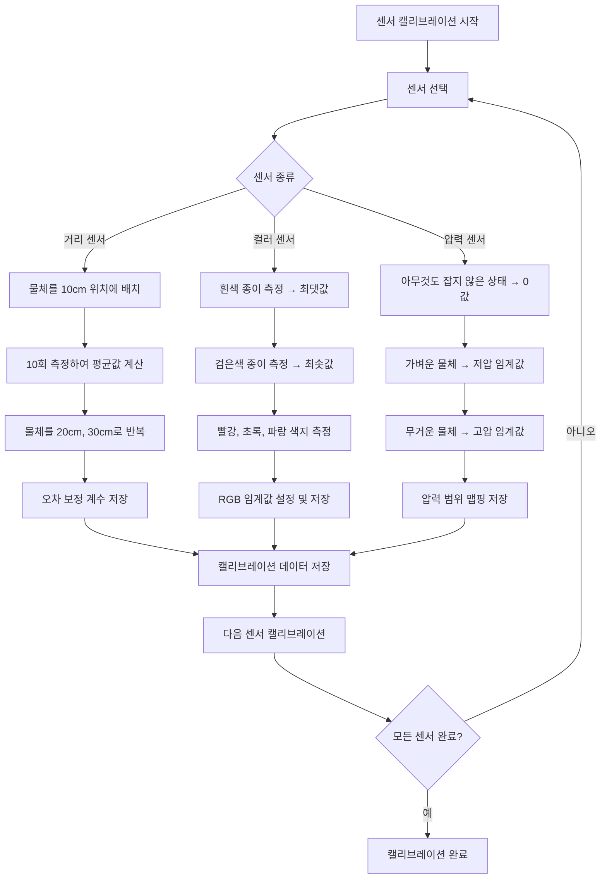

#### 실습 활동

**활동 1: 서보 모터 단독 테스트**
```
알고리즘: 단일 서보 제어

입력: 목표 각도 (0-180)
출력: 서보 PWM 신호

절차:
  1. 서보를 0도로 초기화
  2. 사용자에게 목표 각도 입력 받기
  3. 목표 각도 범위 검증 (0-180)
     만약 범위 벗어남 → 에러 메시지, 다시 입력
  4. 현재 각도에서 목표 각도까지 1도씩 증가/감소
  5. 각 단계마다 20ms 대기 (부드러운 움직임)
  6. 목표 각도 도달 시 완료 메시지
```

**활동 2: 거리 센서 측정**
```
알고리즘: 초음파 센서 거리 측정

출력: 거리 (cm)

절차:
  1. Trigger 핀을 LOW로 2μs
  2. Trigger 핀을 HIGH로 10μs (초음파 발사)
  3. Trigger 핀을 LOW로
  4. Echo 핀에서 HIGH 신호 지속 시간 측정
  5. 시간(μs) = pulseIn(Echo핀)
  6. 거리(cm) = 시간 × 0.034 / 2
     (소리 속도: 340m/s = 0.034cm/μs, 왕복이므로 /2)
  7. 만약 거리 < 2cm or > 400cm → 유효하지 않은 값
  8. 5회 측정 평균값 반환 (노이즈 제거)
```

**활동 3: 컬러 센서 색상 인식**
```
알고리즘: RGB 색상 분류

입력: RGB 센서 값 (R, G, B)
출력: 색상 이름 (빨강/초록/파랑/노랑/기타)

절차:
  1. 센서에서 RGB 값 읽기
  2. 가장 큰 값 찾기 (maxValue)
  3. 
  만약 R > G 그리고 R > B:
      만약 R > 임계값_빨강 그리고 G < 50 그리고 B < 50:
          색상 = "빨강"
      만약 R > 임계값_노랑 그리고 G > 임계값_노랑:
          색상 = "노랑"
  만약 G > R 그리고 G > B:
      만약 G > 임계값_초록 그리고 R < 50 그리고 B < 50:
          색상 = "초록"
  만약 B > R 그리고 B > G:
      만약 B > 임계값_파랑 그리고 R < 50 그리고 G < 50:
          색상 = "파랑"
  그렇지 않으면:
      색상 = "알 수 없음"
  
  4. 색상 반환
```

---

### 3단계: 로봇팔 제어 알고리즘 (6시간)

#### 알고리즘 1: 역기구학 (Inverse Kinematics)

**문제 정의:**
- 입력: 목표 위치 (x, y, z)
- 출력: 각 관절 각도 (θ1, θ2, θ3)

```mermaid
flowchart TD
    A[목표 좌표 입력<br/>x, y, z] --> B[베이스 각도 계산<br/>θ1 = arctan y/x]
    
    B --> C[베이스 좌표계에서<br/>2D 문제로 변환]
    C --> D[수평 거리 계산<br/>r = sqrt x² + y²]
    D --> E[팔 길이 정의<br/>L1 = 어깨-팔꿈치<br/>L2 = 팔꿈치-손목]
    
    E --> F[코사인 법칙 적용]
    F --> G[cos C = L1² + L2² - r² / 2×L1×L2]
    G --> H[팔꿈치 각도<br/>θ3 = arccos C]
    
    H --> I[α = arctan z/r]
    I --> J[β = arctan L2×sin θ3 / L1+L2×cos θ3]
    J --> K[어깨 각도<br/>θ2 = α + β]
    
    K --> L{도달 가능?}
    L -->|r > L1+L2| M[도달 불가<br/>거리 너무 멀음]
    L -->|r < |L1-L2|| N[도달 불가<br/>거리 너무 가까움]
    L -->|정상| O[각도 출력<br/>θ1, θ2, θ3]
    
    M --> P[에러 처리]
    N --> P
```

**수학 공식:**

```
주어진 값:
  - 목표 좌표: (x, y, z)
  - 팔 길이: L1 (어깨-팔꿈치), L2 (팔꿈치-손목)

계산 절차:

1. 베이스 회전 각도 (θ1):
   θ1 = arctan(y / x)
   
   특수 경우:
   - x = 0 그리고 y > 0 → θ1 = 90도
   - x = 0 그리고 y < 0 → θ1 = -90도
   - x < 0 → θ1 = θ1 + 180도 (후방)

2. 수평 거리 (r):
   r = √(x² + y²)
   
3. 도달 가능 여부 확인:
   만약 r > L1 + L2 → 도달 불가 (너무 멀음)
   만약 r < |L1 - L2| → 도달 불가 (너무 가까움)

4. 팔꿈치 각도 (θ3) - 코사인 법칙:
   D = (r² + z² + L1² - L2²) / (2 × L1 × √(r² + z²))
   
   만약 |D| > 1 → 도달 불가
   
   θ3 = arccos(D)

5. 어깨 각도 (θ2):
   α = arctan(z / r)
   β = arcsin((L2 × sin(θ3)) / √(r² + z²))
   θ2 = α + β

6. 각도를 0-180도 범위로 정규화:
   θ1 = θ1 + 90  (중립 위치 기준)
   θ2 = 90 - θ2  (서보 방향 조정)
   θ3 = 90 + θ3
```

#### 알고리즘 2: 경로 계획 (Path Planning)

**문제 정의:**
- 입력: 시작 위치 (x1, y1, z1), 목표 위치 (x2, y2, z2)
- 출력: 중간 경로점들의 시퀀스

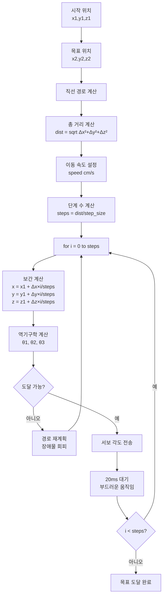

**선형 보간 알고리즘:**

```
입력: 
  - 시작 (x1, y1, z1)
  - 목표 (x2, y2, z2)
  - 보간 단계 수 (n)

출력: 
  - 중간 경로점 배열

알고리즘:

1. 변화량 계산:
   Δx = x2 - x1
   Δy = y2 - y1
   Δz = z2 - z1

2. for i = 0 to n:
     t = i / n  (0.0 ~ 1.0)
     
     x[i] = x1 + Δx × t
     y[i] = y1 + Δy × t
     z[i] = z1 + Δz × t
     
     경로점[i] = (x[i], y[i], z[i])

3. 반환: 경로점 배열
```

#### 알고리즘 3: 충돌 감지 및 안전 제어

```mermaid
flowchart TD
    A[서보 각도 명령 수신] --> B[현재 각도 읽기]
    B --> C[목표 각도와 차이 계산<br/>Δθ = 목표 - 현재]
    
    C --> D{|Δθ| > 5도?}
    D -->|예| E[급격한 움직임<br/>속도 제한 적용]
    D -->|아니오| F[정상 속도]
    
    E --> G[최대 각속도<br/>30도/초로 제한]
    F --> G
    
    G --> H[거리 센서 체크]
    H --> I{장애물 < 5cm?}
    
    I -->|예| J[긴급 정지]
    J --> K[경고음 발생]
    K --> L[사용자 확인 대기]
    
    I -->|아니오| M[압력 센서 체크]
    M --> N{과도한 압력?}
    
    N -->|예| O[그리퍼 힘 감소]
    O --> P[최대 압력 제한]
    
    N -->|아니오| Q[서보 모터 구동]
    P --> Q
    
    Q --> R[목표 각도 도달 대기]
    R --> S[피드백 전송<br/>동작 완료]
```

---

### 4단계: WiFi 통신 및 원격 제어 (4시간)

#### 시스템 구조: ESP32 ↔ PC/스마트폰

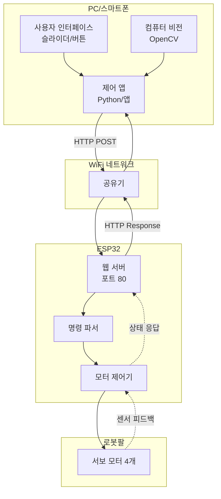

#### 알고리즘: 명령 프로토콜

**JSON 기반 통신 프로토콜:**

```
요청 (PC → ESP32):
{
  "command": "move",
  "servo1": 90,
  "servo2": 45,
  "servo3": 120,
  "gripper": 30,
  "speed": 50
}

또는

{
  "command": "position",
  "x": 15.5,
  "y": 8.2,
  "z": 10.0,
  "gripper": 50
}

응답 (ESP32 → PC):
{
  "status": "success",
  "current_angles": [90, 45, 120, 30],
  "distance": 12.5,
  "pressure": 450
}
```

#### 순서도: 명령 처리

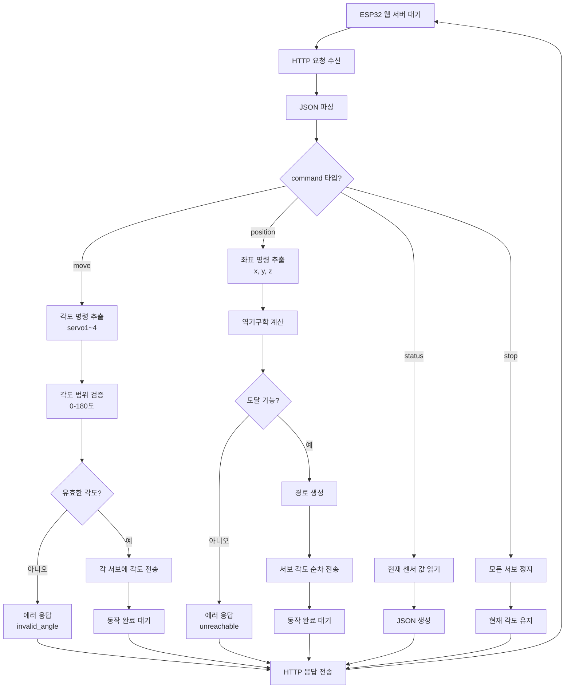

#### 실습 활동

**활동: Python으로 ESP32 제어하기**

```
알고리즘: Python 제어 스크립트

1. WiFi 네트워크에서 ESP32 IP 주소 확인
   예: 192.168.0.100

2. HTTP 요청 준비:
   import requests
   import json
   
   esp32_url = "http://192.168.0.100/control"

3. 명령 전송 함수:
   함수 send_position(x, y, z):
       data = {
           "command": "position",
           "x": x,
           "y": y,
           "z": z,
           "gripper": 50
       }
       
       response = requests.post(esp32_url, json=data)
       
       만약 response.status_code == 200:
           result = response.json()
           반환 result["status"]
       그렇지 않으면:
           반환 "error"

4. 사용 예시:
   # 목표 위치로 이동
   send_position(10, 5, 8)
   
   # 대기
   time.sleep(2)
   
   # 다음 위치
   send_position(15, 0, 10)
```

---

### 5단계: PC 컴퓨터 비전 통합 (4시간)

#### 시스템 구조

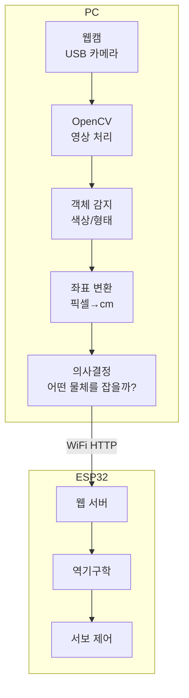

#### 알고리즘: 색상 기반 객체 인식

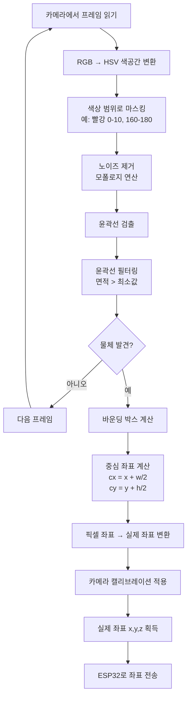

**세부 알고리즘:**

```
알고리즘: 빨간 공 찾기

입력: 카메라 이미지 (640x480 RGB)
출력: 공의 실제 좌표 (x, y, z) cm

절차:

1. 이미지 전처리:
   frame = 카메라.read()
   hsv = RGB_to_HSV(frame)

2. 빨강 색상 범위 정의:
   lower_red1 = (0, 100, 100)
   upper_red1 = (10, 255, 255)
   lower_red2 = (160, 100, 100)
   upper_red2 = (180, 255, 255)
   
   # 빨강은 HSV에서 0과 180 근처에 있음

3. 마스킹:
   mask1 = inRange(hsv, lower_red1, upper_red1)
   mask2 = inRange(hsv, lower_red2, upper_red2)
   mask = mask1 OR mask2

4. 노이즈 제거:
   kernel = 5x5 matrix
   mask = morphologyEx(mask, OPEN, kernel)
   mask = morphologyEx(mask, CLOSE, kernel)

5. 윤곽선 찾기:
   contours = findContours(mask)
   
   만약 contours가 비어있음:
       반환 None

6. 가장 큰 윤곽선 선택:
   max_contour = contours[0]
   for contour in contours:
       만약 area(contour) > area(max_contour):
           max_contour = contour

7. 중심 좌표 계산:
   M = moments(max_contour)
   cx = M["m10"] / M["m00"]  (픽셀 x)
   cy = M["m01"] / M["m00"]  (픽셀 y)

8. 픽셀 → 실제 좌표 변환:
   # 카메라 캘리브레이션 파라미터 사용
   x_cm = (cx - 화면중심x) × 픽셀_to_cm_비율
   y_cm = (cy - 화면중심y) × 픽셀_to_cm_비율
   z_cm = 카메라_높이 - 물체_높이  (고정값 또는 거리 센서)

9. 반환: (x_cm, y_cm, z_cm)
```

#### 카메라 캘리브레이션

```
목표: 픽셀 좌표 → 실제 cm 좌표 변환

방법 1: 참조 물체 사용

1. 알려진 크기의 물체 배치 (예: 10cm x 10cm 정사각형)
2. 카메라로 촬영하여 픽셀 크기 측정
3. 비율 계산:
   
   pixel_width = 측정된_픽셀_너비
   real_width = 10 cm
   
   픽셀_to_cm_비율 = real_width / pixel_width

4. 이 비율을 저장하여 모든 좌표 변환에 사용

방법 2: 체스보드 캘리브레이션 (고급)

1. OpenCV의 calibrateCamera() 함수 사용
2. 다양한 각도에서 체스보드 촬영 (10-20장)
3. 카메라 내부 파라미터 계산:
   - 초점 거리 (fx, fy)
   - 주점 (cx, cy)
   - 왜곡 계수 (k1, k2, p1, p2, k3)

4. 3D 좌표 변환:
   실제_좌표 = undistort(픽셀_좌표, 카메라_매트릭스, 왜곡_계수)
```

#### 실습 활동

**활동 1: 색상별 물체 분류**

```
시나리오:
  빨강, 초록, 파랑 블록이 섞여 있음
  로봇팔이 색상별로 분류하여 각각의 상자에 넣기

알고리즘:

1. 초기화:
   red_box = (x=20, y=-10, z=5)
   green_box = (x=20, y=0, z=5)
   blue_box = (x=20, y=10, z=5)

2. 반복:
   while True:
       # 카메라로 블록 스캔
       blocks = detect_all_blocks()  # 모든 블록 리스트
       
       만약 blocks가 비어있음:
           출력 "분류 완료!"
           break
       
       # 가장 가까운 블록 선택
       closest_block = blocks[0]
       for block in blocks:
           만약 block.distance < closest_block.distance:
               closest_block = block
       
       # 색상 확인
       color = closest_block.color
       x, y, z = closest_block.position
       
       # 블록 위치로 이동
       move_to(x, y, z + 5)  # 5cm 위에서 접근
       move_to(x, y, z)      # 블록 위치로 하강
       
       # 그리퍼 닫기
       gripper_close()
       wait(1초)
       
       # 들어올리기
       move_to(x, y, z + 10)
       
       # 색상에 따라 목표 상자 선택
       만약 color == "빨강":
           target = red_box
       만약 color == "초록":
           target = green_box
       만약 color == "파랑":
           target = blue_box
       
       # 목표 상자로 이동
       move_to(target.x, target.y, target.z + 10)
       move_to(target.x, target.y, target.z)
       
       # 그리퍼 열기
       gripper_open()
       wait(1초)
       
       # 홈 위치로 복귀
       move_to(0, 0, 15)

3. 종료
```

**활동 2: 형태 인식 (동그라미 vs 네모)**

```
알고리즘: 형태 분류

입력: 물체 윤곽선 (contour)
출력: "circle", "square", "triangle", "unknown"

절차:

1. 윤곽선 근사:
   epsilon = 0.04 × perimeter(contour)
   approx = approxPolyDP(contour, epsilon, closed=True)
   vertices = len(approx)  # 꼭짓점 개수

2. 형태 분류:
   만약 vertices == 3:
       shape = "triangle"
   
   만약 vertices == 4:
       x, y, w, h = boundingRect(contour)
       aspect_ratio = w / h
       
       만약 0.95 <= aspect_ratio <= 1.05:
           shape = "square"
       그렇지 않으면:
           shape = "rectangle"
   
   만약 vertices > 8:
       # 원은 많은 꼭짓점으로 근사됨
       area = contourArea(contour)
       perimeter = arcLength(contour)
       circularity = 4 × π × area / (perimeter²)
       
       만약 circularity > 0.85:
           shape = "circle"
       그렇지 않으면:
           shape = "ellipse"
   
   그렇지 않으면:
       shape = "unknown"

3. 반환: shape
```

---

## 🍓 라즈베리파이 버전 커리큘럼 (총 24시간)

### 라즈베리파이의 장점

**ESP32와의 차이점:**
- ✅ 강력한 CPU → 실시간 컴퓨터 비전 처리 가능
- ✅ 라즈베리파이 카메라 모듈 → 고해상도 영상
- ✅ Python → OpenCV, TensorFlow 완벽 지원
- ✅ Linux 기반 → SSH, 네트워크, 파일 시스템
- ✅ AI 모델 실행 가능 → TensorFlow Lite, YOLO

**단점:**
- ❌ 가격이 비쌈 (약 7만원 + 카메라 3만원 = 10만원)
- ❌ 전력 소비 큼 (배터리 구동 어려움)
- ❌ 실시간 제어에는 Arduino/ESP32보다 약함

**최적 구성:**
- 라즈베리파이: 카메라 + AI + 의사결정
- ESP32/Arduino: 실시간 모터 제어

---

### 1단계: 라즈베리파이 + 카메라 설정 (2시간)

#### 하드웨어 구성

```
라즈베리파이 4B (4GB)
  ├─ 카메라 모듈 V2 (CSI 케이블 연결)
  ├─ GPIO → ESP32 (UART 통신)
  ├─ USB → 웹캠 (대안)
  └─ HDMI → 모니터 (초기 설정용)
```

#### 소프트웨어 설치 순서도

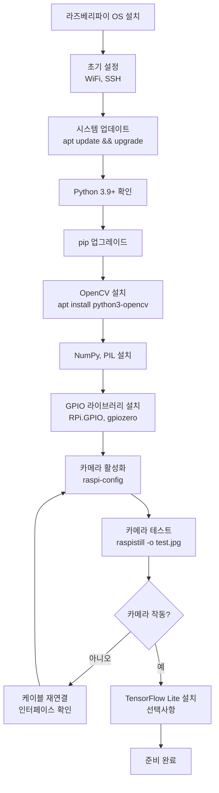

#### 카메라 테스트 알고리즘

```
알고리즘: 카메라 동작 확인

1. 터미널에서 카메라 활성화 확인:
   vcgencmd get_camera
   
   출력 예상:
   supported=1 detected=1
   
   만약 detected=0 → 케이블 연결 확인

2. 정지 이미지 촬영:
   raspistill -o test.jpg -t 2000
   # 2초 후 촬영

3. Python에서 카메라 사용:
   from picamera2 import Picamera2
   
   camera = Picamera2()
   camera.start()
   
   frame = camera.capture_array()
   
   만약 frame is None:
       출력 "카메라 오류"
   그렇지 않으면:
       출력 "카메라 정상"
       출력 frame.shape  # (480, 640, 3) 예상
   
   camera.stop()

4. OpenCV로 실시간 스트림:
   import cv2
   
   cap = cv2.VideoCapture(0)
   
   while True:
       ret, frame = cap.read()
       
       만약 ret == False:
           출력 "프레임 읽기 실패"
           break
       
       cv2.imshow("Camera Test", frame)
       
       만약 cv2.waitKey(1) == ord('q'):
           break
   
   cap.release()
   cv2.destroyAllWindows()
```

---

### 2단계: OpenCV 기초 - 실시간 객체 인식 (4시간)

#### 알고리즘 1: ArUco 마커 인식

**ArUco 마커란?**
- 로봇 비전에서 많이 사용하는 2D 바코드
- 정확한 위치와 방향(pose) 계산 가능
- 인쇄하여 물체에 부착

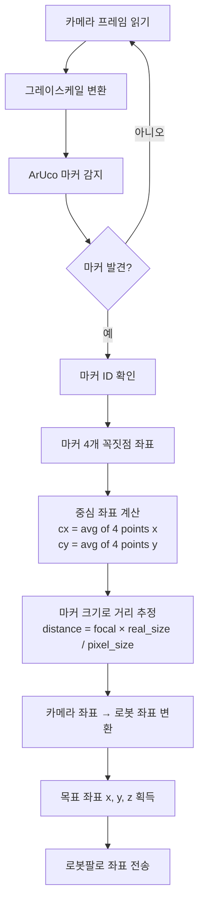

**세부 알고리즘:**

```
알고리즘: ArUco 마커 3D 위치 추정

입력: 카메라 이미지
출력: 마커의 3D 좌표 (x, y, z) 및 회전각

준비:
  1. ArUco 마커 인쇄 (ID 0~9)
  2. 마커 실제 크기 측정 (예: 5cm x 5cm)
  3. 카메라 캘리브레이션 완료

절차:

1. ArUco 딕셔너리 로드:
   dictionary = cv2.aruco.getPredefinedDictionary(cv2.aruco.DICT_6X6_250)
   parameters = cv2.aruco.DetectorParameters()

2. 마커 감지:
   gray = cv2.cvtColor(frame, cv2.COLOR_BGR2GRAY)
   corners, ids, rejected = cv2.aruco.detectMarkers(gray, dictionary, parameters=parameters)
   
   만약 ids is None:
       반환 None  # 마커 없음

3. 각 마커에 대해:
   for i in range(len(ids)):
       marker_id = ids[i][0]
       marker_corners = corners[i][0]  # 4개 꼭짓점
       
       # 중심 좌표 계산
       cx = (marker_corners[0][0] + marker_corners[2][0]) / 2
       cy = (marker_corners[0][1] + marker_corners[2][1]) / 2
       
       # 픽셀 크기 계산
       pixel_width = distance(marker_corners[0], marker_corners[1])
       
       # 거리 추정 (핀홀 카메라 모델)
       focal_length = camera_matrix[0][0]
       real_width = 5  # cm
       distance_z = (focal_length × real_width) / pixel_width
       
       # 픽셀 → 실제 좌표 변환
       x_cm = (cx - camera_center_x) × distance_z / focal_length
       y_cm = (cy - camera_center_y) × distance_z / focal_length
       z_cm = distance_z
       
       # 회전 추정 (solvePnP)
       rvec, tvec = cv2.aruco.estimatePoseSingleMarkers(
           corners[i], real_width, camera_matrix, dist_coeffs
       )
       
       반환: {
           "id": marker_id,
           "position": (x_cm, y_cm, z_cm),
           "rotation": rvec
       }
```

#### 알고리즘 2: 실시간 얼굴 감지 (OpenCV Haar Cascade)

```
알고리즘: 얼굴 따라가는 로봇팔

입력: 카메라 프레임
출력: 로봇팔이 얼굴을 가리키도록

절차:

1. Haar Cascade 로드:
   face_cascade = cv2.CascadeClassifier('haarcascade_frontalface_default.xml')

2. 반복:
   while True:
       frame = camera.read()
       gray = cv2.cvtColor(frame, cv2.COLOR_BGR2GRAY)
       
       # 얼굴 감지
       faces = face_cascade.detectMultiScale(
           gray,
           scaleFactor=1.1,
           minNeighbors=5,
           minSize=(30, 30)
       )
       
       만약 len(faces) == 0:
           출력 "얼굴 없음"
           continue
       
       # 가장 큰 얼굴 선택
       largest_face = faces[0]
       for face in faces:
           만약 face[2] × face[3] > largest_face[2] × largest_face[3]:
               largest_face = face
       
       x, y, w, h = largest_face
       
       # 얼굴 중심 계산
       face_cx = x + w/2
       face_cy = y + h/2
       
       # 화면 중심과의 차이
       screen_center_x = frame_width / 2
       screen_center_y = frame_height / 2
       
       error_x = face_cx - screen_center_x
       error_y = face_cy - screen_center_y
       
       # PID 제어 (비례 제어만)
       Kp = 0.1
       
       servo1_adjustment = Kp × error_x
       servo2_adjustment = Kp × error_y
       
       # 현재 각도 조정
       servo1_angle = servo1_angle - servo1_adjustment
       servo2_angle = servo2_angle + servo2_adjustment
       
       # 범위 제한
       servo1_angle = constrain(servo1_angle, 0, 180)
       servo2_angle = constrain(servo2_angle, 0, 180)
       
       # 서보 이동
       move_servo(1, servo1_angle)
       move_servo(2, servo2_angle)
       
       delay(50ms)
```

---

### 3단계: TensorFlow Lite 객체 인식 (6시간)

#### AI 모델 기반 객체 인식

**ESP32와의 차별점:**
- ESP32: 색상, 마커 등 단순한 특징만 인식
- 라즈베리파이: 딥러닝 모델로 복잡한 객체 인식 가능

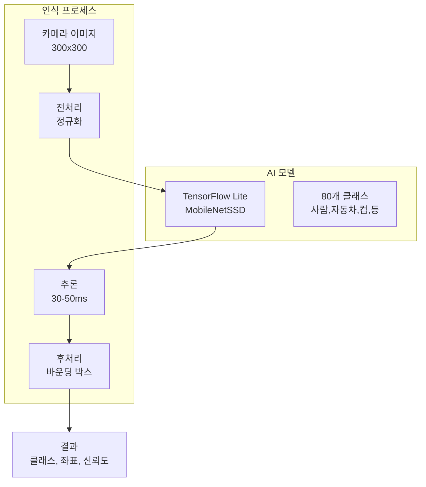

#### 알고리즘: TensorFlow Lite 객체 감지

```
알고리즘: AI 기반 물체 감지 및 파지

모델: MobileNetSSD v2 (COCO 데이터셋 학습)
클래스: cup(컵), bottle(병), apple(사과), etc

절차:

1. 모델 로드:
   interpreter = tf.lite.Interpreter(model_path="detect.tflite")
   interpreter.allocate_tensors()
   
   input_details = interpreter.get_input_details()
   output_details = interpreter.get_output_details()

2. 입력 크기 확인:
   input_shape = input_details[0]['shape']
   # [1, 300, 300, 3] 예상
   
   height, width = input_shape[1], input_shape[2]

3. 반복 (실시간 감지):
   while True:
       frame = camera.read()
       
       # 전처리
       frame_resized = cv2.resize(frame, (width, height))
       input_data = np.expand_dims(frame_resized, axis=0)
       
       만약 input_details[0]['dtype'] == np.uint8:
           input_data = input_data.astype(np.uint8)
       그렇지 않으면:
           input_data = (input_data.astype(np.float32) - 127.5) / 127.5
       
       # 추론
       interpreter.set_tensor(input_details[0]['index'], input_data)
       interpreter.invoke()
       
       # 결과 파싱
       boxes = interpreter.get_tensor(output_details[0]['index'])[0]
       classes = interpreter.get_tensor(output_details[1]['index'])[0]
       scores = interpreter.get_tensor(output_details[2]['index'])[0]
       
       # 신뢰도 임계값
       confidence_threshold = 0.5
       
       detected_objects = []
       
       for i in range(len(scores)):
           만약 scores[i] > confidence_threshold:
               class_id = int(classes[i])
               class_name = labels[class_id]  # 예: "cup"
               
               # 바운딩 박스 (정규화된 좌표)
               ymin, xmin, ymax, xmax = boxes[i]
               
               # 실제 픽셀 좌표로 변환
               left = int(xmin × frame.shape[1])
               top = int(ymin × frame.shape[0])
               right = int(xmax × frame.shape[1])
               bottom = int(ymax × frame.shape[0])
               
               # 중심 좌표
               cx = (left + right) / 2
               cy = (top + bottom) / 2
               
               detected_objects.append({
                   "class": class_name,
                   "confidence": scores[i],
                   "box": (left, top, right, bottom),
                   "center": (cx, cy)
               })
       
       # 특정 물체 찾기 (예: 컵)
       cups = [obj for obj in detected_objects if obj["class"] == "cup"]
       
       만약 len(cups) > 0:
           # 가장 큰 컵 선택
           target_cup = max(cups, key=lambda obj: 
               (obj["box"][2] - obj["box"][0]) × (obj["box"][3] - obj["box"][1])
           )
           
           # 픽셀 좌표 → 실제 좌표 변환
           x_cm, y_cm, z_cm = pixel_to_real_coord(
               target_cup["center"], 
               camera_height=30,
               pixel_to_cm_ratio=0.05
           )
           
           # 로봇팔로 이동
           send_position_to_robot(x_cm, y_cm, z_cm)
           
           출력 f"컵 발견! 좌표: ({x_cm}, {y_cm}, {z_cm})"
       
       delay(100ms)
```

#### 커스텀 모델 학습 (심화)

```
프로젝트: 나만의 물체 인식 모델 만들기

목표: 특정 물체 (예: 학교 로고, 특정 장난감) 인식

절차:

1. 데이터 수집:
   - 다양한 각도에서 물체 사진 100-200장 촬영
   - 다양한 조명, 배경 조건

2. 라벨링:
   - LabelImg 도구 사용
   - 바운딩 박스 그리고 클래스 지정
   - YOLO 또는 PASCAL VOC 포맷으로 저장

3. 모델 학습:
   - Google Colab (무료 GPU 사용)
   - TensorFlow Object Detection API 사용
   - 또는 Teachable Machine (구글, 웹 기반)

4. TFLite 변환:
   converter = tf.lite.TFLiteConverter.from_saved_model(saved_model_dir)
   tflite_model = converter.convert()

5. 라즈베리파이에 배포:
   - 모델 파일 복사
   - 위의 알고리즘에 모델 경로만 변경
   - 클래스 라벨 파일 업데이트

6. 테스트 및 최적화:
   - 인식 정확도 확인
   - 필요 시 추가 데이터 수집 및 재학습
```

---

### 4단계: 라즈베리파이 ↔ ESP32 통신 (4시간)

#### 시스템 아키텍처

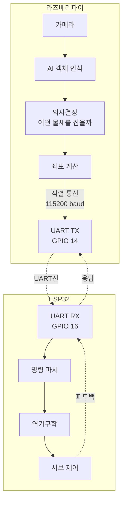

#### 통신 프로토콜

**명령 형식 (라즈베리파이 → ESP32):**

```
<START>COMMAND:DATA<END>

예시:
  <START>MOVE:90,45,120,30<END>
  <START>POS:15.5,8.2,10.0<END>
  <START>GRIP:OPEN<END>
  <START>STATUS<END>

응답 (ESP32 → 라즈베리파이):
  <START>ACK:SUCCESS<END>
  <START>STATUS:90,45,120,30,12.5,450<END>
  <START>ERROR:UNREACHABLE<END>
```

#### 알고리즘: 직렬 통신 (라즈베리파이 측)

```
알고리즘: 라즈베리파이 직렬 통신

라이브러리: pyserial

초기화:
  import serial
  
  ser = serial.Serial(
      port='/dev/ttyAMA0',  # GPIO UART
      baudrate=115200,
      parity=serial.PARITY_NONE,
      stopbits=serial.STOPBITS_ONE,
      bytesize=serial.EIGHTBITS,
      timeout=1
  )

함수: send_position(x, y, z)
  입력: 목표 좌표 (cm)
  출력: 성공 여부
  
  절차:
    1. 명령 문자열 생성:
       command = f"<START>POS:{x},{y},{z}<END>"
    
    2. 전송:
       ser.write(command.encode('utf-8'))
    
    3. 응답 대기 (타임아웃 5초):
       start_time = time.time()
       response = ""
       
       while (time.time() - start_time) < 5:
           만약 ser.in_waiting > 0:
               byte = ser.read(1).decode('utf-8')
               response += byte
               
               만약 response.endswith("<END>"):
                   break
       
       만약 response == "":
           출력 "타임아웃: ESP32 응답 없음"
           반환 False
    
    4. 응답 파싱:
       만약 "SUCCESS" in response:
           반환 True
       그렇지 않으면:
           출력 f"에러: {response}"
           반환 False

함수: get_status()
  출력: 현재 센서 값 딕셔너리
  
  절차:
    1. 명령 전송:
       ser.write(b"<START>STATUS<END>")
    
    2. 응답 대기:
       response = wait_for_response(timeout=2)
    
    3. 파싱:
       # 응답 예: <START>STATUS:90,45,120,30,12.5,450<END>
       data = response.split(':')[1].split('<')[0]
       values = data.split(',')
       
       status = {
           "servo1": int(values[0]),
           "servo2": int(values[1]),
           "servo3": int(values[2]),
           "gripper": int(values[3]),
           "distance": float(values[4]),
           "pressure": int(values[5])
       }
       
       반환 status
```

#### 알고리즘: 직렬 통신 (ESP32 측)

```
알고리즘: ESP32 명령 수신 및 처리

초기화:
  Serial2.begin(115200, SERIAL_8N1, RX_PIN, TX_PIN);

전역 변수:
  String input_buffer = "";

loop() 내에서:
  while (Serial2.available() > 0):
      char c = Serial2.read();
      input_buffer += c;
      
      만약 input_buffer.endsWith("<END>"):
          process_command(input_buffer);
          input_buffer = "";  # 버퍼 초기화

함수: process_command(String cmd)
  절차:
    1. 시작/끝 태그 제거:
       cmd = cmd.substring(7, cmd.length() - 5);
       # "<START>" 제거, "<END>" 제거
    
    2. 명령과 데이터 분리:
       int colon_index = cmd.indexOf(':');
       String command = cmd.substring(0, colon_index);
       String data = cmd.substring(colon_index + 1);
    
    3. 명령 처리:
       만약 command == "MOVE":
           # 데이터: "90,45,120,30"
           int angles[4];
           parse_csv(data, angles, 4);
           
           move_servos(angles[0], angles[1], angles[2], angles[3]);
           send_response("SUCCESS");
       
       만약 command == "POS":
           # 데이터: "15.5,8.2,10.0"
           float coords[3];
           parse_csv_float(data, coords, 3);
           
           bool reachable = inverse_kinematics(coords[0], coords[1], coords[2]);
           
           만약 reachable:
               send_response("SUCCESS");
           그렇지 않으면:
               send_response("ERROR:UNREACHABLE");
       
       만약 command == "GRIP":
           만약 data == "OPEN":
               gripper_servo.write(90);
           만약 data == "CLOSE":
               gripper_servo.write(30);
           
           send_response("SUCCESS");
       
       만약 command == "STATUS":
           String status = get_sensor_status();
           send_response("STATUS:" + status);

함수: send_response(String msg)
  Serial2.print("<START>");
  Serial2.print(msg);
  Serial2.println("<END>");
```

---

### 5단계: 통합 프로젝트 - 자율 물체 정렬 시스템 (8시간)

#### 프로젝트 목표

**시나리오:**
탁자 위에 다양한 물체(컵, 병, 과일 등)가 무작위로 놓여있음
로봇팔이 카메라로 물체를 인식하고, 종류별로 정렬하여 지정된 위치에 배치

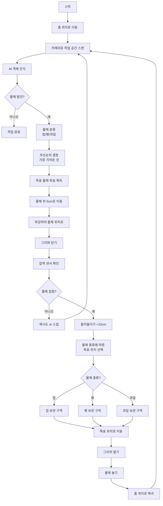

#### 메인 알고리즘

```
알고리즘: 자율 물체 정렬

전역 변수:
  workspace_bounds = {
      "x_min": 5, "x_max": 25,
      "y_min": -15, "y_max": 15,
      "z_work": 2  # 작업 높이
  }
  
  target_zones = {
      "cup": {"x": 25, "y": -10, "z": 5},
      "bottle": {"x": 25, "y": 0, "z": 5},
      "apple": {"x": 25, "y": 10, "z": 5}
  }
  
  home_position = {"x": 0, "y": 0, "z": 15}

메인 함수:
  절차:
    1. 초기화:
       initialize_camera()
       initialize_robot_arm()
       move_to_position(home_position)
       
       sorted_objects = {"cup": 0, "bottle": 0, "apple": 0}
       max_attempts = 3
    
    2. 메인 루프:
       while True:
           # 작업 공간 스캔
           objects = scan_workspace()
           
           만약 len(objects) == 0:
               출력 "정렬 완료!"
               출력 f"컵: {sorted_objects['cup']}개"
               출력 f"병: {sorted_objects['bottle']}개"
               출력 f"과일: {sorted_objects['apple']}개"
               break
           
           # 가장 가까운 물체 선택
           target = select_nearest_object(objects)
           
           출력 f"목표: {target['class']} at ({target['x']}, {target['y']})"
           
           # 물체 파지 시도
           success = pick_object(target)
           
           만약 success:
               # 분류하여 배치
               place_success = place_object(target['class'])
               
               만약 place_success:
                   sorted_objects[target['class']] += 1
                   출력 f"{target['class']} 정렬 성공!"
               그렇지 않으면:
                   출력 "배치 실패, 재시도"
           그렇지 않으면:
               출력 "파지 실패, 다음 물체로"
           
           # 홈 위치 복귀
           move_to_position(home_position)
           delay(1초)
    
    3. 종료:
       출력 "프로그램 종료"
       robot_arm_stop()
       camera_stop()

함수: scan_workspace()
  출력: 감지된 물체 리스트
  
  절차:
    1. 카메라 프레임 획득:
       frame = camera.capture()
    
    2. AI 객체 인식:
       detections = ai_detect_objects(frame)
       
       valid_objects = []
       
       for obj in detections:
           # 신뢰도 필터링
           만약 obj["confidence"] < 0.6:
               continue
           
           # 지원하는 클래스만
           만약 obj["class"] not in ["cup", "bottle", "apple"]:
               continue
           
           # 픽셀 → 실제 좌표 변환
           x_cm, y_cm, z_cm = pixel_to_real_coordinate(obj["center"])
           
           # 작업 공간 내부인지 확인
           만약 not is_in_workspace(x_cm, y_cm):
               continue
           
           valid_objects.append({
               "class": obj["class"],
               "x": x_cm,
               "y": y_cm,
               "z": z_cm,
               "confidence": obj["confidence"]
           })
    
    3. 반환: valid_objects

함수: pick_object(target)
  입력: 목표 물체 정보
  출력: 성공 여부 (True/False)
  
  절차:
    1. 접근 경로 계획:
       approach_pos = {
           "x": target["x"],
           "y": target["y"],
           "z": target["z"] + 5  # 5cm 위
       }
    
    2. 접근:
       success = move_to_position(approach_pos)
       만약 not success:
           반환 False
       
       delay(500ms)  # 안정화
    
    3. 하강:
       grasp_pos = {
           "x": target["x"],
           "y": target["y"],
           "z": target["z"]
       }
       
       success = move_to_position(grasp_pos)
       만약 not success:
           반환 False
       
       delay(500ms)
    
    4. 그리퍼 닫기:
       gripper_close()
       delay(1초)
    
    5. 압력 센서 확인:
       pressure = read_pressure_sensor()
       
       만약 pressure < 100:  # 임계값
           출력 "물체를 잡지 못함"
           gripper_open()
           반환 False
    
    6. 들어올리기:
       lift_pos = {
           "x": target["x"],
           "y": target["y"],
           "z": target["z"] + 10
       }
       
       move_to_position(lift_pos)
       delay(500ms)
    
    7. 반환 True

함수: place_object(object_class)
  입력: 물체 종류 ("cup", "bottle", "apple")
  출력: 성공 여부
  
  절차:
    1. 목표 구역 선택:
       target_zone = target_zones[object_class]
    
    2. 목표 위 이동:
       approach = {
           "x": target_zone["x"],
           "y": target_zone["y"],
           "z": target_zone["z"] + 10
       }
       
       move_to_position(approach)
       delay(500ms)
    
    3. 하강:
       place_pos = target_zone
       move_to_position(place_pos)
       delay(500ms)
    
    4. 그리퍼 열기:
       gripper_open()
       delay(1초)
    
    5. 상승:
       approach["z"] += 10
       move_to_position(approach)
    
    6. 반환 True

함수: select_nearest_object(objects)
  입력: 물체 리스트
  출력: 가장 가까운 물체
  
  절차:
    current_pos = get_current_position()
    
    nearest = objects[0]
    min_distance = calculate_distance(current_pos, nearest)
    
    for obj in objects[1:]:
        dist = calculate_distance(current_pos, obj)
        
        만약 dist < min_distance:
            min_distance = dist
            nearest = obj
    
    반환 nearest

함수: calculate_distance(pos1, pos2)
  입력: 두 개의 3D 좌표
  출력: 유클리드 거리
  
  절차:
    dx = pos2["x"] - pos1["x"]
    dy = pos2["y"] - pos1["y"]
    dz = pos2["z"] - pos1["z"]
    
    distance = sqrt(dx² + dy² + dz²)
    
    반환 distance
```

---

## 📊 평가 및 성찰

### 프로젝트 평가 기준

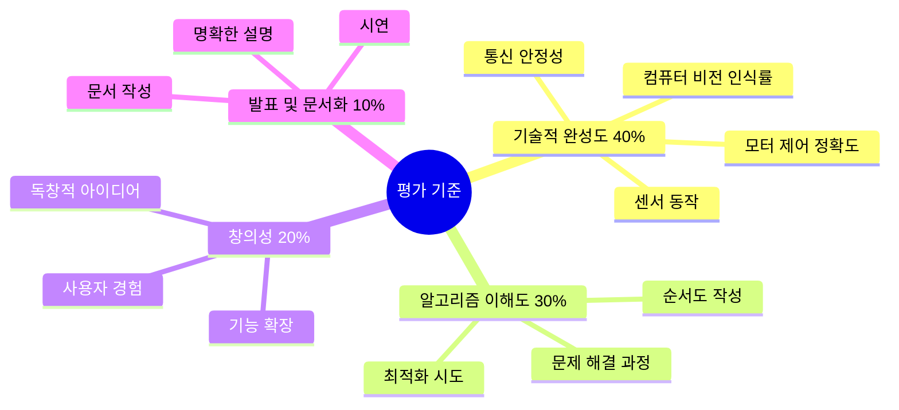

### 학생 자기 평가 질문

1. **입력과 출력의 이해**
   - 사용한 센서(입력)는 무엇이며, 각각 어떤 데이터를 제공하나요?
   - 사용한 액추에이터(출력)는 무엇이며, 어떤 제어 신호가 필요한가요?

2. **알고리즘 설계**
   - 역기구학 알고리즘을 순서도로 그려보세요
   - 물체 인식 알고리즘의 핵심 단계 3가지는 무엇인가요?

3. **문제 해결**
   - 프로젝트 중 가장 어려웠던 문제는 무엇이었나요?
   - 어떻게 해결했나요? (시행착오 포함)

4. **융합적 사고**
   - 이 프로젝트에 어떤 과목의 지식이 사용되었나요?
   - 실생활에서 비슷한 기술이 어디에 활용되나요?

---

## 📈 확장 프로젝트 아이디어

### 프로젝트 1: 자동 체스 플레이어
- 카메라로 체스판 인식
- AI가 다음 수 계산
- 로봇팔이 말을 이동

### 프로젝트 2: 재활용 분류 로봇
- 컬러 센서 + AI로 재질 구분
- 플라스틱/유리/종이 자동 분류
- 환경 보호 메시지

### 프로젝트 3: 자동 약 분배기
- 시간에 맞춰 약 제공
- 얼굴 인식으로 사용자 확인
- 복용 기록 저장

### 프로젝트 4: 그림 그리는 로봇
- 이미지를 윤곽선으로 변환
- 로봇팔이 펜을 잡고 그림
- 예술과 기술의 융합

---

## 📚 참고 자료

### 온라인 시뮬레이터
- Tinkercad Circuits: https://www.tinkercad.com
- Robot Arm Simulator: https://robot-arm-simulator.com

### OpenCV 튜토리얼
- 공식 문서: https://docs.opencv.org
- PyImageSearch: https://www.pyimagesearch.com

### TensorFlow Lite
- 공식 가이드: https://www.tensorflow.org/lite
- 사전 학습 모델: https://www.tensorflow.org/lite/models

### 로봇 공학 이론
- Introduction to Robotics (Stanford)
- Modern Robotics (Northwestern)

---

## 📝 문서 정보

**작성자**: AI Maker Lab 교육팀  
**최종 업데이트**: 2025-01-06  
**문서 버전**: 1.0  
**대상**: 중고등학생, 교사, 교육 기획자

**특징**:
- ✅ 코드 없이 알고리즘과 순서도 중심
- ✅ 입력/출력 시스템 명확히 구분
- ✅ 가상 시뮬레이션 → 실제 구현 단계적 접근
- ✅ ESP32와 라즈베리파이 두 버전 제공
- ✅ 컴퓨터 비전 + 로봇 제어 융합

**피드백**: 
이 커리큘럼을 사용하면서 개선점이나 추가 아이디어가 있으면 공유해주세요!

